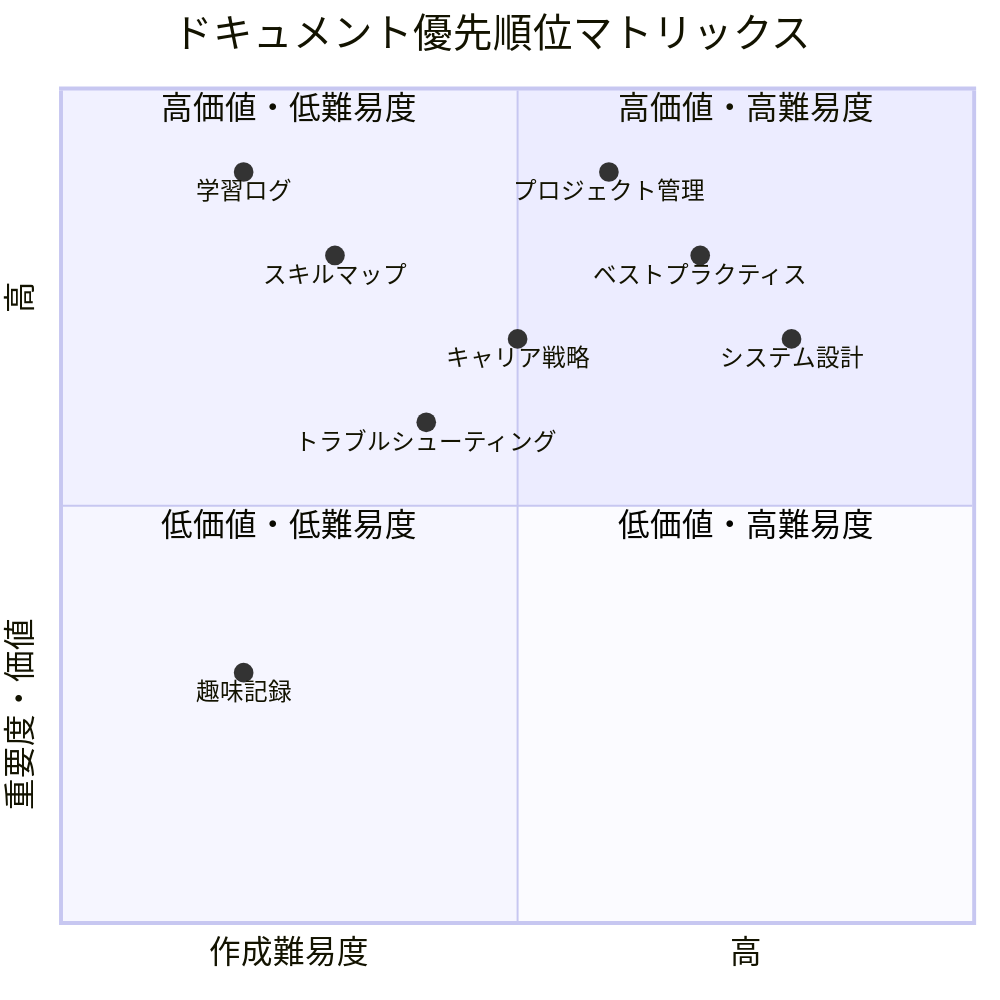
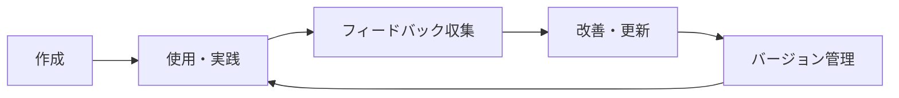

# ドキュメント管理インデックス 📚

*最終更新: 2025年11月9日*

## 📂 現在のドキュメント一覧

### 🌍 公開ドキュメント (Public)

#### 📱 GitHub関連
- [GitHubフル活用術](./public/github/github-mastery-guide.md) - GitHub機能の包括的活用ガイド
- [GitHub公開戦略](./public/github/github-publishing-strategy.md) - リポジトリ公開・運用戦略

#### 🤖 AI・未来技術
- [AIの未来予測](./public/ai-future/ai-robot-future-prediction.md) - AI搭載型ロボットの実現予測と分析
- [AI・ロボット職業置き換え予測レポート](./public/ai-future/ai-robot-job-replacement-timeline.md) - 時系列での職業置き換え詳細予測・創作分野参入障壁崩壊分析

#### 💻 技術関連
- *準備中*

### 🔒 非公開ドキュメント (Private)

#### 👤 個人分析
- [個人分析テンプレート](./private/personal/personal-analysis-template.md) - 自己理解・成長管理用

#### 📝 下書き・草案
- *準備中*

## 🎯 推奨追加ドキュメント候補

### 🏆 高優先度（すぐに作成推奨）

#### 1. **学習・成長管理シリーズ**
- **学習ログテンプレート**: 日々の学習記録と振り返り
- **スキルマップ管理**: 技術・ソフトスキルの体系的管理
- **読書・記事まとめ**: 知識の蓄積と整理
- **プロジェクト振り返りテンプレート**: 失敗・成功の学び整理

#### 2. **技術ドキュメントシリーズ**
- **プログラミングベストプラクティス**: 言語・フレームワーク別
- **システム設計パターン**: アーキテクチャ設計の知見
- **トラブルシューティングガイド**: 問題解決手順書
- **開発環境セットアップガイド**: 効率的な環境構築

#### 3. **プロジェクト管理シリーズ**
- **プロジェクト企画テンプレート**: アイデアから実行計画まで
- **タスク管理術**: 個人・チーム両方の効率化
- **時間管理・生産性向上**: パーソナル生産性システム
- **意思決定フレームワーク**: 重要な判断のための構造化手法

### 🚀 中優先度（段階的に作成）

#### 4. **キャリア・ビジネスシリーズ**
- **キャリア戦略プランニング**: 長期的なキャリア設計
- **ネットワーキング戦略**: 人脈構築の体系的アプローチ
- **プレゼンテーション術**: 効果的な情報伝達技術
- **交渉・コミュニケーション**: ビジネススキル向上

#### 5. **ライフハック・効率化シリーズ**
- **デジタルツール活用術**: 生産性向上ツールの使いこなし
- **情報収集・整理術**: 効率的な情報管理システム
- **健康・ウェルビーイング管理**: 持続可能な生活設計
- **お金・投資の基礎知識**: ファイナンシャルリテラシー

#### 6. **創造性・イノベーションシリーズ**
- **アイデア発想法**: 創造的思考の技術
- **デザイン思考プロセス**: 問題解決のための設計思考
- **イノベーション事例研究**: 成功・失敗事例の分析
- **副業・起業ガイド**: 新しい価値創造の実践

### 💡 低優先度（余裕があるときに）

#### 7. **趣味・教養シリーズ**
- **語学学習戦略**: 効率的な言語習得方法
- **文化・歴史研究**: 興味のある分野の深掘り
- **旅行・体験記録**: 経験の蓄積と共有
- **料理・生活術**: 日常生活の質向上

#### 8. **社会・時事分析シリーズ**
- **技術トレンド分析**: 定期的な業界動向整理
- **社会問題研究**: 関心のある社会課題の分析
- **経済・市場動向**: マクロ・ミクロ経済の理解
- **政治・政策分析**: 社会システムの理解

## 📋 ドキュメント作成優先順位マトリックス



## 🗓️ 作成スケジュール提案

### 📅 今月（2025年11月）
- [ ] **学習ログテンプレート** - 日々の学習を体系化
- [ ] **プロジェクト振り返りテンプレート** - 経験の蓄積開始

### 📅 来月（2025年12月）
- [ ] **プログラミングベストプラクティス** - 技術知識の整理
- [ ] **タスク管理術** - 生産性向上の実践

### 📅 年明け（2026年1月-3月）
- [ ] **システム設計パターン** - 技術的専門性向上
- [ ] **キャリア戦略プランニング** - 長期計画の策定
- [ ] **デジタルツール活用術** - 効率化の最適化

## 🎯 カテゴリ別テンプレート

### 📝 一般的なドキュメント構成

```markdown
# タイトル

*最終更新: 日付*

## 📋 目次
[目次リスト]

## 🎯 概要・目的
[なぜこのドキュメントが必要か]

## 📊 現状分析
[現在の状況・課題]

## 💡 解決策・手法
[具体的な方法・アプローチ]

## 📈 実践・実例
[具体例・ケーススタディ]

## 🔧 ツール・リソース
[使用ツール・参考資料]

## ⚡ アクションプラン
[次のステップ]

## 🎯 まとめ
[重要ポイント・学び]
```

### 🧭 Mermaid図表の活用パターン

- **フローチャート**: プロセス・手順の可視化
- **マインドマップ**: 概念・アイデアの整理
- **ガントチャート**: スケジュール・タイムライン
- **クアドラント図**: 優先順位・分類マトリックス
- **シーケンス図**: 相互作用・コミュニケーション

## 🔄 ドキュメント管理のベストプラクティス

### 📁 ファイル命名規則
```
[カテゴリ]-[サブカテゴリ]-[具体名].md

例:
- learning-log-template.md
- tech-bestpractices-python.md
- career-strategy-longterm.md
- project-retrospective-template.md
```

### 🏷️ タグ・分類システム
- **#learning** - 学習関連
- **#tech** - 技術関連
- **#career** - キャリア関連
- **#productivity** - 生産性関連
- **#personal** - 個人関連
- **#project** - プロジェクト関連

### 🔄 更新・メンテナンスサイクル



## 📞 次のアクション

### 🎯 今すぐできること
1. **学習ログテンプレート**の作成開始
2. **個人分析テンプレート**の記入開始
3. **優先ドキュメント**の選択・計画

### 🚀 今週中に実行
1. 最初の追加ドキュメント作成
2. 既存ドキュメントの実践・活用
3. フィードバック・改善点の収集

### 📅 長期的な取り組み
1. 継続的なドキュメント拡充
2. 公開・非公開の適切な分類
3. コミュニティでの知識共有

---

*このインデックスは、あなたの知識管理システムの中核として、継続的に更新・拡充していきます。どのドキュメントから始めたいか、ぜひお聞かせください！*