# AIによる全知全能感の錯覚と心理分析 🧠

*最終更新: 2025年11月30日*

## 📋 目次

- [概要](#-概要)
- [全知全能感の錯覚とは](#-全知全能感の錯覚とは)
- [なぜこの錯覚が起きるのか](#-なぜこの錯覚が起きるのか)
- [3つの危険な心理パターン](#-3つの危険な心理パターン)
- [セルフチェックリスト](#-セルフチェックリスト)
- [健全なAI活用マインドセット](#-健全なai活用マインドセット)
- [まとめ](#-まとめ)

---

## 🎯 概要

AIの普及により「知能の民主化」が進んでいます。誰でも高度な知的作業にアクセスできるようになった一方で、**AIを使いこなすことで生じる「全知全能感」という危険な錯覚**が広がっています。

このレポートは、自分自身がその罠に陥らないための**自己認識ガイド**です。

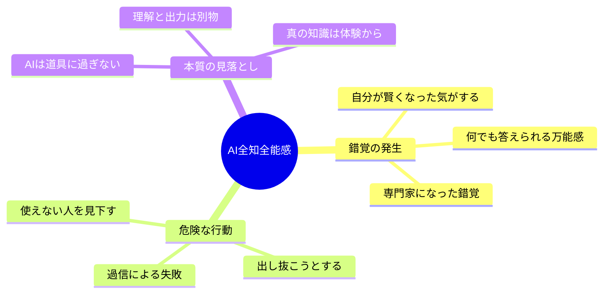

---

## 🔍 全知全能感の錯覚とは

### 定義

**AI全知全能感の錯覚**とは、AIツールを使うことで**自分自身の知性や能力が向上したと誤認する心理状態**です。

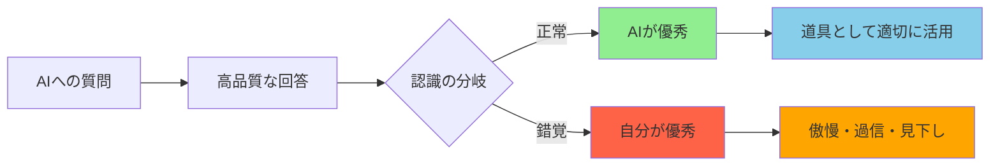

### 本質的な問題

| 錯覚 | 現実 |
|------|------|
| 「私は何でも知っている」 | AIが知っている情報にアクセスできるだけ |
| 「私は専門家レベルだ」 | 出力を読んでいるだけで理解していない |
| 「私は他の人より優れている」 | 同じツールを使えば誰でも同じ結果 |
| 「私の判断は正しい」 | AIの出力を検証する能力がない |

---

## 🧬 なぜこの錯覚が起きるのか

### 1. 認知の外部化による境界の曖昧化

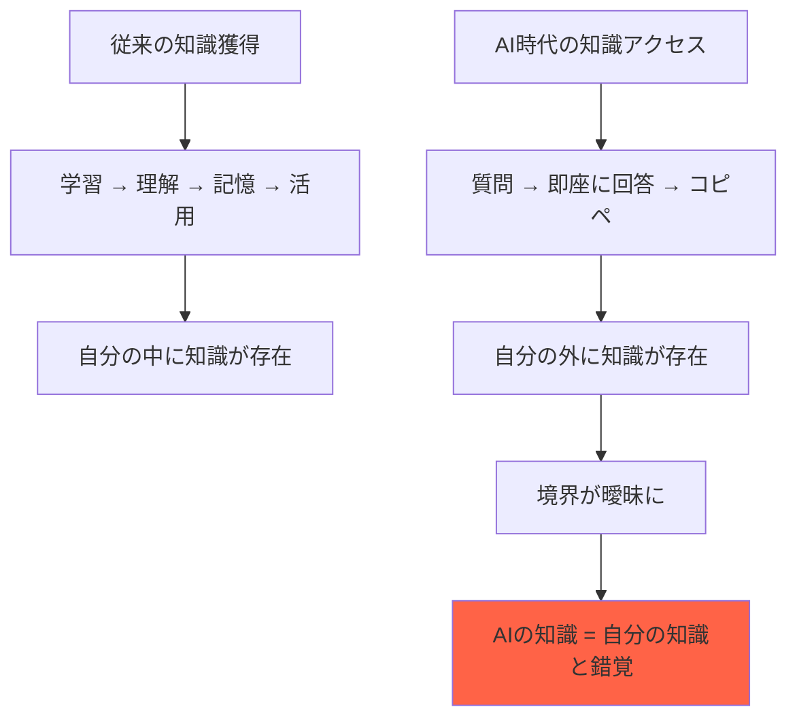

**心理学的メカニズム**:
- 人間の脳は「アクセスできる情報」と「所有している知識」を区別しにくい
- スマホの普及でも同様の現象（「Google効果」）が観察されている
- AIはさらにこの境界を曖昧にする

---

### 2. 承認欲求と社会的比較

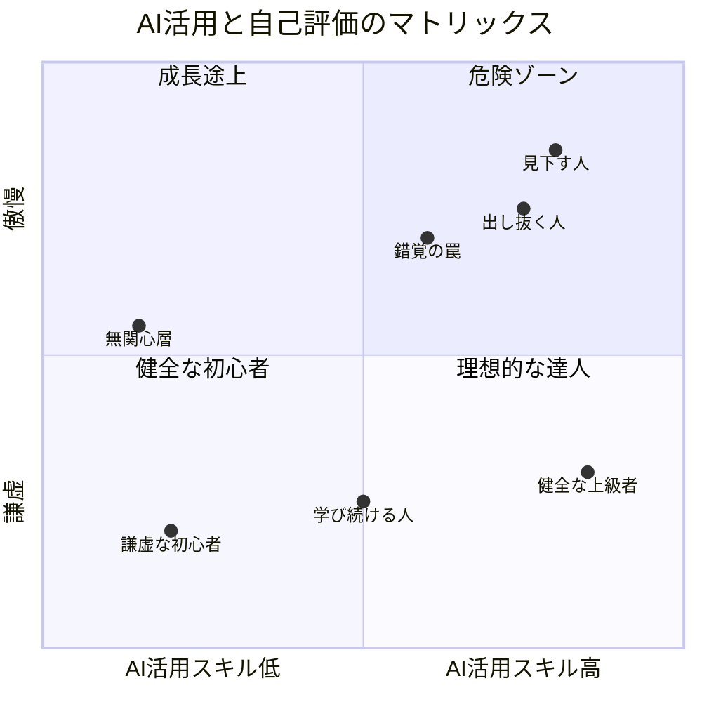

**なぜ見下しが生じるか**:
- AIを使える ＝ 新しいスキル → 優越感
- 使えない人との差 → 社会的比較で自己評価上昇
- SNS等での承認 → 行動の強化

---

### 3. ダニング・クルーガー効果の増幅

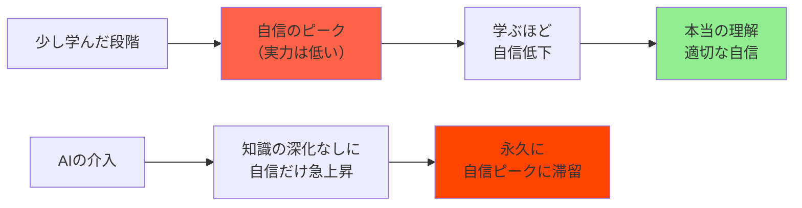

**AIが増幅するメカニズム**:
- 通常: 学習を深めると「自分が知らないこと」を認識 → 謙虚に
- AI時代: 学習なしに回答を得られる → 「知らないこと」を認識する機会がない
- 結果: ダニング・クルーガー効果の「自信ピーク」に固定される

---

## ⚠️ 3つの危険な心理パターン

### パターン1: 知性の錯覚

> 「AIを使える自分は賢い」

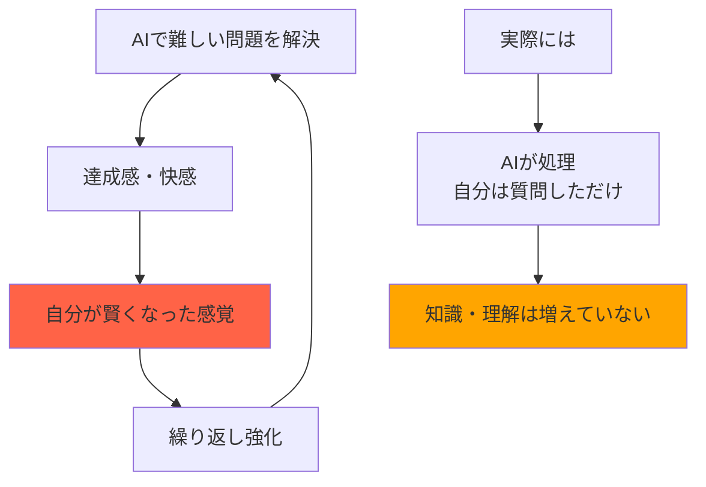

**危険な兆候**:
- 💬 「これくらい知ってて当然でしょ」
- 💬 「なんでこんな簡単なこともわからないの？」
- 💬 「AIに聞けばすぐわかるのに」

**現実**:
- AIの回答を読むことと、理解することは別
- 知識の「消費」と「所有」は異なる
- 応用・批判・創造には真の理解が必要

---

### パターン2: 優越感と見下し

> 「AI使えない人は時代遅れ」

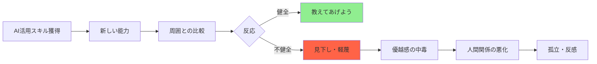

**危険な兆候**:
- 💬 「まだAI使ってないの？」（嘲笑気味に）
- 💬 「そんな非効率なことしてるんだ」
- 💬 「これからはAI使える人だけが生き残る」

**現実**:
- AIを使う/使わないは個人の選択
- 全ての場面でAIが最適解ではない
- 人間性・経験・直感にも価値がある

---

### パターン3: 出し抜き思考

> 「AIで他人より先に行ける」

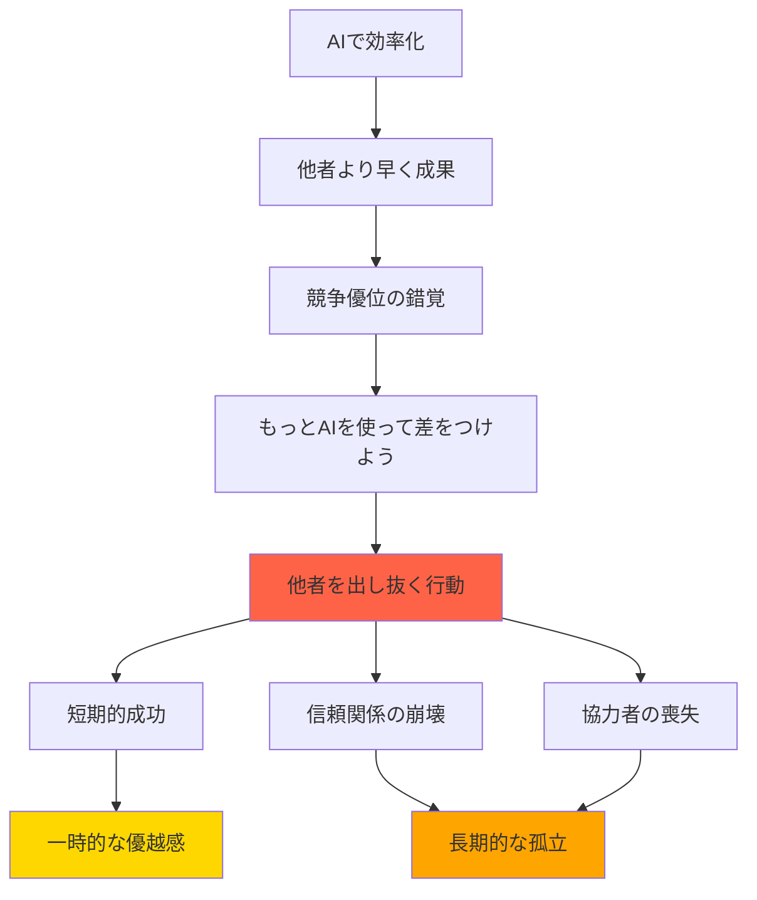

**危険な兆候**:
- 💬 「みんなが気づく前にやっておこう」
- 💬 「これ知ってたら有利になれる」
- 💬 「教えたら自分の価値が下がる」

**現実**:
- AIは誰でもアクセス可能 → 優位性は一時的
- 情報独占よりシェアが長期的に有利
- 出し抜きは信頼を失う最短ルート

---

## ✅ セルフチェックリスト

### 毎日の振り返り用

自分がこれらの罠に陥っていないか、定期的にチェックしましょう。

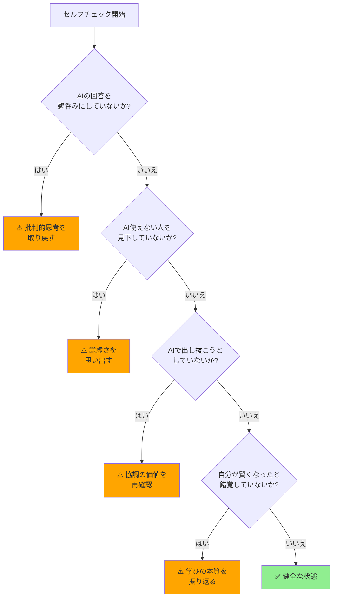

### チェック項目（正直に回答）

| 質問 | 危険 | 注意 | 健全 |
|------|------|------|------|
| AIの回答を何%信じるか | 90%以上 | 70-90% | 50-70%（検証する） |
| AI使えない人への感情 | 軽蔑 | 少し優越感 | 共感・サポート |
| AIの回答の出典を確認する頻度 | ほぼしない | たまに | 常に |
| 「AIがあれば何でもできる」と思うか | 強く思う | 少し思う | 道具に過ぎないと理解 |
| AIで得た知識を「自分の知識」と感じるか | 強く感じる | 少し感じる | 区別できる |

**自己診断**:
- 「危険」が2つ以上 → 🚨 要注意！意識的に修正を
- 「注意」が3つ以上 → ⚠️ 傾向あり。定期的に振り返りを
- ほとんど「健全」 → ✅ 良好。この状態を維持

---

## 🌱 健全なAI活用マインドセット

### 心がけるべき5つの原則

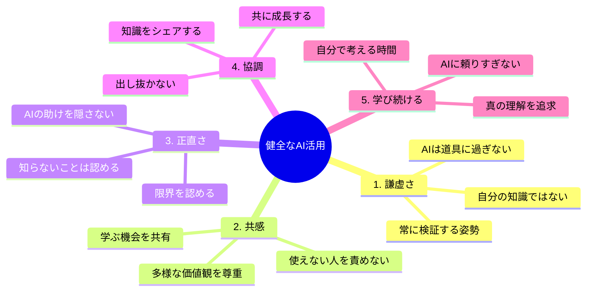

---

### 原則1: 謙虚さを保つ

**実践方法**:

| 場面 | NG行動 | OK行動 |
|------|--------|--------|
| AIで問題解決時 | 「こんなの簡単」 | 「AIのおかげで解決できた」 |
| 知らないことを聞かれた時 | 即座にAIで回答して専門家風 | 「調べてみます」と正直に |
| 他人のミスを見た時 | 「AIに聞けばわかるのに」 | 「もしよければ、こういう方法も」 |

**毎日の習慣**:
- 🔄 AIの回答を1つは必ず検証する
- 📝 「今日AIに教えてもらったこと」を記録（自分の知識と区別）
- 🤔 「これは本当に理解しているか？」と自問する

---

### 原則2: 共感を持つ

**理解すべきこと**:

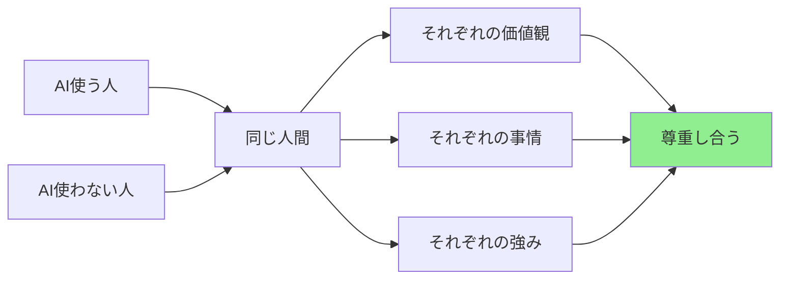

**実践方法**:
- AI使わない人の「理由」を聞く（押し付けない）
- 使い方を教える時は「上から」ではなく「横から」
- AIでできないこと（経験、直感、人間関係）の価値を認める

---

### 原則3: 正直であること

**実践方法**:

| 場面 | 不誠実 | 誠実 |
|------|--------|------|
| AIで作成した資料 | 自分で作ったように見せる | 「AIを活用して作成」と明記 |
| 会議での発言 | AIの受け売りを自分の意見として | 「AIで調べたところ」と前置き |
| 専門外の質問 | AIで即答して専門家のフリ | 「詳しくないですが、調べた限りでは」 |

---

### 原則4: 協調の精神

**出し抜きより共有が有利な理由**:

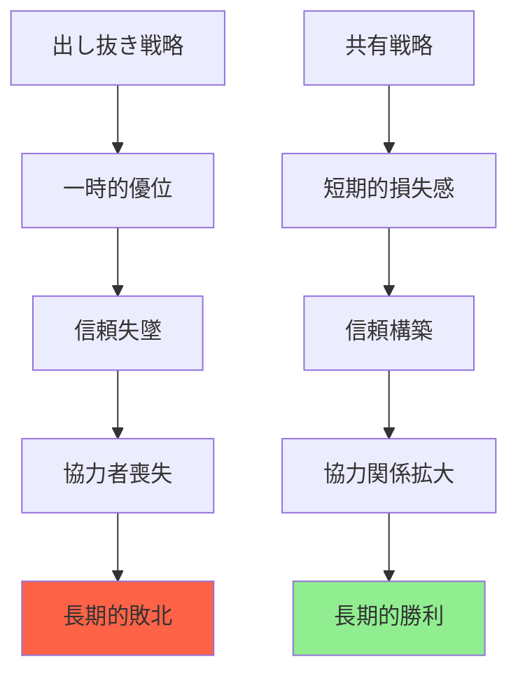

**実践方法**:
- 発見したAI活用法はチームで共有
- 他者の成功を喜ぶ
- 「自分だけ」ではなく「みんなで」成長

---

### 原則5: 学び続ける

**AIに頼りすぎないための習慣**:

| 習慣 | 効果 |
|------|------|
| **週1回、AIなしで考える時間** | 自分の思考力維持 |
| **AIの回答を自分で要約** | 理解の確認・深化 |
| **AIに聞く前に仮説を立てる** | 批判的思考の訓練 |
| **AIの間違いを見つける訓練** | 盲信防止 |
| **本を読む（AI解説ではなく原典）** | 深い理解の獲得 |

---

## 🎯 まとめ

### 覚えておくべき3つの真実

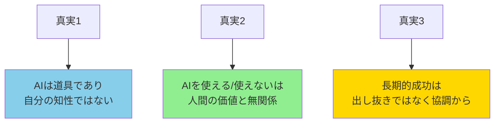

---

### 日々の心がけ

| 罠 | 対策 | 実践 |
|-----|------|------|
| **知性の錯覚** | AIと自分を区別 | 「これはAIの知識」と認識 |
| **優越感・見下し** | 謙虚さと共感 | 使えない人の立場で考える |
| **出し抜き思考** | 協調と共有 | 発見は積極的にシェア |

---

### 最終チェック

自分に問いかけるべき3つの質問:

1. **「この知識は本当に自分のものか？」**
   - AIで得た情報を自分で検証・理解したか

2. **「この優越感は正当か？」**
   - 道具を使えることは人間としての優劣ではない

3. **「この行動は長期的に良い結果をもたらすか？」**
   - 出し抜きより協調の方が持続的な成功につながる

---

### 🌟 最後に

AIは人類史上最も強力な知的ツールです。しかし、**ツールを使いこなすことと、人間として成長することは別物**です。

AIの力を借りながらも:
- 🧠 **自分で考える力**を失わない
- 🤝 **他者への敬意**を忘れない
- 📚 **学び続ける姿勢**を持ち続ける

これができる人が、AI時代に本当の意味で「賢い」人です。

**AIは鏡のようなもの**—使う人の心を映し出します。傲慢に使えば傲慢さが、謙虚に使えば謙虚さが増幅されます。

どちらの自分でありたいか、常に意識しましょう。

---

## 📚 関連ドキュメント

- [AIによる技術革新加速の全貌](./ai-accelerated-innovation-analysis.md)
- [AI・ロボット未来予測](./ai-robot-future-prediction.md)
- [IT革命 vs AI革命 徹底比較](./ai-vs-it-revolution-comparison.md)

---

*このレポートは、AI時代に健全な心理状態を保つための自己認識ガイドです。定期的に見返して、自分自身をチェックしましょう。*

**🧘 AIと共に成長し、人間としての謙虚さを忘れずに。**
