# AIの未来：AI搭載型ロボットの登場予測と技術的展望 🤖

*最終更新: 2025年11月9日*

## 📋 目次

1. [現在のAI技術状況](#現在のai技術状況)
2. [AI搭載型ロボットの定義](#ai搭載型ロボットの定義)
3. [技術的課題と進歩](#技術的課題と進歩)
4. [タイムライン予測](#タイムライン予測)
5. [社会への影響](#社会への影響)
6. [地域別発展状況](#地域別発展状況)
7. [投資・市場動向](#投資市場動向)
8. [倫理・規制課題](#倫理規制課題)
9. [未来シナリオ](#未来シナリオ)
10. [個人・企業への提言](#個人企業への提言)

## 🎯 現在のAI技術状況

### AI技術の成熟度マップ

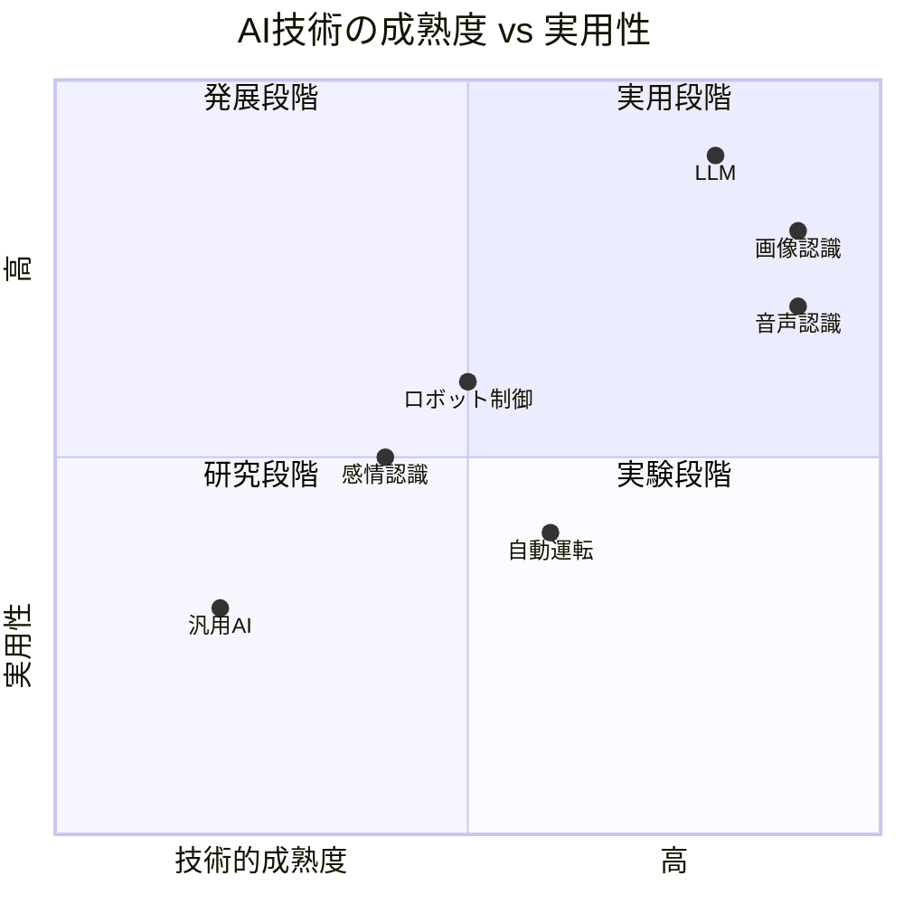

### 2024年11月時点の主要技術

| 技術分野 | 成熟度 | 主要企業 | 実用化レベル |
|---------|--------|----------|-------------|
| **大規模言語モデル** | 90% | OpenAI, Google, Anthropic | 商用化済み |
| **コンピュータビジョン** | 85% | NVIDIA, Tesla, Meta | 広く実用化 |
| **ロボット制御** | 60% | Boston Dynamics, Tesla | 限定的実用化 |
| **汎用人工知能** | 15% | 各社研究中 | 研究段階 |
| **脳-コンピュータインターフェース** | 25% | Neuralink, Meta | 実験段階 |

## 🤖 AI搭載型ロボットの定義

### レベル別分類

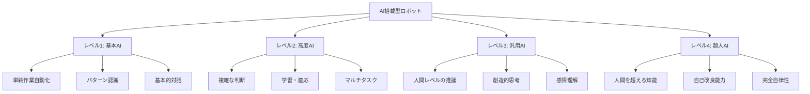

### 必要技術要素

1. **認知能力**
   - 視覚・聴覚・触覚の統合処理
   - 空間認識・物体認識
   - 状況理解・文脈把握

2. **運動制御**
   - 精密な動作制御
   - バランス・協調性
   - 複雑な作業実行

3. **コミュニケーション**
   - 自然言語処理
   - 非言語コミュニケーション
   - 感情認識・表現

4. **学習・適応**
   - リアルタイム学習
   - 経験の蓄積・活用
   - 新しい環境への適応

## 🔬 技術的課題と進歩

### 現在の主要課題

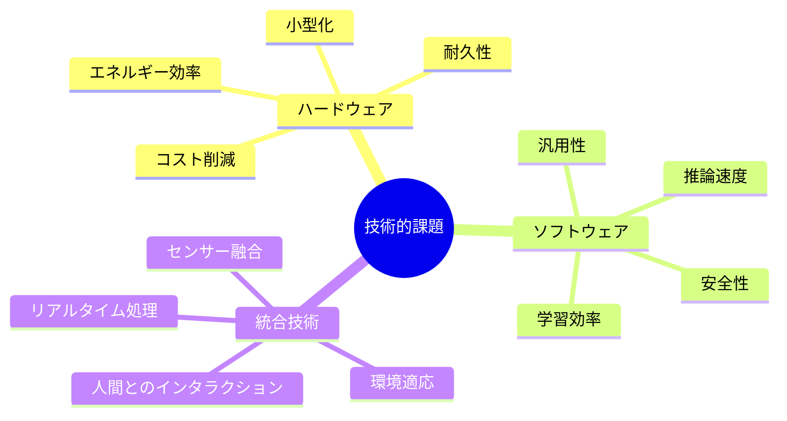

### 技術進歩の加速要因

1. **計算能力の向上**
   - 量子コンピューティング
   - 神経形態チップ
   - エッジコンピューティング

2. **データの蓄積**
   - マルチモーダルデータ
   - シミュレーション環境
   - 実世界データ収集

3. **アルゴリズムの進化**
   - トランスフォーマー改良
   - 強化学習の発展
   - フェデレーテッド学習

## ⏰ タイムライン予測

### 段階別実現予測

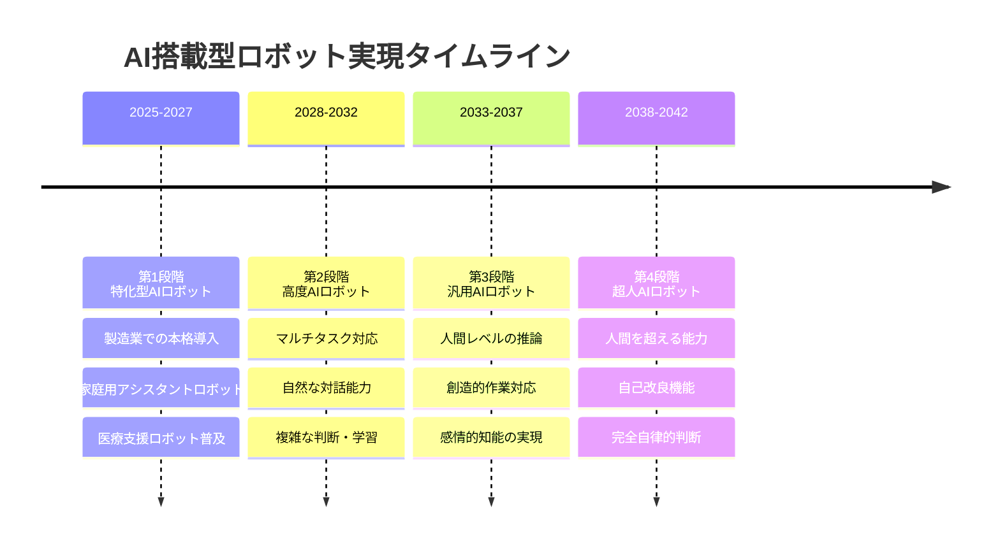

### 分野別実現予測

| 分野 | 2025年 | 2030年 | 2035年 | 2040年 |
|-----|-------|-------|-------|-------|
| **製造業** | 高度自動化 | 完全無人化工場 | 自己最適化製造 | 創造的製造 |
| **家庭** | 簡単な家事 | 包括的家事支援 | 家族パートナー | 完全生活支援 |
| **医療** | 手術支援 | 診断・治療 | 予防医学 | 再生医療 |
| **教育** | 学習支援 | 個別指導 | 創造的教育 | 知識創造 |
| **介護** | 基本介護 | 包括的ケア | 心理的支援 | 完全ケア |

## 🌍 社会への影響

### ポジティブな影響

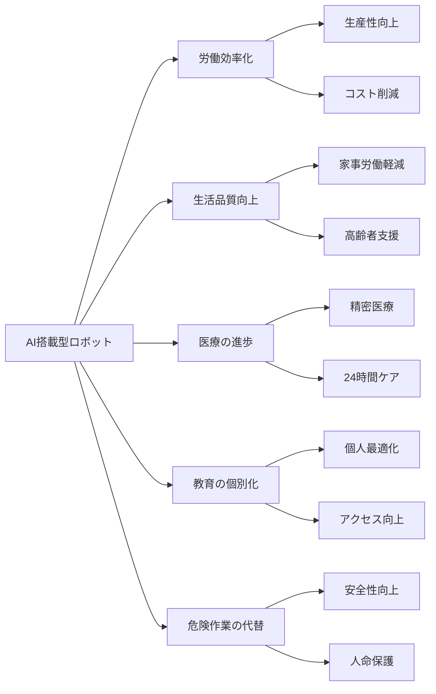

### 課題・リスク

1. **雇用への影響**
   - 大規模な職種消失
   - スキル格差の拡大
   - 経済格差の増大

2. **社会的影響**
   - 人間関係の変化
   - 依存性の増大
   - アイデンティティの混乱

3. **技術的リスク**
   - システム障害
   - サイバーセキュリティ
   - 制御不能な自己進化

### 対策・準備

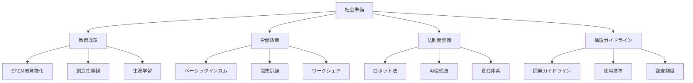

## 🌏 地域別発展状況

### 主要地域の取り組み

| 地域 | 強み | 戦略 | 主要企業/機関 |
|------|------|------|---------------|
| **米国** | AI研究・資金力 | 民間主導のイノベーション | OpenAI, Google, Tesla |
| **中国** | 製造・実装力 | 国家主導の大規模投資 | Baidu, ByteDance, DJI |
| **日本** | ロボット技術 | 高齢化対応・製造業 | SoftBank, Honda, Toyota |
| **欧州** | 倫理・規制 | 責任あるAI開発 | DeepMind, SAP |
| **韓国** | 半導体・5G | インフラ基盤整備 | Samsung, LG |

### 国際競争の構図

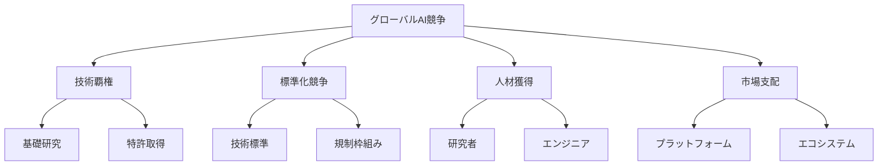

## 💰 投資・市場動向

### 市場規模予測

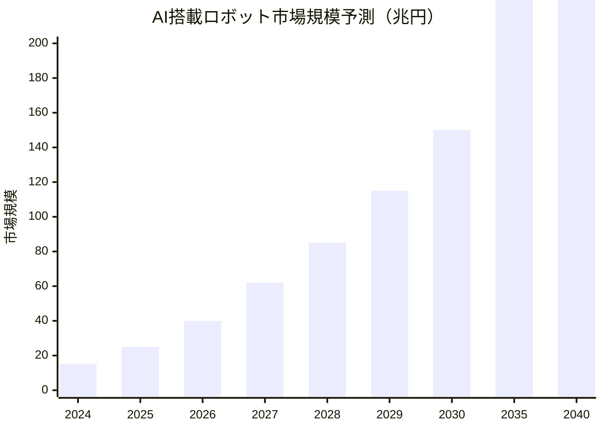

### 投資分野別分析

1. **産業用ロボット**: 30%
2. **サービスロボット**: 25%
3. **医療ロボット**: 20%
4. **軍事・セキュリティ**: 15%
5. **家庭用ロボット**: 10%

### 主要投資家・企業

- **VC投資**: Andreessen Horowitz, Sequoia Capital
- **企業投資**: Amazon, Microsoft, NVIDIA
- **政府投資**: DARPA, 中国政府, EU Horizon
- **個人投資家**: Elon Musk, Jeff Bezos

## ⚖️ 倫理・規制課題

### 主要な倫理課題

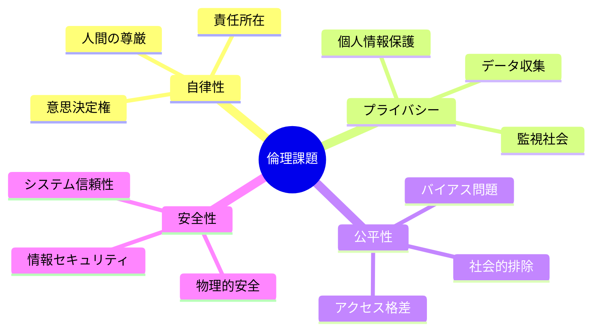

### 規制フレームワーク

1. **EU AI Act**: 包括的AI規制
2. **米国 AI Bill of Rights**: 権利保護
3. **中国AI規制**: 国家安全保障重視
4. **IEEE倫理標準**: 技術者向けガイドライン

### 今後の規制動向

- **国際標準化**: ISO/IEC標準策定
- **業界自主規制**: 企業倫理委員会
- **民間認証**: 安全性・倫理認証
- **国際協調**: G7・G20での議論

## 🔮 未来シナリオ

### シナリオ1: 楽観的未来（確率40%）

**2025-2030年**:
- 技術の順調な発展
- 適切な規制とガバナンス
- 社会の円滑な適応

**結果**:
- 生産性大幅向上
- 生活品質の向上
- 新たな雇用創出
- 人間とAIの協調

### シナリオ2: 混合的未来（確率45%）

**2025-2030年**:
- 技術発展に規制が追い付かない
- 社会的摩擦と適応の遅れ
- 地域・階層格差の拡大

**結果**:
- 局所的な成功と問題
- 段階的な社会変化
- 継続的な調整が必要

### シナリオ3: 悲観的未来（確率15%）

**2025-2030年**:
- 技術的な限界や挫折
- 重大な事故や悪用
- 強い社会的反発

**結果**:
- 技術発展の停滞
- 厳しい規制・制限
- 社会分裂のリスク

## 📝 個人・企業への提言

### 個人への提言

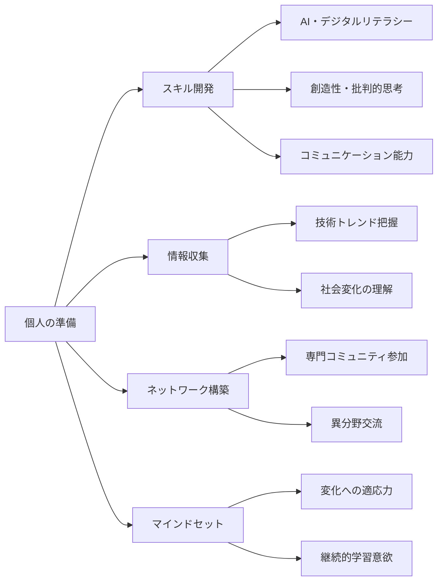

### 企業への提言

1. **戦略的投資**
   - AI・ロボット技術への段階的投資
   - 人材育成・リスキリング
   - パートナーシップ構築

2. **組織変革**
   - デジタル変革推進
   - 新しい働き方導入
   - イノベーション文化醸成

3. **リスク管理**
   - 倫理ガイドライン策定
   - セキュリティ対策強化
   - 規制対応体制構築

### 政府・社会への提言

1. **教育改革**
   - STEM教育の強化
   - 創造性・批判的思考重視
   - 生涯学習制度充実

2. **社会保障制度**
   - 労働移行支援
   - 新しい社会保障制度検討
   - デジタル格差解消

3. **国際協調**
   - グローバルガバナンス構築
   - 技術標準の国際調和
   - 倫理基準の共有

## 🎯 結論：AI搭載型ロボット実現への道のり

### 実現までの推定日数

**基準日**: 2025年11月9日

**レベル別実現予測**:
- **レベル1（基本AI）**: 約730日（2027年頃）
- **レベル2（高度AI）**: 約2,190日（2031年頃）
- **レベル3（汎用AI）**: 約3,650日（2035年頃）
- **レベル4（超人AI）**: 約5,475日（2040年頃）

### 成功の鍵

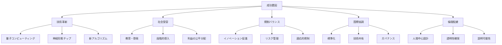

### 最終見解

AI搭載型ロボットの本格的な社会実装は、技術的には2030年代前半には可能になると予測されます。しかし、真の意味での「汎用AI搭載型ロボット」の実現には、技術的ブレークスルーだけでなく、社会的合意形成、倫理的枠組みの構築、国際的協調が不可欠です。

**重要なのは、この変化を恐れるのではなく、積極的に準備し、人間とAIが協調する未来を創造することです。**

---

*このドキュメントは技術的進歩と社会情勢に応じて継続的に更新されます。*