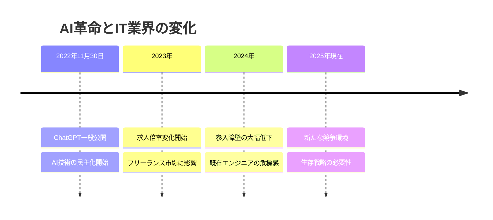
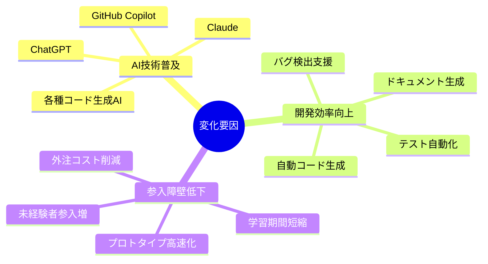
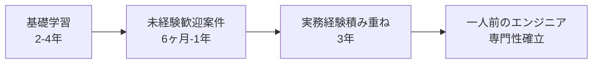
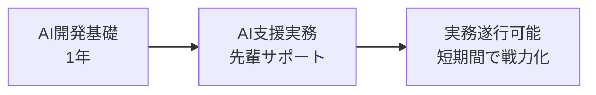
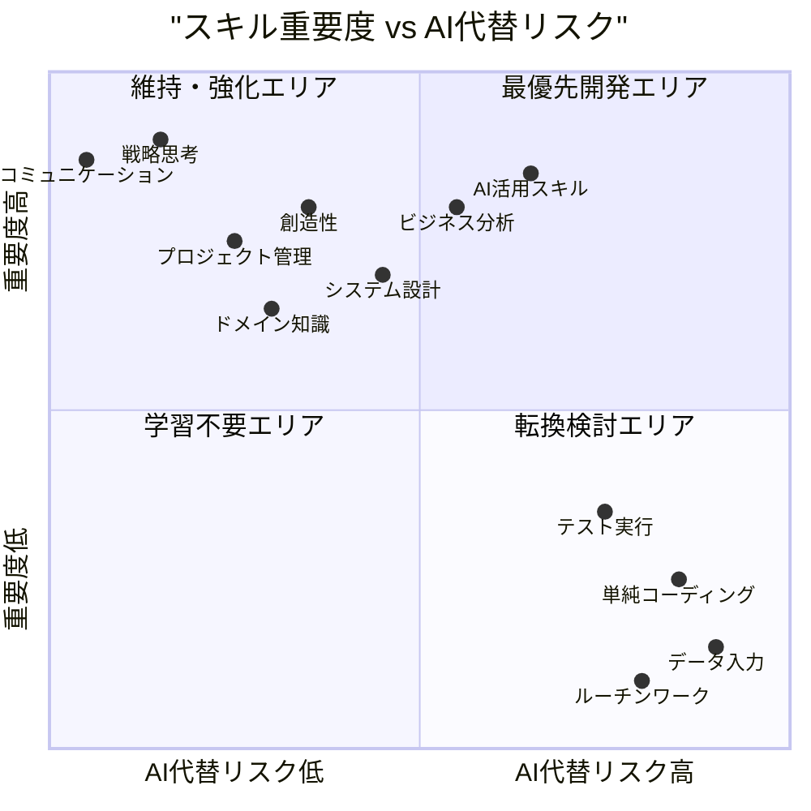
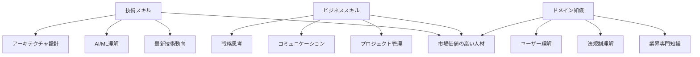

# AI時代の生存戦略：ITエンジニアの未来と行動指針 🤖

*最終更新: 2025年11月9日*

## 📋 目次
1. はじめに：この資料を作る理由
2. 急激な変化の現状分析
3. AIによる参入障壁の崩壊
4. 今後の世界的変化予測
5. 自分に必要な力・スキル
6. これからの行動指針
7. まとめ・次のステップ

---

## 1. はじめに：この資料を作る理由

- ChatGPTが一般公開された2022年11月30日以降、IT業界の求人倍率が「3弱→1強」へ急激に変化。
- たった3年でフリーランスITエンジニアの市場構造が激変し、将来への不安・危機感を強く感じた。
- AIによる世界的な変化を先読みし、「自分に何が必要か」「どう行動すべきか」を考察・整理するために本資料を作成。

---

## 2. 急激な変化の現状分析

### 📊 IT業界求人倍率の変化

**2022年以前**:
- 求人倍率: 約3倍（企業募集 > エンジニア応募）
- エンジニア不足が深刻
- 高い待遇・条件での採用競争

**2025年現在**:
- 求人倍率: 約1倍（企業募集 ≒ エンジニア応募）
- **企業の募集数**: 横ばい〜微減（開発効率向上による人員需要調整）
- **エンジニア応募数**: 大幅増加（参入障壁低下により新規参入者が急増）
- AI支援により開発効率向上
- 求められるスキルレベルの変化

### 🔄 変化の要因分析

---

## 3. AIによる参入障壁の崩壊

### 🎓 従来のエンジニア養成プロセス

**旧来のキャリアパス**:

**求められた期間**: 合計5-8年

### ⚡ AI時代の新しいパス

**現在のキャリアパス**:

**求められる期間**: 合計1-2年

### 📈 影響を受ける職種・分野

| 職種 | 影響度 | 理由 | 対策の緊急度 |
|------|--------|------|-------------|
| **コーダー・プログラマー** | 🔴 極大 | AI自動生成で代替可能 | 緊急 |
| **Web開発者** | 🟠 大 | テンプレート化・自動化進展 | 高 |
| **テスター** | 🟠 大 | 自動テスト・AI検証普及 | 高 |
| **システム設計者** | 🟡 中 | 経験・判断力が重要 | 中 |
| **プロジェクトマネージャー** | 🟢 小 | 人間的スキルが中心 | 低 |

---

## 4. 今後の世界的変化予測

### 🌍 短期予測（2025-2027年）

**技術面**:
- AI開発ツールのさらなる高度化
- ノーコード・ローコード領域の拡大
- リアルタイムコード生成の実用化

**社会面**:
- ITエンジニア供給過多の本格化
- 給与水準の調整・下落
- スキル要件の大幅変化

### 🚀 中期予測（2028-2032年）

**技術面**:
- AGI（汎用人工知能）の実用化開始
  - **※AGIとは**: 現在のAIは特定分野に特化（ChatGPTは文章、画像生成AIは画像など）だが、AGIは人間のように様々な分野で学習・思考・判断できる汎用的な知能
  - **影響例**: プログラミング、企画、管理、創作など、あらゆる知的作業を一つのAIが担当可能
- 自律的なシステム開発・保守
- 人間とAIの協働モデル確立

**社会面**:
- 職種の大規模再編成
- 新しい価値創造領域の出現
- 教育システムの根本的変革

### 💡 長期予測（2033年以降）

- 完全自動化された開発プロセス
- 人間は戦略・創造・倫理判断に特化
- 新たな職業・産業の創出

---

## 5. 自分に必要な力・スキル

### 🎯 AIに代替されにくいスキル

### 💪 強化すべき能力

**1. 戦略・企画力**
- ビジネス課題の本質理解
- 技術選択の意思決定
- ROI・投資効果の判断

**2. 創造・設計力**
- 新しいアイデアの創出
- システム全体のアーキテクチャ設計
- ユーザー体験の設計

**3. コミュニケーション力**
- ステークホルダーとの対話
- 技術的内容の分かりやすい説明
- チームマネジメント・リーダーシップ

**4. 学習・適応力**
- 新技術の迅速なキャッチアップ
- 変化に対する柔軟性
- 継続的なスキル更新

---

## 6. これからの行動指針

### 🎯 短期アクション（今すぐ開始）

**1. AIツールの習熟**
- [ ] ChatGPT、Claude等のLLMを日常業務に組み込み
- [ ] GitHub Copilot等のコード生成ツール活用
- [ ] AI支援開発フローの確立

**2. 付加価値の高い領域へのシフト**
- [ ] 要件定義・システム設計領域への進出
- [ ] ビジネス課題解決に直結する分野の学習
- [ ] ドメイン専門知識の習得
  - **※ドメイン知識とは**: 特定の業界・分野の専門知識（例：金融業界の法規制、医療システムの安全基準、製造業の工程管理、ECサイトのマーケティング手法等）
  - **重要性**: AIはコードは書けるが、業界特有の課題やルール、ベストプラクティスは理解できない

**3. ネットワーク・ブランディング強化**
- [ ] 技術ブログ・SNSでの情報発信
- [ ] 専門コミュニティへの参加
- [ ] 個人ブランドの確立

### 📈 中期戦略（1-3年）

**1. 複合スキルの獲得**

**2. ポジションの確立**
- スペシャリスト路線 vs ゼネラリスト路線の選択
  - **※スペシャリスト**: 特定分野の深い専門知識を持つ専門家（例：セキュリティ専門家、AI/ML エンジニア、アーキテクト等）
  - **※ゼネラリスト**: 幅広い分野の知識・スキルを持ち、全体を俯瞰できる人材（例：フルスタックエンジニア、技術コンサルタント、プロジェクトマネージャー等）
  - **AI時代の傾向**: どちらも価値があるが、単純なゼネラリストよりも「T字型人材」（一つの専門性＋幅広い知識）が最も重宝される
- 特定領域での第一人者を目指す
- 後進指導・メンタリング能力の開発

### 🚀 長期ビジョン（3年以降）

**1. 新しい価値創造領域での活動**
- AI倫理・ガバナンス分野
  - **※ガバナンスとは**: 組織や社会でAIを適切に管理・運用するための仕組み・ルール作り
  - **具体例**: AI利用の社内ガイドライン策定、バイアス対策、プライバシー保護、AI監査、リスク管理等
  - **重要性**: AI普及に伴い、適切な利用ルールやリスク管理の専門家が急速に求められている
- 人間とAIの協働設計
- 新技術の社会実装支援

**2. 起業・独立の検討**
- 自身の専門性を活かしたサービス提供
- AI時代の新しいビジネスモデル創出
- 教育・コンサルティング事業

---

## 7. まとめ・次のステップ

### 🎯 重要な認識

1. **変化は既に始まっている** - 待つのではなく今すぐ行動
2. **技術だけでは不十分** - ビジネス・コミュニケーション能力が鍵
3. **継続的学習が必須** - 一度身につけたスキルに安住は危険
4. **差別化が生存の条件** - 他者と同じことをしていては淘汰される

### 📋 今週から始める具体的アクション

**今週**:
- [ ] AI開発ツールの導入・設定
- [ ] 自己スキル棚卸し・分析
- [ ] 学習計画の策定

**今月**:
- [ ] AI支援開発プロセスの確立
- [ ] 専門分野の選定・学習開始
- [ ] 業界動向の定期的情報収集体制構築

**3ヶ月後**:
- [ ] 新しいスキルセットでの実績作り
- [ ] ネットワーク・ブランディング活動成果
- [ ] 次のキャリアステップの具体化

### 🌟 最終メッセージ

**この変化は脅威ではなく機会(大チャンス)**です。

AI時代に求められる新しいスキルを身につけ、変化を先取りすることで、より価値の高いエンジニアとして活躍できる可能性が広がります。

**現在の行動が、未来の自分を決める。**

---

*この資料は継続的に更新し、最新の業界動向と個人の成長を反映していきます。*
