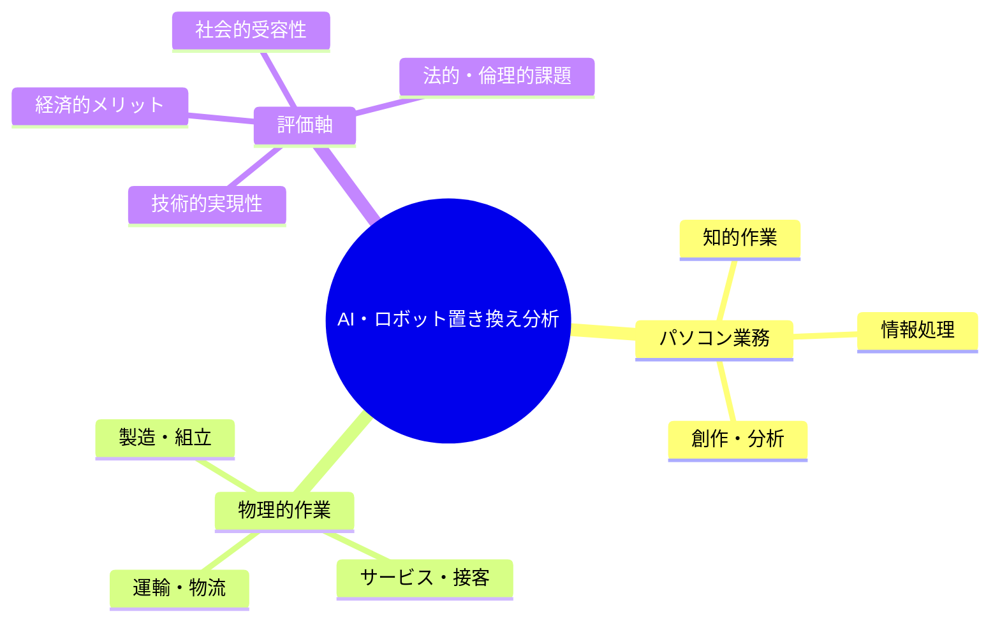
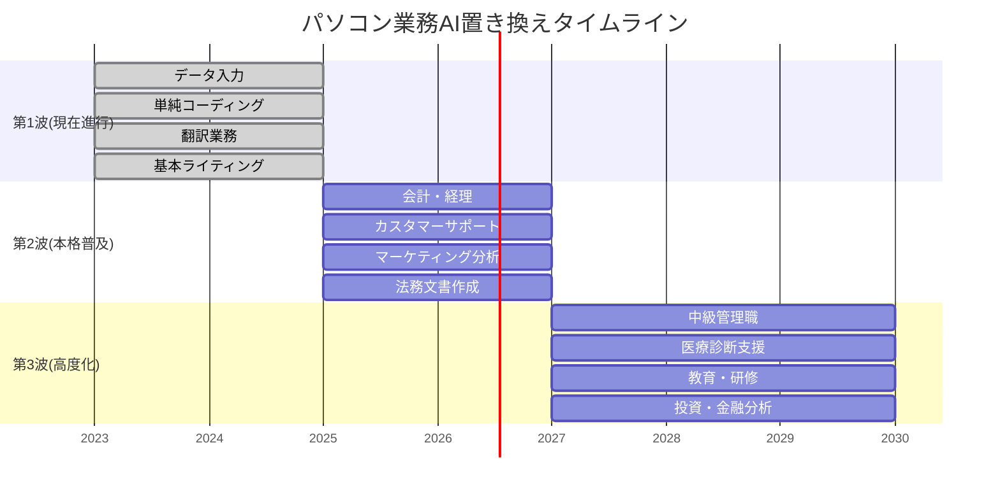
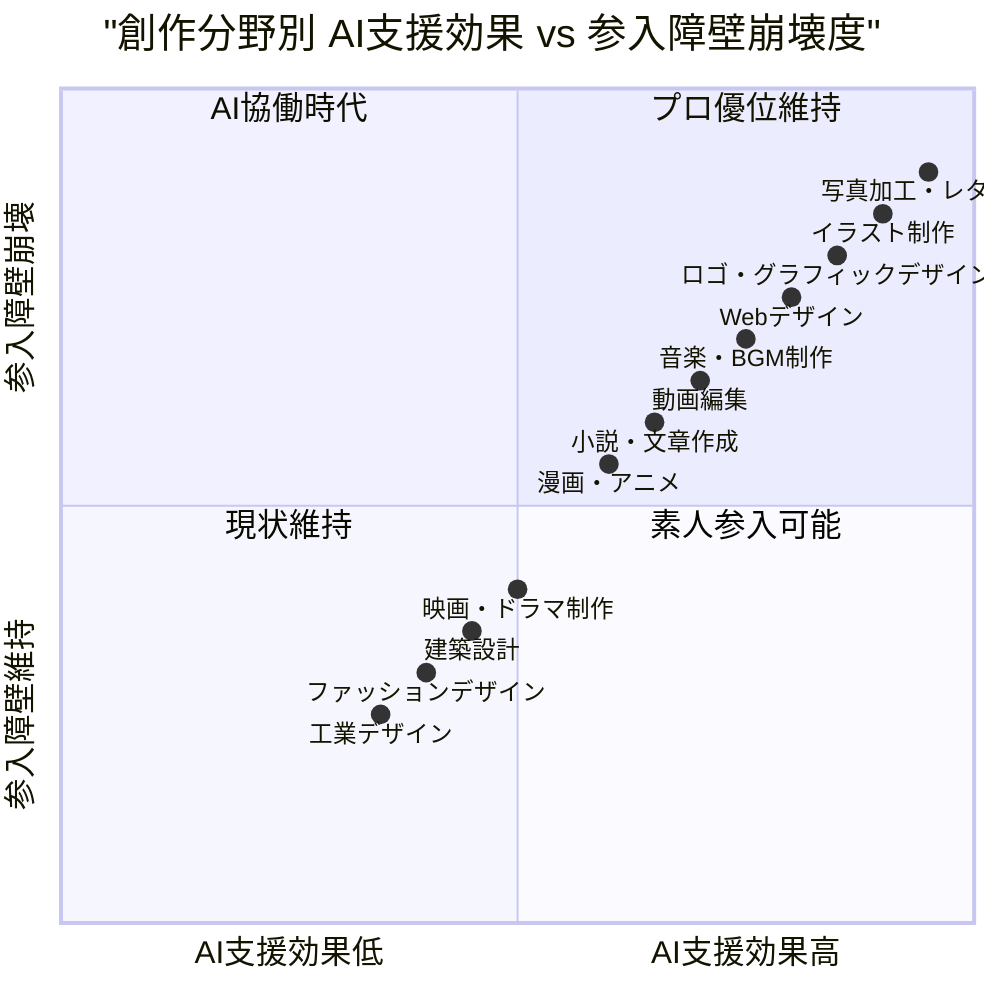
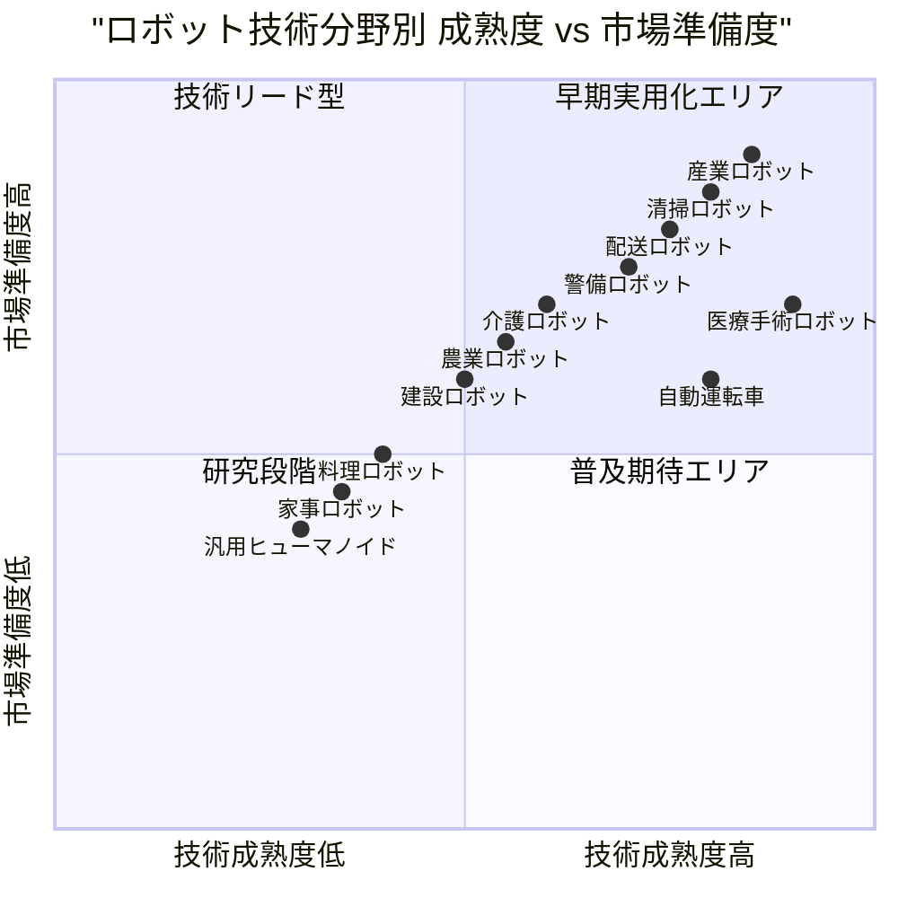
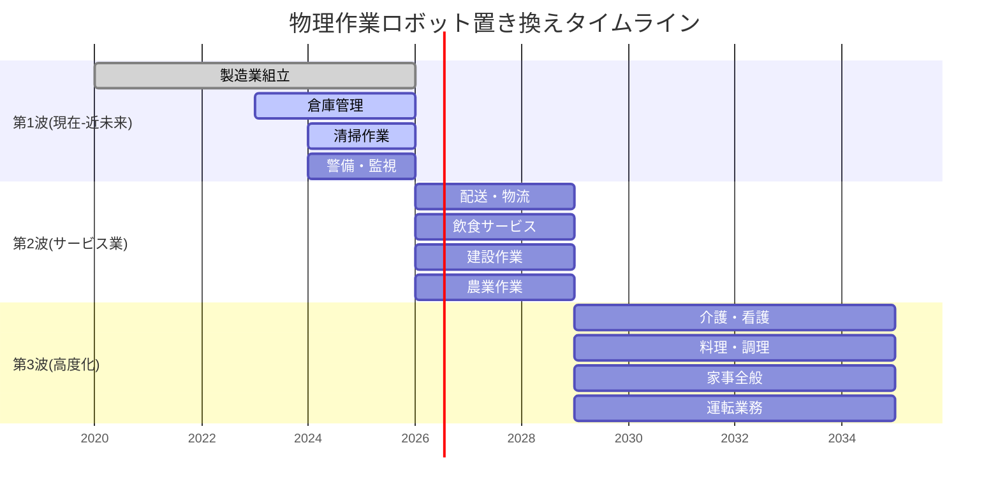
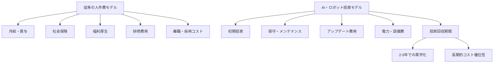
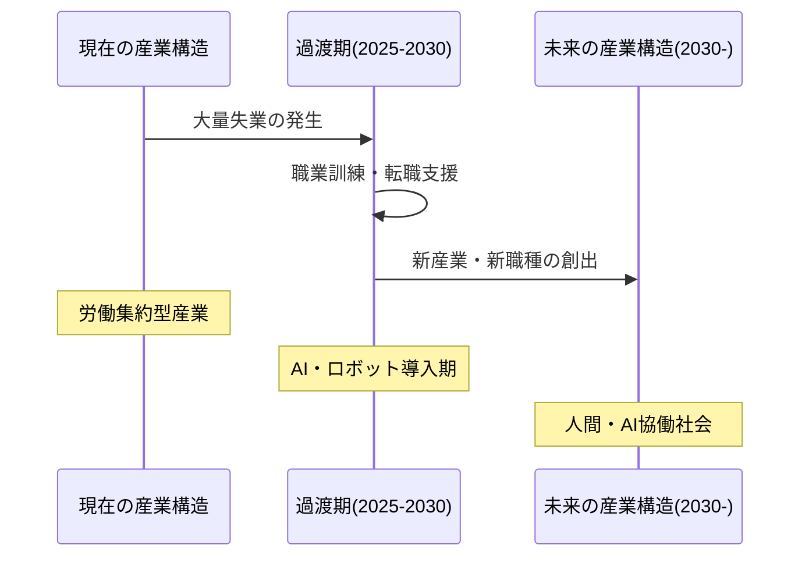
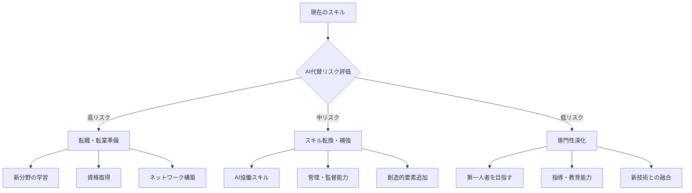

# AI・ロボット技術による職業置き換え予測レポート 🤖🦾

*最終更新: 2025年11月9日*

## 📋 目次
1. 概要・調査目的
2. パソコン業務のAI置き換え時系列予測
3. ロボット技術の現状分析
4. 物理的作業のロボット置き換え時系列予測
5. 経済・社会への影響分析
6. 対策・準備指針
7. まとめ・今後の展望

---

## 1. 概要・調査目的

### 🎯 調査の背景

AI技術の急速な発展により、従来「人間でなければできない」とされてきた作業の自動化が現実となっています。本レポートでは、パソコンを使った知的作業から物理的な作業まで、AI・ロボット技術による職業置き換えの時系列予測を行います。

### 📊 分析の枠組み

---

## 2. パソコン業務のAI置き換え時系列予測

### 🚀 第1波：既に開始（2023-2025年）

| 職種・業務 | 置き換え率 | AIの種類 | メリット | 課題 |
|------------|------------|----------|----------|------|
| **データ入力作業** | 90% | OCR + LLM | ・24時間稼働可能 ・ミス率大幅削減 ・コスト削減 | ・初期投資 ・例外処理対応 |
| **単純なコーディング** | 70% | GitHub Copilot等 | ・開発速度向上 ・バグ削減 ・コード品質向上 | ・複雑な設計は困難 ・セキュリティリスク |
| **翻訳業務** | 80% | DeepL, GPT-4等 | ・多言語対応 ・即座の翻訳 ・一貫性確保 | ・文脈理解の限界 ・専門用語対応 |
| **基本的なライティング** | 60% | ChatGPT, Claude等 | ・大量生産可能 ・SEO最適化 ・複数パターン生成 | ・創造性の限界 ・事実確認必要 |
| **イラスト・画像生成** | 75% | Midjourney, DALL-E等 | ・高速画像生成 ・スタイル統一 ・コスト大幅削減 | ・細かい指定困難 ・著作権問題 |
| **音声文字起こし** | 95% | Whisper, Rev等 | ・高精度認識 ・多言語対応 ・リアルタイム処理 | ・専門用語精度 ・方言対応 |
| **簡単な動画編集** | 65% | Runway ML等 | ・自動カット編集 ・エフェクト自動適用 ・時間短縮 | ・創造性不足 ・複雑編集困難 |
| **基本的な会計処理** | 85% | freee AI等 | ・自動仕訳 ・レシート読取 ・税務計算自動化 | ・複雑取引対応 ・責任問題 |
| **SNSコンテンツ作成** | 55% | Buffer AI等 | ・投稿自動生成 ・最適時間投稿 ・エンゲージメント予測 | ・ブランド一貫性 ・炎上リスク |
| **簡易な漫画制作** | 50% | ComicAI等 | ・背景自動生成 ・キャラ一貫性 ・コマ割り支援 | ・ストーリー性 ・独創性不足 |

### ⚡ 第2波：本格普及（2025-2027年）

| 職種・業務 | 置き換え率 | 技術進歩 | メリット | 課題 |
|------------|------------|----------|----------|------|
| **会計・経理業務** | 85% | 高度な数値処理AI | ・ミス率ほぼゼロ ・リアルタイム処理 ・法規制自動対応 | ・複雑な判断業務 ・責任の所在 |
| **カスタマーサポート** | 75% | 対話AI + 感情認識 | ・24時間対応 ・多言語対応 ・感情に配慮した応答 | ・複雑なクレーム対応 ・人間的な温かみ |
| **マーケティング分析** | 70% | ビッグデータAI | ・大量データ処理 ・パターン発見 ・予測精度向上 | ・戦略的思考 ・創造的企画 |
| **法務文書作成** | 60% | 法的知識AI | ・法律知識の網羅性 ・過去判例の活用 ・文書の一貫性 | ・複雑な法解釈 ・交渉スキル |
| **プロレベル画像・動画制作** | 80% | Sora, Pika等 | ・映画品質映像生成 ・コスト1/10削減 ・短時間制作 | ・監督の演出力 ・著作権クリア |
| **Web・UIデザイン** | 75% | Adobe Firefly等 | ・レスポンシブ自動対応 ・A/Bテスト自動化 ・UX最適化 | ・ブランド理解 ・ユーザー心理 |
| **音楽・BGM制作** | 70% | AIVA, Amper等 | ・ジャンル指定生成 ・著作権フリー ・感情に合わせた楽曲 | ・独創性 ・文化的背景理解 |
| **商品写真撮影・加工** | 85% | 3D生成AI | ・撮影不要 ・ライティング完璧 ・バリエーション無限 | ・実物との差異 ・質感表現 |
| **テクニカルライティング** | 80% | 専門文書AI | ・技術仕様書自動生成 ・多言語同時出力 ・更新自動化 | ・専門知識の深さ ・読み手への配慮 |
| **漫画のアシスタント業務** | 90% | ComicStudio AI | ・背景詳細描写 ・トーン貼り自動化 ・効果線生成 | ・作家性の統一 ・手描きの味 |

### 🌊 第3波：高度化（2027-2030年）

| 職種・業務 | 置き換え率 | 技術革新 | メリット | 課題 |
|------------|------------|----------|----------|------|
| **中級管理職業務** | 50% | AGI初期版 | ・客観的判断 ・データドリブン決定 ・バイアス排除 | ・リーダーシップ ・人間関係構築 |
| **医療診断支援** | 80% | 医療特化AI | ・高精度診断 ・見落とし防止 ・最新知識活用 | ・責任問題 ・患者との関係性 |
| **教育・研修** | 65% | 個別最適化AI | ・個人最適化学習 ・24時間対応 ・進捗の可視化 | ・モチベーション管理 ・人格形成支援 |
| **投資・金融分析** | 90% | 高度予測AI | ・リアルタイム分析 ・リスク管理 ・市場予測精度 | ・突発的変化対応 ・倫理的判断 |
| **映画・アニメ制作** | 70% | 次世代映像AI | ・全自動アニメ制作 ・声優音声合成 ・リアルタイム配信 | ・芸術性 ・人間の感動創出 |
| **ゲーム開発** | 75% | プロシージャル生成AI | ・無限コンテンツ生成 ・プレイヤー適応AI ・バグ自動修正 | ・ゲーム哲学 ・プレイヤー心理 |
| **建築設計・CAD** | 80% | 3D設計AI | ・法規制自動チェック ・構造計算自動化 ・最適化設計 | ・美的センス ・人間工学配慮 |
| **小説・脚本執筆** | 60% | 創作AI | ・プロット自動生成 ・キャラ一貫性維持 ・読者嗜好分析 | ・独創的世界観 ・深い人間洞察 |
| **マンガ原作・ストーリー** | 55% | ストーリーAI | ・読者データ分析 ・トレンド予測 ・多様な展開生成 | ・文化的感性 ・社会的メッセージ |
| **プロダクトデザイン** | 70% | 工業デザインAI | ・機能性最適化 ・材料選択自動化 ・製造コスト計算 | ・美的価値 ・ユーザー体験設計 |

---

## 2.5 創作分野での参入障壁崩壊と民主化

### 🎨 AIによる創作領域の変革

従来「プロの専売特許」とされてきた創作分野で、AI技術により素人でもプロレベルの作品制作が可能になっています。これは単純な「置き換え」ではなく、**参入障壁の完全崩壊**という新たな現象です。

### 📊 創作分野別 参入障壁崩壊度分析

### 🚀 参入障壁崩壊の段階的進行

#### **第1段階：ツール民主化（2023-2024年）**

| 分野 | 従来の習得期間 | AI支援後 | 変化の内容 |
|------|---------------|---------|------------|
| **イラスト制作** | 5-10年 | 1-3ヶ月 | プロンプト技術で高品質画像生成 |
| **写真レタッチ** | 2-3年 | 1週間 | ワンクリック高度加工・背景除去 |
| **ロゴデザイン** | 3-5年 | 1-2週間 | コンセプト入力で無限バリエーション |
| **音楽制作** | 3-7年 | 1ヶ月 | ジャンル・感情指定で楽曲自動生成 |

#### **第2段階：品質革命（2024-2026年）**

| 分野 | プロとの品質差 | 市場への影響 | 新たな競争軸 |
|------|---------------|-------------|-------------|
| **Webデザイン** | ほぼ同等 | 価格競争激化 | UX設計・戦略立案力 |
| **動画編集** | 90%同等 | 編集業界再編 | ストーリーテリング力 |
| **グラフィック広告** | 95%同等 | 制作費1/10 | ブランド理解・企画力 |
| **商品写真** | 同等以上 | 撮影スタジオ不要 | マーケティング視点 |

#### **第3段階：創造性の境界線（2026-2030年）**

**完全置き換えが困難な領域**：
- **独創的世界観**: 文化的背景・人生経験に基づく深い洞察
- **感情的共鳴**: 人間の心に響く本質的メッセージ
- **社会的価値**: 時代を読む力・社会問題への深い理解
- **ブランド戦略**: 企業文化・ターゲット心理の深層理解

### 💼 従来プロへの影響と対応戦略

#### **影響を受ける職種の変化**

| 職種 | 影響度 | 新たな役割 | 必要スキル転換 |
|------|--------|------------|----------------|
| **グラフィックデザイナー** | 🔴極大 | AIディレクター ブランド戦略家 | プロンプト技術 戦略思考 |
| **イラストレーター** | 🔴極大 | 世界観クリエイター キャラクター設計 | 独創性 物語性 |
| **写真家** | 🟠大 | ビジュアル演出家 体験デザイナー | 演出力 企画力 |
| **音楽プロデューサー** | 🟡中 | 音楽ディレクター アーティスト育成 | 人間性理解 市場分析 |
| **映像クリエイター** | 🟡中 | 体験設計者 ストーリーテラー | 物語構成 演出技術 |

#### **新たなビジネス機会**

**1. AI創作支援サービス**
- プロンプト作成代行
- AI作品のクオリティ向上サービス
- 業界特化型AI活用コンサルティング

**2. 人間×AI協働制作**
- AIで量産、人間で最終調整
- コンセプト・企画は人間、実制作はAI
- 複数AI組み合わせのディレクション

**3. 新しい創作体験**
- 一般人向けプロ品質制作体験
- AIアシスタント付き創作教育
- オーダーメイド作品の大衆化

### 🎯 創作分野で生き残る戦略

#### **短期戦略（1-2年）**
1. **AIツールマスター**: 主要AI創作ツールの習熟
2. **スペシャリティ確立**: AI が苦手な特定領域での専門性
3. **ディレクション能力**: 複数AIを組み合わせる統合力

#### **中長期戦略（3-10年）**
1. **世界観創造者**: 独創的な世界観・価値観の創出
2. **体験デザイナー**: ユーザー体験全体の設計
3. **文化的価値創造**: 社会・文化に影響を与える作品制作

### 🌟 創作分野の未来予測

**2030年の創作業界**：
- **量産型制作**: 95%がAI主導
- **オリジナル創作**: 人間が主導、AIが支援
- **新職種**: AI創作ディレクター、体験デザイナー、文化的価値創造者
- **市場構造**: 超高品質×低価格の実現、創作体験の民主化

**創作における人間の価値**：
- **感情の源泉**: 人生経験に基づく深い感情表現
- **文化的洞察**: 時代・社会への深い理解と批評
- **独創性**: 前例のない新しい価値観・世界観の創出
- **共感力**: 他者の心に響く本質的メッセージの創造

---

## 3. ロボット技術の現状分析

### 🏭 主要ロボットメーカーと技術動向

#### **Tesla（テスラ）- Optimus**
- **開発状況**: プロトタイプ段階、2024年デモ実施
- **技術特徴**: 
  - 身長: 173cm、体重: 57kg
  - 歩行速度: 8km/h
  - 持ち上げ能力: 20kg
- **予想価格**: $20,000-30,000（約300-450万円）
- **実用化予測**: 2026-2028年

#### **Boston Dynamics - Atlas・Spot**
- **開発状況**: 技術的には最先端、商用化進行中
- **技術特徴**:
  - 動的バランス制御
  - 複雑地形対応
  - 高い運動能力
- **予想価格**: $75,000-150,000（研究用）
- **実用化予測**: 特定用途で既に実用化

#### **Honda - ASIMO後継機**
- **開発状況**: 研究開発継続中
- **技術特徴**:
  - 安全性重視設計
  - 人間協働特化
- **実用化予測**: 2027-2029年

#### **中国系メーカー（Unitree、Agility等）**
- **開発状況**: 低価格帯で急速発展
- **予想価格**: $10,000-50,000
- **実用化予測**: 2025-2027年

### 📊 ロボット技術の成熟度分析

---

## 4. 物理的作業のロボット置き換え時系列予測

### 🏗️ 第1波：既存技術の拡張（2024-2026年）

| 職種・業務 | 置き換え率 | ロボット種類 | メリット | 課題 |
|------------|------------|--------------|----------|------|
| **製造業組立作業** | 60% | 産業ロボット改良版 | ・精度向上 ・24時間稼働 ・労災リスク削減 | ・初期投資高 ・柔軟性不足 |
| **倉庫管理・ピッキング** | 70% | 自律移動ロボット | ・効率化 ・ミス削減 ・在庫最適化 | ・複雑形状対応 ・システム統合 |
| **清掃作業** | 50% | 自律清掃ロボット | ・人件費削減 ・一定品質確保 ・危険場所対応 | ・複雑環境 ・メンテナンス |
| **警備・監視** | 40% | 警備ロボット | ・24時間監視 ・客観的判断 ・危険地域対応 | ・判断力不足 ・緊急時対応 |
| **工場検査業務** | 80% | 画像認識ロボット | ・不良品100%検出 ・検査時間短縮 ・基準統一化 | ・新製品対応 ・微細欠陥検出 |
| **溶接・塗装作業** | 75% | 専用作業ロボット | ・品質安定 ・有害環境対応 ・精密作業 | ・複雑形状対応 ・設備投資 |
| **パッケージング** | 85% | 梱包ロボット | ・高速処理 ・材料節約 ・形状適応 | ・壊れやすい商品 ・イレギュラー対応 |
| **機械メンテナンス** | 45% | 診断ロボット | ・予防保全 ・危険作業代替 ・データ蓄積 | ・複雑故障診断 ・経験的判断 |
| **単純運搬作業** | 90% | 搬送ロボット | ・重量物対応 ・ルート最適化 ・事故防止 | ・階段・段差 ・人との協働 |
| **農業収穫作業** | 35% | 収穫ロボット | ・24時間作業 ・収穫タイミング最適 ・人手不足解消 | ・作物識別精度 ・天候対応 |

### 🚛 第2波：サービス業への展開（2026-2029年）

| 職種・業務 | 置き換え率 | ロボット技術 | メリット | 課題 |
|------------|------------|--------------|----------|------|
| **配送・物流** | 80% | 自動配送ロボット | ・コスト削減 ・配送時間短縮 ・人手不足解消 | ・交通法規 ・盗難リスク |
| **飲食店サービス** | 45% | サービスロボット | ・人件費削減 ・衛生管理 ・多言語対応 | ・接客の温かみ ・複雑注文対応 |
| **建設現場作業** | 35% | 建設ロボット | ・危険作業代替 ・精度向上 ・人手不足対応 | ・環境適応性 ・高コスト |
| **農業作業** | 55% | 農業ロボット | ・効率化 ・品質安定 ・データ収集 | ・天候対応 ・作物多様性 |
| **小売店レジ・接客** | 70% | 接客ロボット | ・多言語対応 ・商品知識完璧 ・待ち時間削減 | ・人間的温かみ ・複雑相談対応 |
| **ホテル客室清掃** | 85% | 清掃ロボット | ・清掃品質統一 ・感染リスク削減 ・24時間対応 | ・細かい気配り ・トラブル対応 |
| **駐車場管理** | 95% | 自動駐車システム | ・スペース効率化 ・事故防止 ・料金自動化 | ・システム故障 ・特殊車両対応 |
| **病院内搬送** | 60% | 医療搬送ロボット | ・感染防止 ・正確な配送 ・記録自動化 | ・緊急時対応 ・患者との接触 |
| **工事現場測量** | 75% | ドローン測量 | ・危険地域測量 ・高精度3D計測 ・時間短縮 | ・天候制約 ・法規制対応 |
| **廃棄物分別・処理** | 80% | 分別ロボット | ・分別精度向上 ・有害物質対応 ・リサイクル率向上 | ・複雑物質判定 ・汚れ対応 |

### 🏥 第3波：高度サービス（2029-2035年）

| 職種・業務 | 置き換え率 | 先進ロボット | メリット | 課題 |
|------------|------------|--------------|----------|------|
| **介護・看護補助** | 60% | 介護ロボット | ・力仕事代替 ・感染リスク削減 ・記録自動化 | ・心理的ケア ・複雑判断 |
| **料理・調理** | 50% | 調理ロボット | ・衛生管理 ・標準化 ・材料最適化 | ・創作性 ・味覚判断 |
| **家事全般** | 40% | 汎用家事ロボット | ・時間創出 ・標準品質 ・高齢者支援 | ・高価格 ・プライバシー |
| **運転業務** | 90% | 完全自動運転 | ・事故削減 ・効率化 ・高齢者移動支援 | ・法的責任 ・システム信頼性 |
| **外科手術補助** | 70% | 手術ロボット | ・精密手術 ・疲労なし ・遠隔手術対応 | ・責任問題 ・緊急判断 |
| **美容・理髪** | 35% | 美容ロボット | ・技術統一 ・感染防止 ・24時間営業 | ・個性対応 ・コミュニケーション |
| **ペット世話・散歩** | 55% | ペットケアロボット | ・定期的世話 ・健康管理 ・飼い主不在対応 | ・動物との絆 ・緊急時判断 |
| **教育・保育補助** | 45% | 教育ロボット | ・個別対応 ・無限の忍耐 ・学習記録分析 | ・人格形成 ・感情的ケア |
| **芸術・工芸制作** | 30% | 創作ロボット | ・精密加工 ・材料特性活用 ・量産可能 | ・芸術性 ・文化的価値 |
| **スポーツ指導・審判** | 40% | スポーツAI | ・客観的判定 ・データ分析指導 ・怪我予防 | ・精神的指導 ・臨機応変性 |

---

## 5. 経済・社会への影響分析

### 💰 経済的インパクト

#### **コスト構造の変化**

#### **投資回収期間の試算**

| 業務分野 | 人件費(年間) | ロボット投資 | 運用費(年間) | 回収期間 |
|----------|-------------|-------------|-------------|----------|
| **製造業作業員** | 400万円 | 1,000万円 | 100万円 | 3.3年 |
| **事務作業** | 350万円 | 200万円 | 50万円 | 0.7年 |
| **配送業務** | 300万円 | 500万円 | 80万円 | 2.3年 |
| **介護補助** | 320万円 | 800万円 | 120万円 | 4.0年 |

### 🏢 産業構造の変化

### 👥 雇用への影響

#### **影響を受ける労働者数（日本）**

| 分野 | 現在の従事者数 | 2030年予測削減数 | 削減率 |
|------|---------------|-----------------|--------|
| **製造業** | 1,000万人 | 400万人 | 40% |
| **事務職** | 1,200万人 | 600万人 | 50% |
| **運輸・物流** | 350万人 | 200万人 | 57% |
| **小売・サービス** | 1,500万人 | 450万人 | 30% |
| **合計** | 4,050万人 | 1,650万人 | 41% |

#### **新たに創出される職種**

- **AI・ロボット関連**：エンジニア、オペレーター、メンテナンス技術者
- **人間性重視職種**：カウンセラー、創作活動、エンターテイメント
- **監督・管理職**：AI監査、品質管理、戦略立案
- **教育・研修**：デジタル教育、職業訓練、スキル開発

---

## 6. 対策・準備指針

### 🎯 個人レベルの対策

#### **短期対策（今すぐ開始）**

1. **AIツールの習熟**
   - [ ] 業務でのAI活用スキル習得
   - [ ] 自動化ツールの理解・活用
   - [ ] データ分析スキルの向上

2. **人間特有スキルの強化**
   - [ ] コミュニケーション能力
   - [ ] 創造性・企画力
   - [ ] 批判的思考力
   - [ ] 感情知能（EQ）の向上

3. **専門性の深化**
   - [ ] AIが代替困難な分野への特化
   - [ ] 複数分野の組み合わせスキル
   - [ ] 業界特有の深い知識習得

#### **中長期戦略（3-10年）**

### 🏛️ 社会・政策レベルの対策

#### **教育制度の変革**
- **STEM教育の強化**：科学・技術・工学・数学
- **創造性教育**：アート、デザイン、音楽
- **社会性教育**：コミュニケーション、協働、リーダーシップ
- **生涯学習システム**：継続的なスキルアップデート

#### **社会保障制度の見直し**
- **ベーシックインカム**：AI時代の所得保障
- **職業訓練支援**：転職・転業のための公的支援
- **雇用保険制度**：長期失業への対応

#### **法的・倫理的枠組み**
- **AI・ロボット規制**：安全性・倫理基準
- **データプライバシー**：個人情報保護
- **労働法の見直し**：人間・AI協働の法的枠組み

---

## 7. まとめ・今後の展望

### 🔮 2035年の世界予測

**働き方の変化**：
- 週休3日制が一般化
- リモートワーク・フレックスが標準
- プロジェクトベースの働き方が主流
- 人間は創造性・戦略・対人関係に特化

**産業構造**：
- 製造業は完全自動化
- サービス業は人間・AI協働
- 新産業（AI倫理、体験デザイン等）が拡大
- 地方創生・分散型経済の実現

**社会システム**：
- 教育は個別最適化・生涯学習
- 医療は予防・個別化が中心
- 都市はスマートシティ化
- エネルギーは完全再生可能化

### 🎯 重要な認識

1. **変化は避けられない** - 準備するか、取り残されるかの選択
2. **人間の価値は消えない** - 新しい価値創造の形が生まれる
3. **適応力が生存の鍵** - 継続的学習と柔軟性が必須
4. **協働が新しい形** - 人間 vs AI ではなく、人間 + AI

### 📋 今すぐ始めるべきアクション

**今週**：
- [ ] 自分の業務のAI代替リスク評価
- [ ] AI活用ツールの調査・試用開始
- [ ] 業界動向・技術トレンドの情報収集

**今月**：
- [ ] スキル転換計画の策定
- [ ] 学習・資格取得の開始
- [ ] 専門コミュニティへの参加

**3ヶ月後**：
- [ ] 新しいスキルでの実績作り
- [ ] ネットワーク・ブランド構築
- [ ] キャリア戦略の具体化

---

### 🌟 最終メッセージ

**この大変革期は、人類史上最大のチャンスでもあります。**

AI・ロボット技術によって、人間は創造性・感情・洞察力など、真に人間らしい能力を発揮する時代になります。変化を恐れるのではなく、新しい可能性を見つけ、準備し、挑戦することで、より豊かで創造的な未来を築くことができるでしょう。

**未来は予測するものではなく、創造するものです。**

---

*このレポートは技術・市場の進歩に応じて継続的に更新し、最新の予測と対策を提供していきます。*