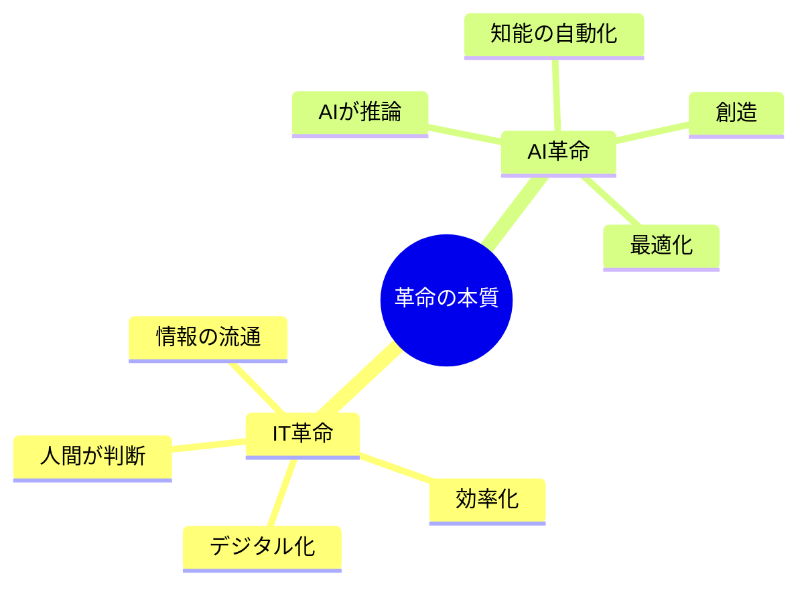
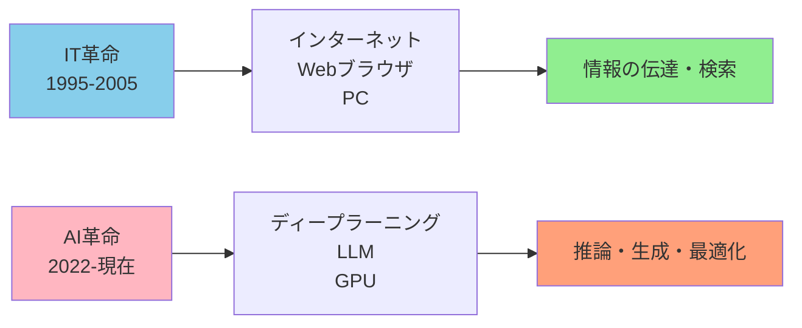
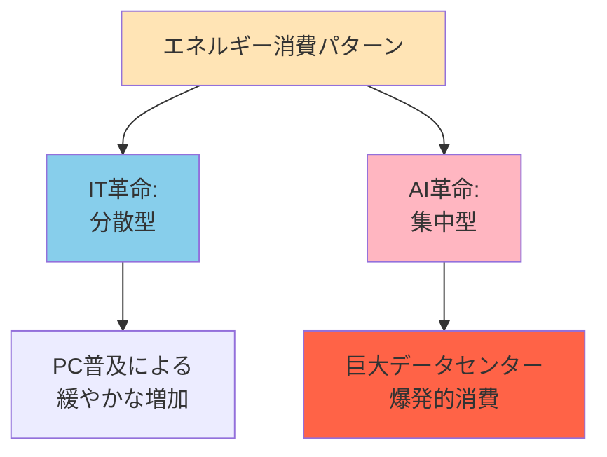
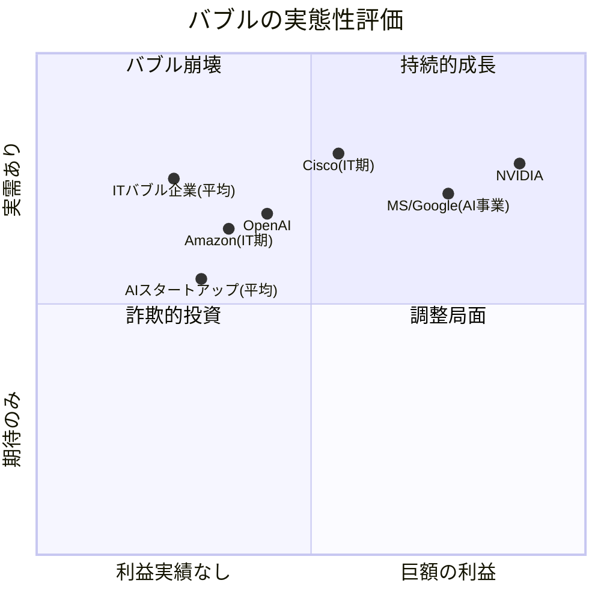
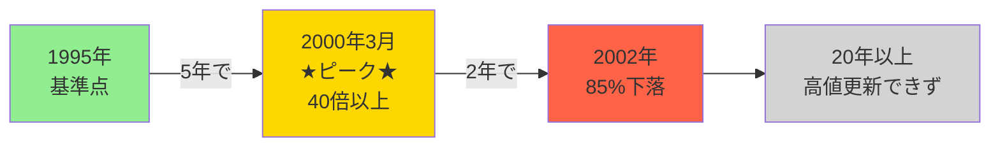
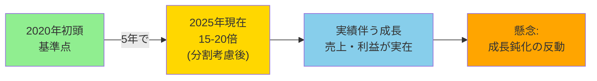
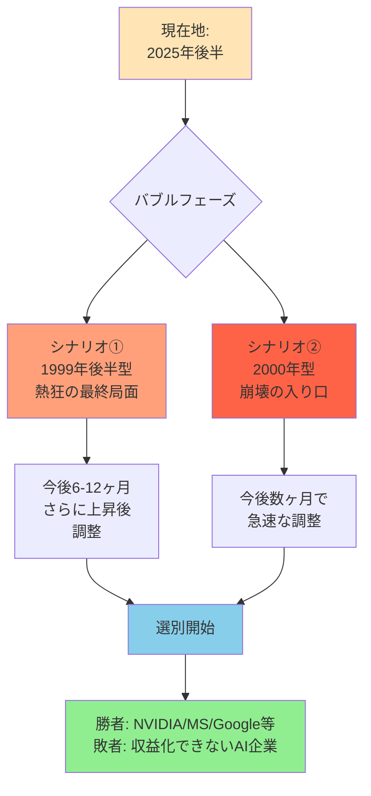
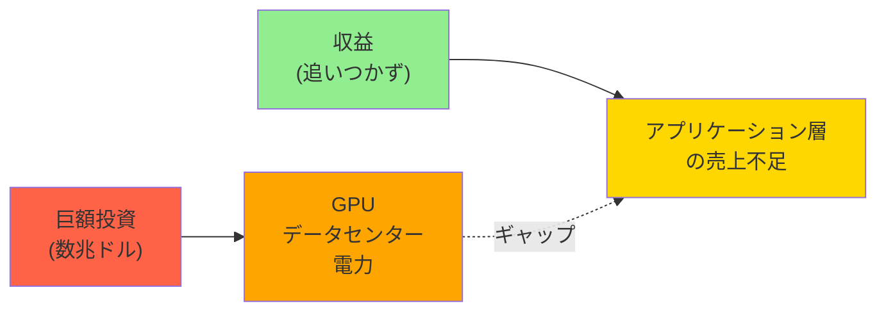
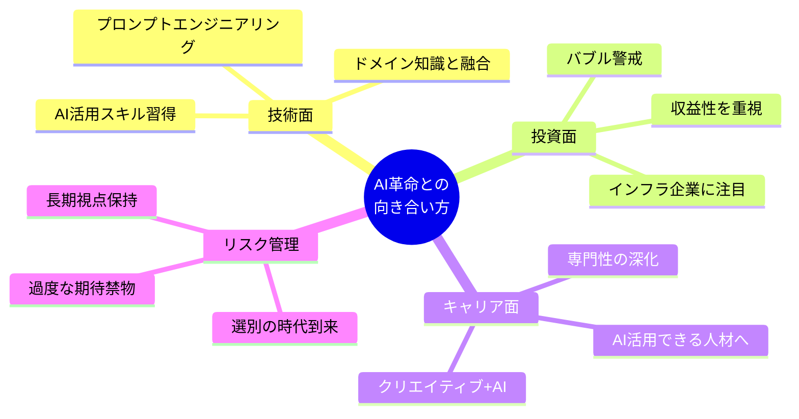

# IT革命 vs AI革命 徹底比較 🚀

*最終更新: 2025年11月22日*

## 📋 目次

- [概要](#-概要)
- [革命の本質比較](#-革命の本質比較)
- [詳細比較マトリックス](#-詳細比較マトリックス)
- [バブル構造の比較](#-バブル構造の比較)
- [代表銘柄の軌跡](#-代表銘柄の軌跡)
- [現在のフェーズ分析](#-現在のフェーズ分析)
- [まとめと展望](#-まとめと展望)

---

## 🎯 概要

IT革命（インターネット革命）とAI革命を、技術・経済・社会的影響の視点から徹底比較します。それぞれのバブルの特徴、代表銘柄の軌跡、そして現在どのフェーズにいるのかを分析します。

### 💡 核心的な違い

---

## 🔍 革命の本質比較

### 技術基盤の違い

### 人間の役割の変化

| 要素 | IT革命 | AI革命 |
|------|--------|--------|
| 👤 **人間の役割** | 情報を入力し、**判断する** | AIに指示し、結果を**監督・評価する** |
| 💻 **インターフェース** | キーボード、マウス、GUI | 自然言語、音声、マルチモーダル |
| 📊 **情報の流れ** | 1対多 → 多対多 (SNS) | 多対個 → 個対AI (パーソナライズ) |

---

## 📊 詳細比較マトリックス

### 🔧 技術・インフラ

| 視点 | IT革命 | AI革命 |
|------|--------|--------|
| **核心技術** | インターネット、Webブラウザ、PC | ディープラーニング、LLM、GPU |
| **インフラ** | 光ファイバー、サーバー、ルーター | データセンター、H100 GPU、電力 |
| **ボトルネック** | 通信速度、ストレージ容量 | 計算能力(FLOPS)、電力供給、学習データ |
| **データ処理** | DB蓄積・検索 (SQL) | パターン認識、ベクトル化 (Vector DB) |
| **開発速度** | ムーアの法則 (18ヶ月で2倍) | AIの法則 (数ヶ月で劇的向上) |

### 💼 ビジネス・経済

| 視点 | IT革命 | AI革命 |
|------|--------|--------|
| **主役企業** | MS, Intel, Cisco, Amazon, Yahoo | NVIDIA, OpenAI, MS, Google, Meta, TSMC |
| **キラーアプリ** | メール、Web検索、EC | ChatGPT、画像生成、Copilot |
| **収益モデル** | 広告、ライセンス販売、サブスク | API利用料、トークン課金、生産性投資 |
| **産業影響** | 広告、小売、金融、メディア | 医療、法務、創作、製造、全ホワイトカラー |
| **勝者の条件** | プラットフォーム支配 (OS/検索) | 計算資源とデータ支配 |

### 👥 社会・雇用

| 視点 | IT革命 | AI革命 |
|------|--------|--------|
| **必要スキル** | プログラミング、ITリテラシー | プロンプトエンジニアリング、ドメイン知識 |
| **雇用影響** | 事務作業効率化、IT職創出 | 専門職・クリエイティブ職の代替・拡張 |
| **社会の恐怖** | デジタル・ディバイド (格差) | 人類滅亡シナリオ、大量失業 |
| **普及速度** | 数年〜10年単位 | 数ヶ月〜1年単位で爆発的 |

### 🔐 セキュリティ・規制

| 視点 | IT革命 | AI革命 |
|------|--------|--------|
| **脅威** | ウイルス、ハッキング、情報漏洩 | ディープフェイク、プロンプトインジェクション |
| **規制焦点** | 著作権、独占禁止法、プライバシー | 倫理、安全性、偽情報、自律兵器 |

### ⚡ エネルギー

---

## 💰 バブル構造の比較

### 主要指標比較

| 項目 | ITバブル (ドットコム) | AIバブル |
|------|---------------------|----------|
| **期間** | 1995年〜2000年 (約5年) | 2022年末〜2025年現在 (進行中) |
| **きっかけ** | Windows 95、Netscape上場 | ChatGPT公開 (2022.11) |
| **市場心理** | ".com"で株価高騰 | "AI"で資金調達成功 |
| **PER倍率** | 利益なしでもPER 100倍超 | 実益伴うがPER 60-80倍 |
| **主役セクター** | 通信機器 (Cisco)、Web企業 | 半導体 (NVIDIA)、クラウド |
| **崩壊要因** | FRB利上げ、業績失望 | 電力不足、収益化遅れ懸念 |

### バブルの質的違い

---

## 📈 代表銘柄の軌跡

### 🌐 ITバブル代表: Cisco Systems

**「インターネットの配管工」** - 現在のNVIDIAに相当する立ち位置

**教訓**: 技術は本物でも、株価が高すぎた

### 🤖 AIバブル代表: NVIDIA

**「AIのつるはしを売る企業」** - 圧倒的独占状態

**特徴**: ITバブルと異なり、**実績（売上・利益）が伴っている**

### 比較サマリー

| 要素 | Cisco (IT期) | NVIDIA (AI期) |
|------|-------------|---------------|
| **ピーク倍率** | 40倍以上 (5年) | 15-20倍 (5年) |
| **利益実態** | あり (ただし過大評価) | あり (圧倒的) |
| **独占性** | 高い (ルーター市場) | 極めて高い (AI GPU 80%超) |
| **崩壊後** | 85%下落、長期低迷 | 未定 (進行中) |
| **最大リスク** | 競合出現、需要鈍化 | 成長鈍化、過剰投資の反動 |

---

## 🎯 現在のフェーズ分析

### 2025年11月時点の位置づけ

### 🚨 2025年の最大リスク

**「収益性のギャップ」問題**

---

## 🎯 まとめと展望

### 💡 重要な洞察

1. **技術は本物、株価は?**
   - ITバブル: 技術は定着、多くの企業は消滅
   - AIバブル: AI技術は確実に定着、企業の選別はこれから

2. **実績の差**
   - ITバブル: 利益のない企業が乱立
   - AIバブル: NVIDIA等は巨額利益を計上中

3. **投資と収益のギャップ**
   - 数兆ドルのGPU/データセンター投資
   - アプリケーション層の収益化が追いつかない
   - このギャップが2025-2026年の焦点

### 📌 投資家・ビジネスパーソンへの示唆

### 🔮 今後の予測

| タイムライン | 予測 |
|------------|------|
| **2025-2026** | 選別フェーズ突入。収益化できない企業の淘汰開始 |
| **2027-2030** | 勝者確定。NVIDIAクラスの新巨人誕生 or 失速 |
| **2030以降** | AI技術は完全に社会インフラ化。新しい革命の萌芽 |

---

## 📚 参考情報

### ITバブルの教訓

- **生き残った企業**: Amazon, Google, eBay
- **消えた企業**: Pets.com, Webvan, Boo.com
- **教訓**: プラットフォームと実需を持つ企業が勝利

### AIバブルで注目すべきポイント

- ✅ 実際の売上と利益
- ✅ エネルギー効率の改善
- ✅ アプリケーション層の成長
- ⚠️ 規制動向
- ⚠️ 競合技術の出現

---

*このドキュメントは、公開情報と市場分析に基づいて作成されています。投資判断は自己責任でお願いします。*

**🔄 継続的アップデート予定 - 次回更新: 2025年12月**
