# IT革命 vs AI革命 インパクト比較分析 💥

*最終更新: 2025年11月22日*

## 📋 目次

- [概要](#-概要)
- [結論: AI革命の方がインパクト大](#-結論-ai革命の方がインパクト大)
- [6つの決定的な違い](#-6つの決定的な違い)
- [数値で見るインパクト差](#-数値で見るインパクト差)
- [時間軸での比較](#-時間軸での比較)
- [重要な注意点](#-重要な注意点)
- [最終結論](#-最終結論)

---

## 🎯 概要

IT革命とAI革命、どちらが人類にとって大きなインパクトを持つのか？この問いに対して、技術的・経済的・社会的視点から徹底分析します。

### 💡 一言でまとめると

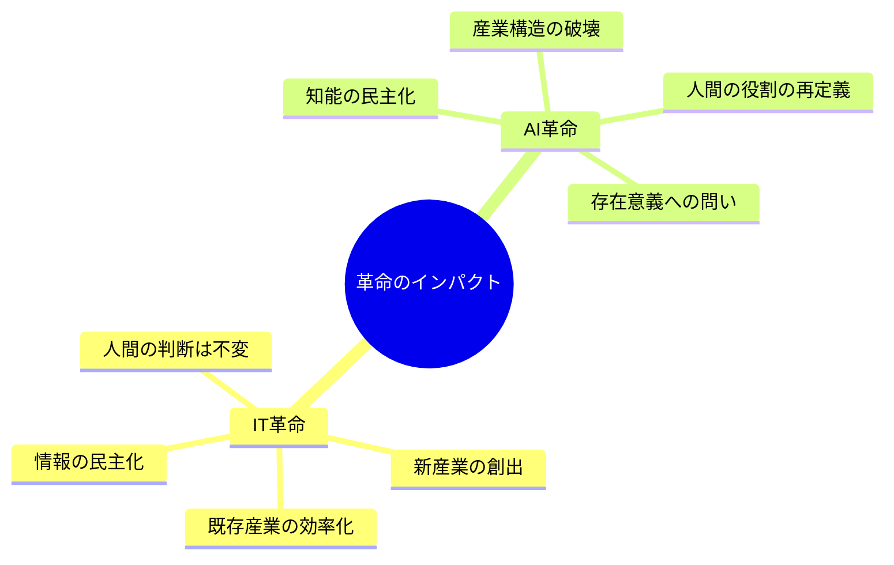

---

## 🏆 結論: AI革命の方がインパクト大

**AI革命の方が圧倒的にインパクトが大きい**と結論づけられます。

### 理由の概要

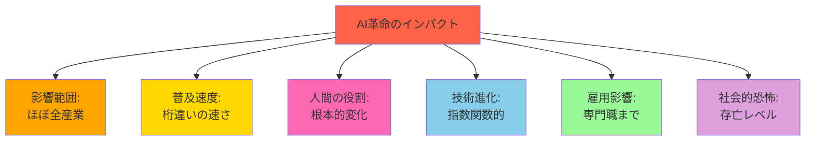

---

## 🔍 6つの決定的な違い

### 1️⃣ 影響範囲の違い

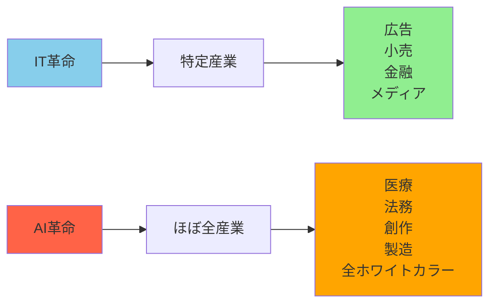

| 革命 | 影響を受けた/受ける産業 | インパクト度 |
|------|----------------------|------------|
| **IT革命** | 情報、広告、EC、金融など**限定的** | ⭐⭐⭐ |
| **AI革命** | 製造、医療、法務、創作、教育など**ほぼ全て** | ⭐⭐⭐⭐⭐ |

### 2️⃣ 人間の役割の根本的変化

| 要素 | IT革命 | AI革命 |
|------|--------|--------|
| **情報処理** | デジタル化・高速化 | 自動推論・生成 |
| **判断** | 👤 **人間が行う** | 🤖 **AIが行う** |
| **人間の役割** | プレイヤー（実行者） | 監督者（評価者） |
| **変化の本質** | ツールの進化 | **役割の転換** |

#### 💡 重要な洞察

```
IT革命: 人間の能力を「拡張」
AI革命: 人間の役割を「置換・再定義」
```

これは**産業革命以来の「人間の仕事の定義」そのものの変化**です。

### 3️⃣ 普及スピードが桁違い

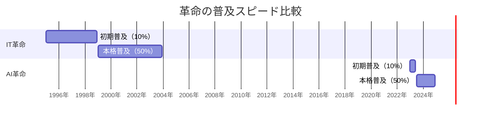

| 指標 | IT革命 | AI革命 | 差 |
|------|--------|--------|-----|
| **10%普及** | 約3年 | 約6ヶ月 | **6倍速** |
| **50%普及** | 約8年 | 約1.5年（予測） | **5倍速** |
| **代表例** | インターネット普及 | ChatGPT 2ヶ月で1億人 | **史上最速** |

### 4️⃣ 技術進化の速度

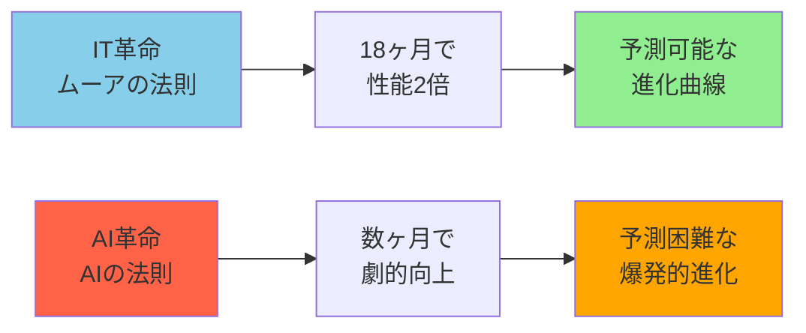

**具体例: AIの進化**
- GPT-3 (2020年6月) → GPT-4 (2023年3月): 約3年
- GPT-4 → GPT-4o (2024年5月): 約1年
- 各モデルの能力差は**桁違い**

### 5️⃣ 雇用への影響の深刻さ

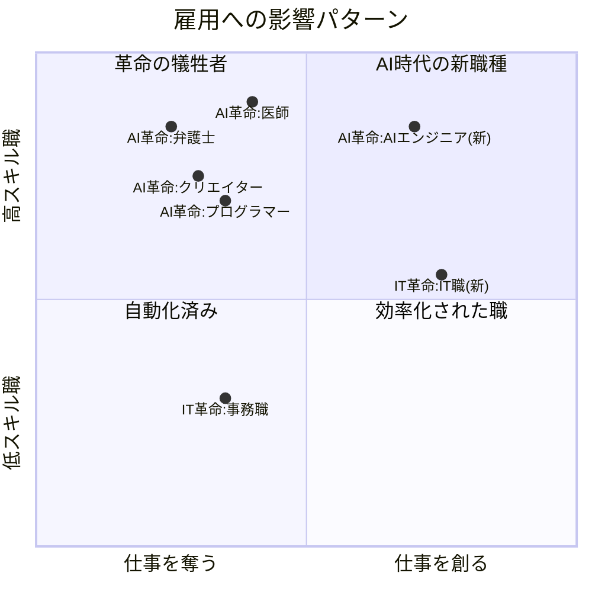

| 革命 | 影響を受ける職種 | 新たに生まれた職種 | 懸念 |
|------|----------------|------------------|------|
| **IT革命** | 事務作業、タイピスト | プログラマー、Webデザイナー、SEO専門家 | デジタル格差 |
| **AI革命** | **弁護士、医師、クリエイター、プログラマー** | プロンプトエンジニア、AI倫理専門家 | **代替職が不明確** |

#### ⚠️ 決定的な違い

```
IT革命: 単純作業を効率化 → 新しいIT職が大量創出
AI革命: 専門職・知的労働を代替 → 代替職の創出が不透明
```

### 6️⃣ 社会の恐怖レベル

| 革命 | 社会的懸念 | 恐怖レベル |
|------|-----------|----------|
| **IT革命** | デジタル・ディバイド（情報格差） | ⚠️⚠️ |
| **AI革命** | 人類滅亡シナリオ、大量失業、AI独裁 | 🚨🚨🚨🚨🚨 |

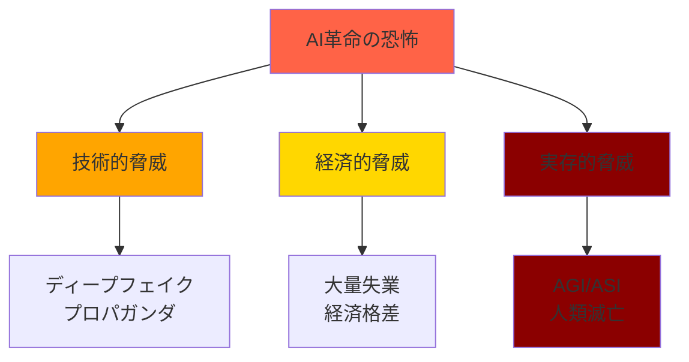

**重要**: AI革命では、**実在する恐怖として「人類滅亡」が語られている**レベルが違う

---

## 📊 数値で見るインパクト差

### 主要指標の比較

| 指標 | IT革命 | AI革命 | 倍率 |
|------|--------|--------|------|
| **投資規模** | 数千億ドル | **数兆ドル** | 約10倍 |
| **エネルギー消費増加** | 緩やか（分散型） | **爆発的（集中型）** | 推定50-100倍 |
| **主要企業成長** | 5年で10-40倍 | 5年で15-20倍 | 同等（ただし実益差あり） |
| **影響職種数** | 一部産業 | **ほぼ全産業** | 5-10倍 |
| **普及速度** | 5-10年 | 0.5-2年 | **5-10倍速** |
| **技術進化サイクル** | 18ヶ月で2倍 | 数ヶ月で劇的向上 | **6-10倍速** |

### 投資規模の視覚化

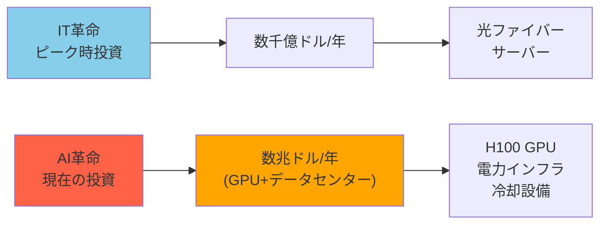

### エネルギー消費の違い

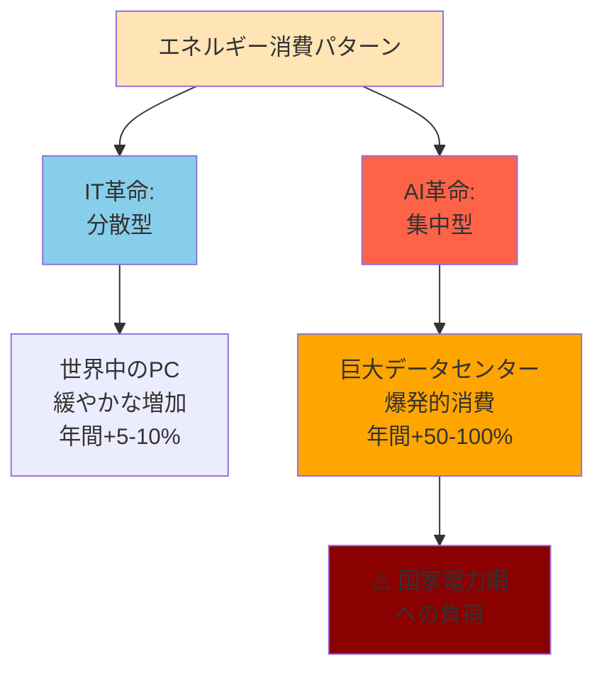

---

## ⏱️ 時間軸での比較

### 短期的インパクト (1-5年)

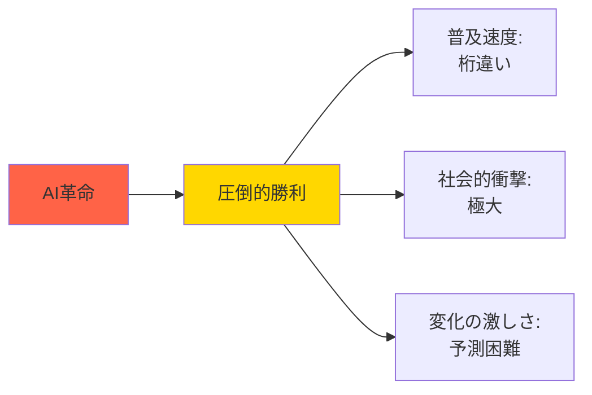

**理由**:
- 普及速度が5-10倍速い
- 変化が激しく予測困難
- 社会的衝撃が大きい

### 長期的インパクト (10-25年)

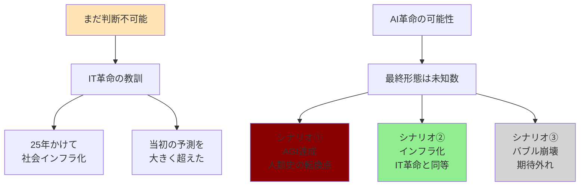

### 現時点での評価 (2025年11月)

| 期間 | IT革命 | AI革命 | 優位性 |
|------|--------|--------|--------|
| **短期 (1-5年)** | 段階的変化 | 爆発的変化 | **AI革命 >>>** |
| **中期 (5-10年)** | インフラ確立 | 真価を問われる時期 | **AI革命 >>** |
| **長期 (10-25年)** | 完全に社会インフラ化 | 未知数 | **判断不可** |
| **超長期 (25年+)** | 次世代技術の基盤 | 人類の存在様式を変える可能性 | **AI革命の可能性** |

---

## ⚠️ 重要な注意点

### 1. IT革命は「インフラ」になった

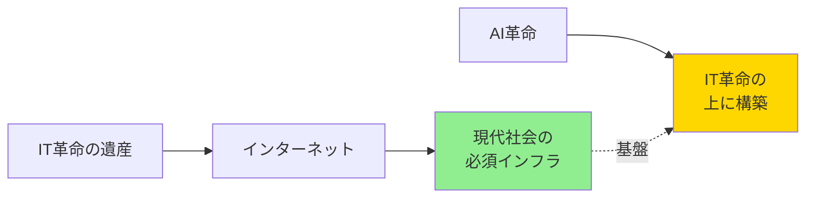

**重要な事実**:
- インターネットなしでは現代社会は成り立たない
- AI革命は、IT革命という**巨人の肩の上**に立っている
- IT革命がなければ、AI革命も存在しない

### 2. AI革命の真のインパクトはこれから

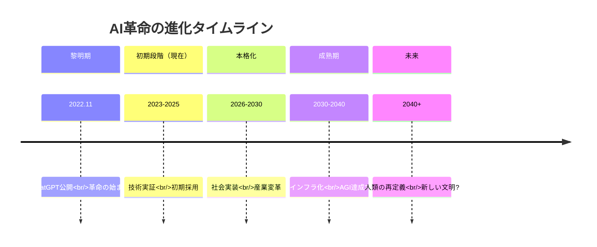

**現状認識**:
- 現在はまだ**初期段階**（2022年末開始、わずか3年）
- IT革命は25年かけて社会インフラ化
- AI革命の最終形態を判断するには時期尚早

### 3. 比較の本質的困難さ

| 要因 | 説明 |
|------|------|
| **時間軸の違い** | IT革命は完結、AI革命は進行中 |
| **評価基準** | 何を持って「大きい」とするか |
| **予測の限界** | AI革命の最終形態は未知数 |
| **相互依存性** | AI革命はIT革命の上に成立 |

---

## 🎯 最終結論

### 💡 総合評価

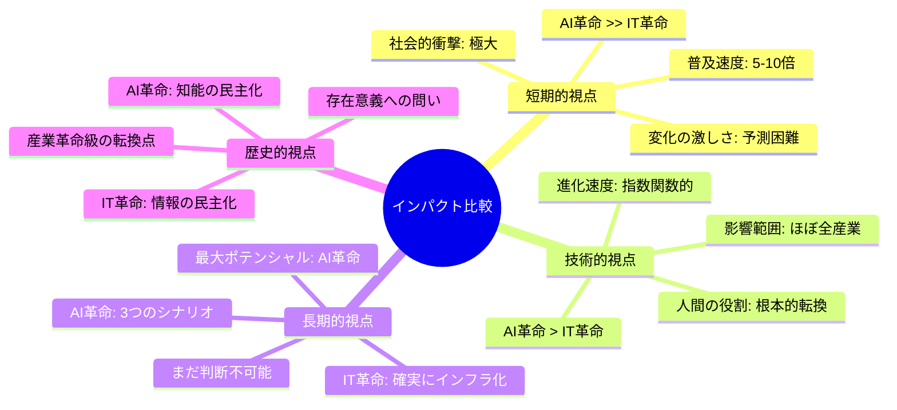

### 🏆 結論

**AI革命の方が圧倒的にインパクトが大きい（可能性が高い）**

#### 理由:

1. **影響範囲**: ほぼ全産業 vs 特定産業
2. **変化の本質**: 役割の転換 vs ツールの進化
3. **普及速度**: 5-10倍速い
4. **人間への影響**: 存在意義を問う vs 効率化
5. **技術進化**: 予測困難な爆発的成長

### 🌟 歴史的位置づけ

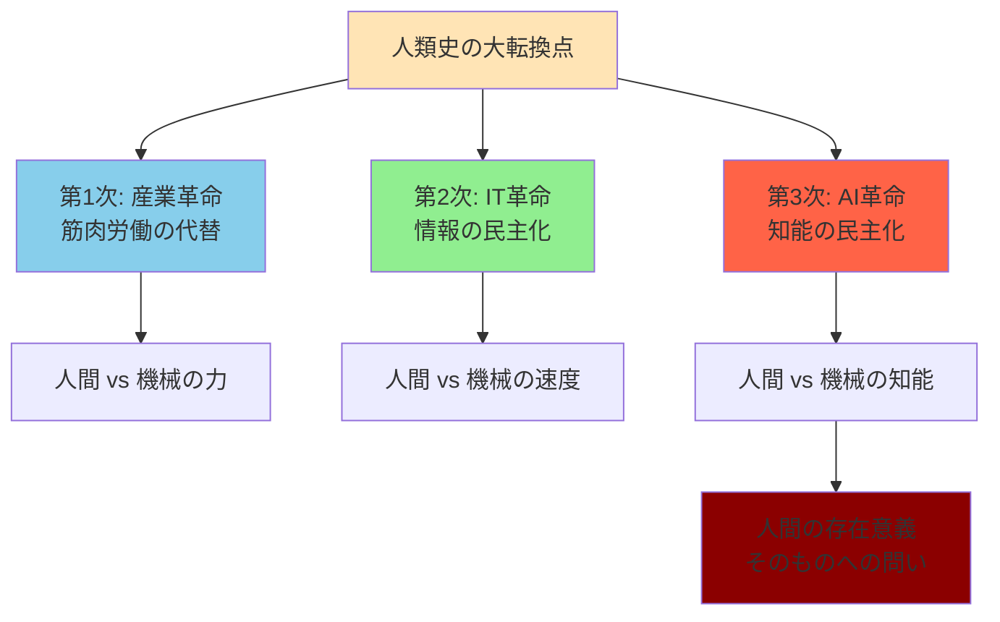

### 📌 個人的見解

AI革命は、**産業革命**、**IT革命**に続く**第3の革命**として、人類史に残る最大級のインパクトになると予測されます。

| 革命 | 本質 | 人類への問い |
|------|------|------------|
| **産業革命** | 筋肉労働の代替 | 「機械に負ける力」 |
| **IT革命** | 情報の民主化 | 「情報格差」 |
| **AI革命** | 知能の民主化 | **「人間とは何か」** |

### 🔮 最後に

IT革命が「**情報の民主化**」だったとすれば、
AI革命は「**知能の民主化**」です。

これは**人間の存在意義そのものを問う革命**になる可能性があります。

---

## 📚 関連ドキュメント

- [IT革命 vs AI革命 徹底比較](./ai-vs-it-revolution-comparison.md)
- [AI・ロボット未来予測](./ai-robot-future-prediction.md)
- [AI vs IT革命 詳細比較](./ai-vs-it-revolution-comparison.md)

---

*この分析は、2025年11月時点の情報と現在進行中のAI革命の観察に基づいています。最終的な評価は、今後10-25年の展開を見る必要があります。*

**🔄 継続的アップデート予定 - AI革命の進展に応じて随時更新**
