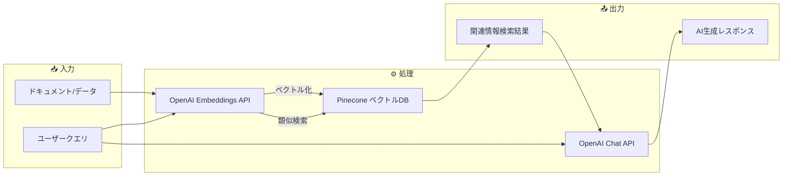
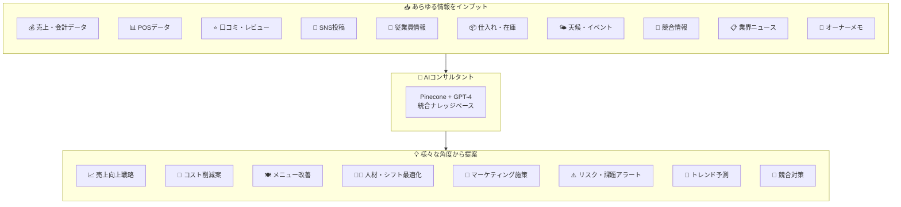
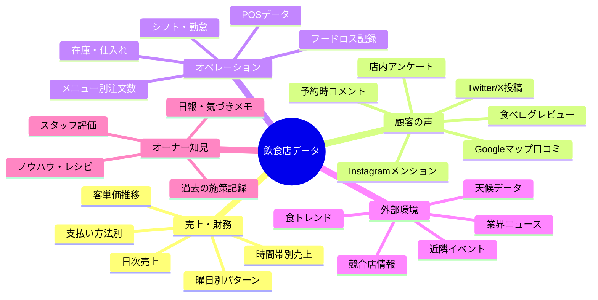
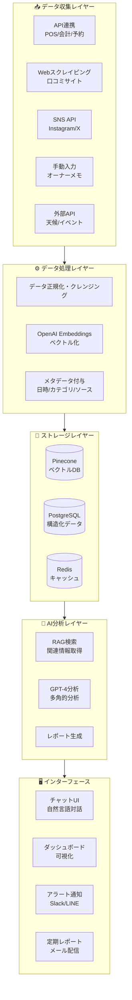

# OpenAI API + Pinecone WEBアプリ開発アイデア集 🚀

*最終更新: 2025年12月7日*

## 📋 目次

1. [技術スタック概要](#技術スタック概要)
2. [飲食店向けAIソリューション（検討中）](#飲食店向けaiソリューション検討中)
3. [比較評価マトリクス](#比較評価マトリクス)
4. [次のステップ](#次のステップ)

---

## 🔧 技術スタック概要

### OpenAI API + Pinecone の組み合わせとは？



**RAG（Retrieval-Augmented Generation）**:
- **Pinecone**: 大量のテキストデータをベクトル化して保存・高速検索
- **OpenAI**: 検索結果を基に文脈を理解した自然な回答を生成
- **メリット**: 独自データを活用した正確で最新の情報提供が可能

---

## 🍽️ 飲食店AIコンサルタント（メイン検討案）

### 🎯 コンセプト

**「飲食店経営のあらゆる情報を蓄積し、AIが多角的に分析・提案する万能コンサルタント」**

従来のコンサルタントは高額で、限られた視点からのアドバイス。
このシステムは、店舗のあらゆるデータを統合し、24時間365日、
様々な角度から分析・提案を行う**AI経営参謀**。



---

### 💬 使用イメージ：自然言語で何でも相談

```
┌─────────────────────────────────────────────────────────────┐
│  🍽️ 飲食店AIコンサルタント                                    │
├─────────────────────────────────────────────────────────────┤
│                                                             │
│  👤 オーナー:                                                │
│  「最近売上が落ちてるんだけど、原因は何だと思う？」            │
│                                                             │
│  🤖 AI:                                                      │
│  「複数のデータを分析した結果、以下の要因が考えられます：     │
│                                                             │
│   1. 📊 客単価の低下（-8%）                                  │
│      → ランチセットの注文比率増加、ディナー客減少            │
│                                                             │
│   2. ⭐ 口コミ評価の変化                                     │
│      → 「待ち時間」に関するネガティブ言及が先月比+23%        │
│                                                             │
│   3. 🏪 競合状況                                             │
│      → 近隣に新規オープン店舗あり（11/15〜）                 │
│                                                             │
│   4. 🌤️ 外部要因                                             │
│      → 先月は雨天日が多く来客数に影響                        │
│                                                             │
│   💡 推奨アクション:                                         │
│   ・待ち時間改善のオペレーション見直し                       │
│   ・ディナータイム限定キャンペーン検討                       │
│   ・競合店との差別化ポイント強化」                           │
│                                                             │
└─────────────────────────────────────────────────────────────┘
```

---

### 📊 データソース詳細



---

### 🎯 AIが提案できること（機能一覧）

#### 📈 売上・収益分析

| 質問例 | AIの分析・提案 |
|--------|---------------|
| 「今月の売上傾向を教えて」 | 日別・時間帯別の売上分析、前月/前年比較 |
| 「なぜ水曜日だけ売上が低い？」 | 曜日別パターン分析、近隣施設の影響調査 |
| 「利益率を上げるには？」 | メニュー別原価率分析、高利益商品の露出提案 |

#### 🍽️ メニュー戦略

| 質問例 | AIの分析・提案 |
|--------|---------------|
| 「人気メニューと不人気メニューは？」 | 注文数×利益率のマトリクス分析 |
| 「新メニューのアイデアある？」 | トレンド+口コミ分析から提案 |
| 「この料理の評価はどう？」 | 口コミからメニュー別感情分析 |
| 「値上げしても大丈夫？」 | 価格感度分析、競合価格比較 |

#### ⭐ 顧客満足度・評判管理

| 質問例 | AIの分析・提案 |
|--------|---------------|
| 「最近の口コミ傾向は？」 | 感情分析、カテゴリ別評価推移 |
| 「クレームで多いのは何？」 | ネガティブ口コミのパターン抽出 |
| 「リピーターを増やすには？」 | 再来店パターン分析、施策提案 |

#### 👨‍🍳 人材・オペレーション

| 質問例 | AIの分析・提案 |
|--------|---------------|
| 「明日のシフトは適切？」 | 来客予測に基づくシフト最適化 |
| 「人件費を抑えるには？」 | 時間帯別必要人員分析 |
| 「新人教育で伝えるべきことは？」 | ナレッジベースから重要ポイント抽出 |

#### 📣 マーケティング

| 質問例 | AIの分析・提案 |
|--------|---------------|
| 「SNSで何を発信すべき？」 | 反応が良い投稿パターン分析 |
| 「キャンペーンのアイデアは？」 | 過去施策効果+トレンドから提案 |
| 「競合との差別化ポイントは？」 | 競合口コミ分析、自店の強み抽出 |

#### 🔮 予測・早期警告

| 質問例 | AIの分析・提案 |
|--------|---------------|
| 「来週の来客予測は？」 | 天候・イベント・過去データから予測 |
| 「注意すべきリスクはある？」 | 口コミ悪化傾向、在庫切れリスク等 |
| 「来年のトレンドは？」 | 業界ニュース・SNS分析から予測 |

---

### 🏗️ システムアーキテクチャ


