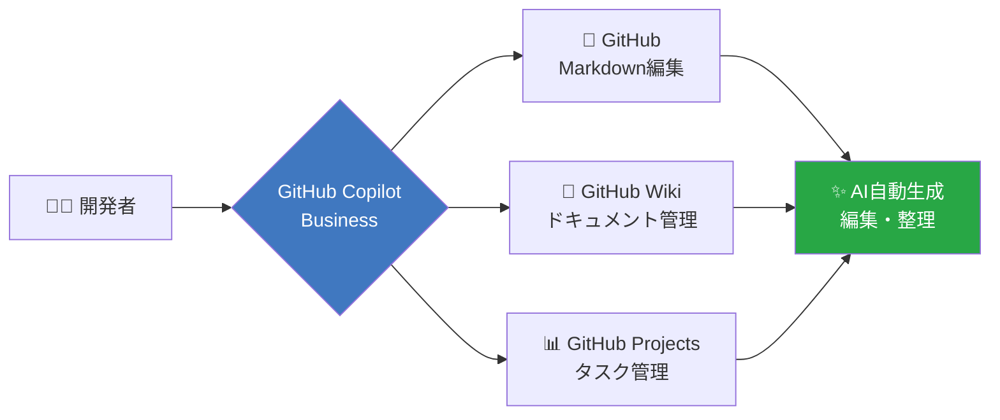

## 🤖 AI親和性比較：GitHub Copilot vs Notion AI

### 📊 AI支援機能の詳細比較

| 機能 | GitHub + Copilot Business | Notion + Notion AI（有料） | Notion無料版 |
|------|---------------------------|---------------------------|-------------|
| **ドキュメント生成** | ✅ Copilot Chat経由で完全対応 | ✅ Notion AI直接対応 | ❌ AI機能なし |
| **ドキュメント編集** | ✅ Copilot経由で自動修正 | ✅ Notion AI直接編集 | ❌ 手動のみ |
| **ドキュメント整理** | ✅ Copilot提案で構造化 | ✅ Notion AIで自動整理 | ❌ 手動のみ |
| **情報検索** | ✅ Copilot経由で検索支援 | ✅ AI検索で高精度 | ⚠️ 通常検索のみ |
| **要約・翻訳** | ✅ Copilot経由で対応 | ✅ Notion AI対応 | ❌ 非対応 |
| **MCP連携** | 🔧 検討中（GitHub MCP未公式） | 🔧 検討中（Notion MCP実験段階） | ❌ 非対応 |
| **API経由のAI操作** | ✅ GitHub API + Copilot | ⚠️ Notion API（AI機能は別料金） | ❌ 非対応 |
| **コスト** | **¥39** /月/人（既契約） | **+¥10** /月/人（追加） | **¥0** |

### 🔍 MCP（Model Context Protocol）の現状

#### GitHub MCP
- **状況**: 非公式だがコミュニティ実装あり（`modelcontextprotocol/servers`）
- **機能**: Issue作成・PR管理・リポジトリ操作をClaude等から可能
- **GitHub Copilot連携**: VS Code拡張経由で既に強力な統合済み
- **メリット**: Copilot Business契約があれば追加コスト不要

#### Notion MCP
- **状況**: 公式MCPサーバー実装済み（`@notionhq/client`利用）
- **機能**: ページ作成・データベース操作・検索をClaude等から可能
- **制限**: **Notion AI機能は別料金**（MCP経由でも自動編集・要約等は有料版必須）
- **問題点**: Notion無料版ではMCP使えても「AI支援ドキュメント編集」は不可

### 🎯 GitHub Copilot Business主軸での最適解

**既にGitHub Copilot Businessを契約している場合**、以下の構成が最もコスト効率とAI親和性が高い：



#### ✅ GitHub Copilot Businessでできること

**VS Code拡張経由**:
1. **ドキュメント自動生成**
   ```
   @workspace /new GitHub Wikiページを作成:
   新機能XのAPI仕様書を生成してください
   ```

2. **既存ドキュメント編集**
   ```
   このMarkdownファイルを構造化して、
   目次とMermaid図表を追加してください
   ```

3. **情報整理・要約**
   ```
   このディレクトリ内の全ドキュメントを分析して、
   インデックスページを生成してください
   ```

4. **GitHub Issue/Projects操作**
   ```
   明日の開発タスクをIssueとして作成し、
   Projectsボードに追加してください
   ```

**GitHub CLI + Copilot**:
```bash
# ターミナルでAI支援
gh copilot suggest "新しいWikiページを作成"
gh copilot explain "このIssueの履歴を要約"
```

### 💰 コスト比較（月額・チーム5名想定）

| 構成 | 月額コスト | AI支援レベル |
|------|-----------|-------------|
| **Slack有料 + GitHub無料 + Notion無料** | **¥5,250** | ❌ AI支援なし |
| **Slack有料 + GitHub無料 + Notion有料** | **¥11,250** | ⭕ Notion AIのみ |
| **Slack有料 + GitHub無料 + Notion無料<br>+ GitHub Copilot Business** | **¥10,200** | ✅ 全ドキュメントAI対応 |
| **Slack有料 + GitHub無料 + Notion有料<br>+ GitHub Copilot Business** | **¥16,200** | ✅✅ 最強（両方AI） |

### 🎯 推奨構成：GitHub Copilot Business主軸

**既にCopilot Business契約がある場合**、以下が最適：

#### 📌 推奨構成A：コスト最適化
```
✅ Slack有料版（¥1,050/人） - コミュニケーション
✅ GitHub無料版（¥0） - タスク・コード管理
✅ Notion無料版（¥0） - 非技術ドキュメント・プロジェクト概要
✅ GitHub Copilot Business（¥39/人） - **全AI支援**
✅ スプシ無料版（¥0） - 既存資料（Notionにリンク集約）

月額合計：¥10,200（5名）
```

**AI活用フロー**:
1. **技術ドキュメント**: GitHub Wiki + Copilot自動生成・編集
2. **非技術ドキュメント**: Notion手動作成（検索・整理重視）
3. **タスク管理**: GitHub Projects + Copilot自動化

**メリット**:
- ✅ 技術ドキュメントは完全AI自動化
- ✅ Notion無料版で非技術者向け資料も管理
- ✅ 追加コスト¥0でAI活用最大化

**デメリット**:
- ⚠️ Notion側のドキュメントは手動編集（AI支援なし）

#### 📌 推奨構成B：AI完全対応（予算に余裕がある場合）
```
✅ Slack有料版（¥1,050/人）
✅ GitHub無料版（¥0）
✅ Notion有料版（¥1,200/人） - **Notion AI追加**
✅ GitHub Copilot Business（¥39/人）
✅ スプシ無料版（¥0）

月額合計：¥16,200（5名）
```

**メリット**:
- ✅ 全ツールでAI支援可能
- ✅ 技術・非技術両方のドキュメントが自動化
- ✅ Notion AI検索で情報発見が劇的改善

**デメリット**:
- ⚠️ 月額¥6,000追加コスト（5名）

### 🚀 結論：GitHub Copilot Business主軸なら

**GitHub Copilot Business契約済みの場合**:

1. **技術ドキュメント → GitHub Wiki**
   - Copilot経由で完全AI自動化
   - バージョン管理も自動
   - 追加コスト¥0

2. **非技術ドキュメント → Notion無料版**
   - プロジェクト概要・議事録・FAQ
   - 検索性・UI/UXの良さを活かす
   - AI支援なしでも十分使える

3. **AI支援が必要な非技術ドキュメント → GitHub Wikiで代替**
   - 営業資料・提案書もMarkdownで作成
   - Copilot経由で自動生成・編集
   - 必要に応じてNotionにエクスポート

**この構成なら、月額¥10,200（5名）で全ドキュメント管理がAI支援付きで実現できます！**

### 📊 最終判定

| 項目 | GitHub + Copilot | Notion + Notion AI |
|------|------------------|-------------------|
| **AI親和性** | ✅ 極めて高い | ✅ 高い |
| **既存契約活用** | ✅ 追加コスト¥0 | ❌ 追加¥1,200/人 |
| **技術ドキュメント** | ✅ 最適 | ⚠️ 可能だが非推奨 |
| **非技術ドキュメント** | ⚠️ Markdown限定 | ✅ WYSIWYG・直感的 |
| **バージョン管理** | ✅ Git標準 | ⚠️ 有料版のみ詳細履歴 |
| **チーム規模拡大** | ✅ 無制限 | ⚠️ ゲスト10名制限 |

**最適解**: **GitHub Copilot Business + Notion無料版のハイブリッド** 🎯

- GitHub Wiki: 技術ドキュメント（Copilot AI自動化）
- Notion無料版: 非技術ドキュメント（UI/UX・検索性重視）
- 追加コスト: ¥0
- AI活用: 技術ドキュメントは完全自動化

---

*GitHub Copilot Businessを既に契約しているなら、Notion AI追加は不要です。GitHub側で技術ドキュメントを完全AI化し、Notionは検索・整理に特化した補完ツールとして活用するのが最もコスト効率が良い選択です。*