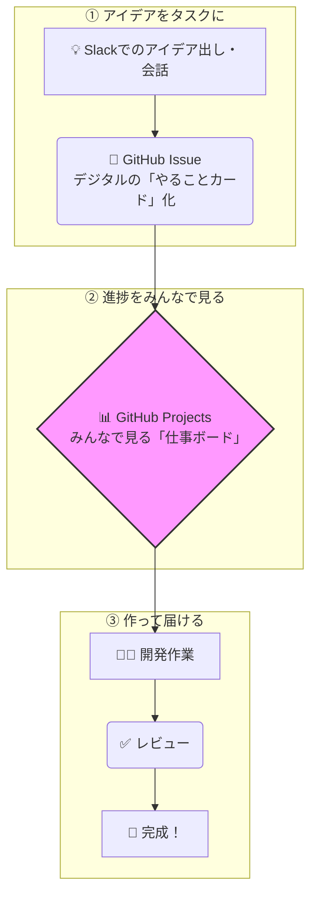

# 🚀 新しい開発の進め方：リアルタイムで「見える」仕組みづくり

*最終更新: 2025-11-14*

## 🎯 この資料の目的

この資料は、エンジニア以外のチームメンバー（経営層、マネージャー、デザイナー、企画担当者など）に向けて、私たちのチームが導入する新しい開発プロセスの全体像と、それによって**「何がどう良くなるのか」**をご説明するものです。

専門用語をできるだけ使わず、メリットに焦点を当てて解説します。

## 📋 目次

1.  [なぜ変えるのか？：現状の課題](#1-なぜ変えるのか現状の課題)
2.  [新しい進め方の全体像：アイデアから完成まで](#2-新しい進め方の全体像アイデアから完成まで)
3.  [主役となるツールの新しい役割](#3-主役となるツールの新しい役割)
4.  [皆さんにとってのメリット](#4-皆さんにとってのメリット)
5.  [これからのこと](#5-これからのこと)

---

### 1. なぜ変えるのか？��現状の課題

現在、私たちのチームの情報は、下記のように様々なツールに分散しています。

*   **Slack**: 日々の会話、アイデア出し
*   **スプレッドシート**: タスクやドキュメントの管理
*   **自社スケジューラ**: 個人のスケジュール管理
*   **GitHub**: エンジニアのコード置き場

これにより、「あの件、今どうなってるんだっけ？」「プロジェクト全体の進捗は順調？」といった状況を把握するために、複数のツールを確認する必要があり、手間と時間がかかっていました。

**目標：** 情報の置き場所を一つにまとめ、**誰でも・リアルタイムに・直感的に**開発状況を把握できる仕組みを作ります。

### 2. 新しい進め方の全体像：アイデアから完成まで

これからの開発は、基本的に以下の流れで進みます。

ポイントは、Slackで生まれたアイデアが「やることカード」になり、それが「仕事ボード」に貼られ、完成まで進んでいく様子が**一気通貫で見える化**される点です。

### 3. 主役となるツールの新しい役割

#### Slack：変わらない「ひらめき」の場所 🗣️

*   今まで通り、アイデア出しや気軽な相談の場として活用します。
*   **新しいこと**: Slackでの会話から、ワンクリックで後述の「やることカード」を作成できるようになります。

#### GitHub：「エンジニアだけの場所」から「みんなのプロジェクト管理ツール」へ 🏢

今までの「コード置き場」という役割に加え、チームのプロジェクト管理のハブ（中心地）になります。

*   **やることカード (Issue)**
    *   全てのタスク（新機能開発、バグ修正、デザイン作成など）を、このカードで管理します。
    *   カードには「担当者」「期限」「内容」「関連資料」など、そのタスクに関する全ての情報が集約されます。

*   **仕事ボード (Projects)**
    *   全ての「やることカード」が並んだ、大きなカンバンボードです。
    *   カードが「未着手 → 作業中 → レビュー中 → 完了」と動いていくことで、**誰が・いつ・何をしているか**が一目瞭然になります。
    *   **プロジェクト単位（例：A案件）での絞り込み表示も可能**なので、見たい情報だけを簡単に見ることができます。

*   **情報置き場 (Wiki)** **(★追加)**
    *   チームのルールや開発手順、そして**これまでスプレッドシート等で作成した資料への「リンク集」**をここにまとめます。
    *   プロジェクトに関する「知りたいこと」は、まずここを見ればOK、という状態を目指します。

#### スプレッドシート ＆ 自社スケジューラ：役割を最適化 🗓️

*   **タスク管理 → GitHubへ移行**: スプレッドシートで行っていたタスク管理は、リアルタイム性が高く、開発作業と連動するGitHubに移行します。
*   **既存の資料 → GitHub Wikiにリンクを集約** **(★変更)**: これまで作成した仕様書などの資料は、すぐに参照できるよう **GitHub Wiki** に「リンク集」としてまとめます。これにより、過去の資料を探す手間が省けます。
*   **個人の大まかな予定 → 継続利用**: 部長や課長がメンバーの空き状況をざっくり把握するための自社スケジューラは、引き続き活用します。

### 4. 皆さんにとってのメリット

この新しい進め方で、皆さんの仕事はこう変わります。

| こう変わる！                                      | 具体的なメリット                                                                                               |
| :------------------------------------------------ | :------------------------------------------------------------------------------------------------------------- |
| **📈 プロジェクトの進捗がリアルタイムにわかる**     | 「あの件どうなった？」と聞かなくても、**仕事ボードを見れば**、どのタスクがどの段階にあるかすぐに把握できます。     |
| **🗺️ どこを見れば良いかが明確になる**             | 情報がGitHubに集約されるため、「最新の仕様書はどこ？」「担当者は誰？」といった探し物の時間がなくなります。       |
| **🤔 優先順位がひと目でわかる**                    | ボード上でタスクの優先順位が可視化されるため、チームが今、何に最も注力しているかが明確になります。               |
| **🤝 チーム間の連携がスムーズになる**              | デザイナーとエンジニアのタスクが同じボード上で管理されるため、お互いの進捗を把握しやすくなり、手戻りが減ります。 |
| **📊 将来の見通しが立てやすくなる**                | プロジェクト全体のタスクの進み具合が見えるため、将来の計画やリソース配分がより正確に行えるようになります。       |

### 5. これからのこと

まずは、いくつかのプロジェクトでこの新しいフローを試験的に導入します。
慣れない部分もあるかと思いますが、チーム全員で改善しながら、より良い開発体制を築いていきたいと考えています。

ご不明な点や、「こうしたらもっと良くなるのでは？」といったご意見があれば、いつでもお声がけください！