# GitHub Copilot Agents - リポジトリ操作機能ガイド 🤖

*最終更新: 2025年11月20日*

## 📋 目次

1. [GitHub Copilot Agentsとは](#github-copilot-agentsとは)
2. [リポジトリに対する基本操作](#リポジトリに対する基本操作)
3. [コード編集・管理機能](#コード編集管理機能)
4. [プロジェクト管理機能](#プロジェクト管理機能)
5. [CI/CD・自動化サポート](#cicd自動化サポート)
6. [ドキュメント作成・管理](#ドキュメント作成管理)
7. [セキュリティ・品質管理](#セキュリティ品質管理)
8. [実用例とベストプラクティス](#実用例とベストプラクティス)
9. [制限事項と注意点](#制限事項と注意点)
10. [まとめ](#まとめ)

## 🎯 GitHub Copilot Agentsとは

### 概要

GitHub Copilot Agentsは、AIアシスタントとして開発者をサポートし、リポジトリに対して様々な操作を実行できる強力なツールです。単なるコード補完を超え、プロジェクト全体の管理・改善・自動化を支援します。

### 主な特徴

```mermaid
mindmap
  root((GitHub Copilot<br/>Agents))
    コード理解
      ファイル読み取り
      構造分析
      依存関係把握
      パターン認識
    コード編集
      ファイル作成
      修正・リファクタリング
      バグ修正
      テスト生成
    プロジェクト管理
      Issue対応
      PR作成
      ドキュメント整備
      タスク自動化
    品質保証
      コードレビュー
      セキュリティチェック
      テスト実行
      ベストプラクティス適用
```

### Agent活用の価値

| 領域 | 従来の開発 | Agents活用時 | 改善効果 |
|------|-----------|-------------|----------|
| **コード理解** | 手動でファイル探索・読解 | AI支援による即座の理解 | 時間短縮80% |
| **コード作成** | ゼロから記述 | テンプレート・パターン活用 | 効率向上60% |
| **バグ修正** | 原因調査・試行錯誤 | 構造的分析・提案 | 速度向上70% |
| **ドキュメント** | 手動作成・更新遅延 | 自動生成・同期更新 | 品質向上50% |
| **セキュリティ** | 手動レビュー・見落とし | 自動スキャン・警告 | 検出率向上90% |

## 🔧 リポジトリに対する基本操作

### 1. ファイル・ディレクトリ操作

#### 📂 参照・閲覧
- **ファイル内容の表示**: 任意のファイルを読み取り、内容を分析
- **ディレクトリ構造の把握**: プロジェクト全体の構造を理解
- **複数ファイルの並列読み取り**: 効率的な情報収集
- **特定行範囲の参照**: 必要な部分のみを抽出

#### ✏️ 作成・編集
- **新規ファイル作成**: テンプレートやパターンを活用した生成
- **既存ファイル編集**: 正確な文字列置換による更新
- **複数ファイルの同時編集**: 一括変更の効率的実行
- **段階的な修正**: 安全な増分更新

#### 🗂️ ディレクトリ管理
- **プロジェクト構造の理解**: ファイル配置の把握
- **適切な配置提案**: ベストプラクティスに基づく整理
- **命名規則の遵守**: 一貫性のある名前付け

### 2. Git操作

#### 📊 リポジトリ状態確認
- **変更状態の確認**: `git status` による現状把握
- **差分確認**: `git diff` で変更内容の検証
- **コミット履歴**: ログの参照と分析
- **ブランチ管理**: 現在のブランチ確認

#### ⚠️ 制限事項（重要）
Agentsは以下のGit操作を**直接実行できません**：
- ❌ `git commit`: コミット作成
- ❌ `git push`: リモートへのプッシュ
- ❌ `git pull`: リモートからのプル
- ❌ `git merge`: マージ操作
- ❌ `git rebase`: リベース操作

**代替方法**: 
- ✅ **report_progress ツール**を使用してコミット・プッシュを実行
- ✅ 変更内容を準備し、開発者に実行を依頼

### 3. ファイル検索・分析

#### 🔍 コード検索
- **パターンマッチング**: 特定のコード・テキストを検索
- **ファイルタイプフィルタ**: 拡張子による絞り込み
- **再帰検索**: サブディレクトリを含む全体検索

#### 📈 依存関係分析
- **インポート/require追跡**: モジュール依存の把握
- **関数・クラス参照**: 使用箇所の特定
- **影響範囲分析**: 変更の波及効果予測

## 💻 コード編集・管理機能

### 1. コード生成

#### 🆕 新規コード作成
- **関数・メソッド生成**: 要件に基づく実装
- **クラス・構造体**: 設計パターン適用
- **API エンドポイント**: RESTful設計遵守
- **データモデル**: 適切なスキーマ定義

#### 🧪 テストコード生成
- **ユニットテスト**: 個別機能のテスト
- **統合テスト**: コンポーネント間のテスト
- **エッジケース対応**: 境界値・異常系テスト
- **既存テストとの整合性**: スタイル統一

### 2. コードリファクタリング

#### 🔄 構造改善
- **重複コード削除**: DRY原則の適用
- **関数分割**: 単一責任原則の遵守
- **命名改善**: 意味のある名前への変更
- **パフォーマンス最適化**: 効率的なアルゴリズム適用

#### 📐 設計パターン適用
- **デザインパターン**: GoF パターンの実装
- **アーキテクチャパターン**: MVC、MVVM等の適用
- **コーディング規約**: プロジェクト標準への準拠

### 3. バグ修正

#### 🐛 バグ検出・修正プロセス
1. **問題の理解**: Issue・エラーメッセージの分析
2. **関連コード特定**: 原因箇所の探索
3. **影響範囲分析**: 修正の波及効果確認
4. **修正実装**: 最小限の変更で対応
5. **テスト追加**: 再発防止のための検証

## 📊 プロジェクト管理機能

### 1. GitHub Issues連携

#### 📝 Issue分析・対応
- **Issue内容の理解**: 要求・バグの把握
- **優先度判断**: 重要度・緊急度の評価
- **タスク分解**: 実行可能な単位に分割
- **進捗追跡**: 完了状況の確認

#### ⚠️ 制限事項
Agentsは以下を**直接実行できません**：
- ❌ Issue の作成・更新・クローズ
- ❌ ラベルの追加・削除
- ❌ アサイン・マイルストーン設定

**できること**：
- ✅ Issue内容の読み取り・理解
- ✅ Issue対応のコード・ドキュメント作成
- ✅ 対応内容をPRとして提出（間接的）

### 2. プルリクエスト（PR）作成支援

#### 🔀 PR準備
- **変更内容の整理**: commit message の提案
- **PR説明文作成**: 変更の要約と目的説明
- **チェックリスト生成**: レビューポイント整理

#### 📋 PR品質向上
- **コードレビュー実施**: 自動的な品質チェック
- **改善提案**: ベストプラクティス適用
- **テストカバレッジ**: 不足テストの指摘

## 🚀 CI/CD・自動化サポート

### 1. GitHub Actions理解・支援

#### 📜 ワークフロー管理
- **YAML設定理解**: GitHub Actions設定の解析
- **ジョブ失敗分析**: ログからエラー原因特定
- **修正提案**: 設定の改善・最適化
- **新規ワークフロー作成**: テンプレートからの生成

#### 🔧 トラブルシューティング
- **ビルドエラー対応**: 依存関係・設定問題の解決
- **テスト失敗分析**: 失敗理由の特定と修正
- **デプロイ問題**: 環境・権限問題の診断

### 2. 依存関係管理

#### 📦 パッケージ管理
- **依存関係の把握**: package.json、requirements.txt等の理解
- **セキュリティチェック**: 脆弱性のある依存関係の検出
- **アップデート提案**: 安全なバージョン管理

#### 🛡️ セキュリティスキャン
- **脆弱性データベース照合**: GitHub Advisory Database活用
- **問題のある依存関係特定**: CVE情報の確認
- **修正方法提案**: 安全なバージョンへの更新

## 📚 ドキュメント作成・管理

### 1. 自動ドキュメント生成

#### 📖 ドキュメントタイプ
- **README.md**: プロジェクト概要・使用方法
- **API ドキュメント**: エンドポイント仕様・例
- **コードコメント**: 関数・クラスの説明
- **ユーザーガイド**: エンドユーザー向け手順
- **開発者ドキュメント**: 設計・アーキテクチャ説明

#### 🎨 ドキュメント品質
- **構造化**: 見出し・目次による整理
- **視覚化**: Mermaid図表の活用
- **実例**: コードサンプル・スクリーンショット
- **一貫性**: スタイル・フォーマット統一

### 2. ドキュメント更新・同期

#### 🔄 自動更新
- **コード変更追跡**: 関連ドキュメントの特定
- **不整合検出**: コードとドキュメントの齟齬発見
- **更新提案**: 変更に応じた文書修正

#### 📊 品質維持
- **リンク切れチェック**: 参照の検証
- **古い情報検出**: 更新日時の管理
- **網羅性確認**: 必要情報の漏れチェック

## 🔒 セキュリティ・品質管理

### 1. コードレビュー自動化

#### 🔍 レビュー観点
- **コード品質**: 可読性・保守性・拡張性
- **セキュリティ**: 脆弱性・安全性確保
- **パフォーマンス**: 効率性・最適化
- **テスト**: カバレッジ・品質
- **ドキュメント**: 説明の充実度

### 2. セキュリティスキャン

#### 🛡️ CodeQL チェック
- **静的解析**: ソースコードの脆弱性検出
- **パターンマッチング**: 既知の脆弱性パターン照合
- **カスタムルール**: プロジェクト固有のチェック

#### 📊 セキュリティレポート
- **脆弱性一覧**: 検出された問題の整理
- **重要度評価**: Critical、High、Medium、Low分類
- **修正優先順位**: 影響度に基づく対応順序
- **修正ガイド**: 具体的な対処方法

### 3. テスト実行・分析

#### 🧪 テスト実行
- **既存テスト実行**: プロジェクトのテストスイート
- **結果分析**: 成功・失敗の詳細確認
- **カバレッジ確認**: テスト網羅率の把握

#### 📈 テスト改善
- **不足テスト特定**: カバーされていない領域
- **テスト追加**: 新規テストケース作成
- **品質向上**: より堅牢なテスト設計

## 💡 実用例とベストプラクティス

### 実用例1: 新機能開発フロー

**ステップ詳細**:
1. **Issue分析**: 要求の理解と実装方針決定
2. **設計**: アーキテクチャ・データモデル設計
3. **実装**: コード作成・リファクタリング
4. **テスト**: ユニット・統合テスト作成
5. **ドキュメント**: README・API仕様更新
6. **品質チェック**: コードレビュー・セキュリティスキャン
7. **PR作成**: 変更のコミット・プッシュ

### 実用例2: バグ修正フロー

### 実用例3: ドキュメント整備フロー

### ベストプラクティス

#### ✅ 推奨事項

1. **段階的な変更**
   - 一度に多くの変更をせず、小さな単位で実装
   - 各段階で report_progress を使用して進捗報告

2. **頻繁なテスト**
   - コード変更後すぐにテスト実行
   - ビルド・リント・テストの早期確認

3. **明確なコミットメッセージ**
   - 変更の目的・内容を簡潔に記述
   - "Fix bug" より "Fix null pointer exception in user validation"

4. **セキュリティファースト**
   - 依存関係追加前に脆弱性チェック
   - codeql_checker を必ず実行

5. **ドキュメント同期**
   - コード変更と同時にドキュメント更新
   - 関連ファイル（README、API仕様等）の整合性維持

#### ⚠️ 避けるべき事項

1. **過度な変更**
   - 無関係なコード・ファイルの修正
   - スコープ外のリファクタリング

2. **テスト削除**
   - 既存テストの安易な削除・無効化
   - 失敗テストを消して対処

3. **セキュリティ軽視**
   - 脆弱性警告の無視
   - セキュリティチェックのスキップ

4. **ドキュメント放置**
   - コード変更後のドキュメント未更新
   - 古い情報の放置

5. **一方的な実装**
   - 要求・Issue内容の誤解に基づく実装
   - 確認なしの大規模変更

## 🚫 制限事項と注意点

### できないこと（重要）

#### 🚫 Git直接操作の制限

**できないこと**:
- ❌ `git commit` - コミット作成
- ❌ `git push` - リモートへのプッシュ
- ❌ `git pull` - リモートからのプル
- ❌ `git merge` - ブランチマージ
- ❌ `git rebase` - コミット履歴書き換え
- ❌ `git reset` - 変更の取り消し（force push不可のため）

**代替手段**:
- ✅ **report_progress ツール**を使用
  - コミットメッセージ指定
  - 自動的にコミット・プッシュ実行
  - PR説明も同時更新

#### 🚫 GitHub直接操作の制限

**できないこと**:
- ❌ Issue作成・更新・クローズ
- ❌ PR作成・更新・マージ
- ❌ ラベル・マイルストーン管理
- ❌ レビュアー・アサイン設定
- ❌ リポジトリ設定変更

**できること**:
- ✅ Issue・PR内容の読み取り
- ✅ Issue対応のコード・ドキュメント作成
- ✅ report_progress経由でのPR更新

### セキュリティ上の注意

#### 🔒 機密情報管理

**絶対にしてはいけないこと**:
- ❌ 認証情報（パスワード、APIキー）のコード埋め込み
- ❌ 個人情報の公開リポジトリへのコミット
- ❌ 社内機密情報の外部共有

**推奨事項**:
- ✅ 環境変数での秘密情報管理
- ✅ .gitignore による機密ファイル除外
- ✅ GitHub Secrets の活用

#### 🛡️ セキュリティベストプラクティス

1. **依存関係**: 必ず脆弱性チェック（gh-advisory-database ツール）
2. **コードスキャン**: codeql_checker を実行
3. **定期更新**: 古い依存関係の更新
4. **最小権限**: 必要最小限の権限設定

### パフォーマンス上の考慮事項

#### ⚡ 効率的な操作

**推奨**:
- ✅ 複数ファイルの並列読み取り
- ✅ 必要な行範囲のみ参照
- ✅ 適切なコマンド連鎖（`&&`）

**非推奨**:
- ❌ 不要なファイル全体の読み取り
- ❌ 巨大ファイルの繰り返し読み取り
- ❌ 非効率な検索・置換

## 🎯 まとめ

### GitHub Copilot Agentsの主要能力

### 活用効果まとめ

| 領域 | 主な効果 | 期待値 |
|------|---------|--------|
| **開発速度** | コード生成・テンプレート活用 | ⬆️ 60-80% |
| **コード品質** | 自動レビュー・ベストプラクティス | ⬆️ 50-70% |
| **バグ修正** | 構造的分析・即座の対応 | ⬆️ 70-90% |
| **ドキュメント** | 自動生成・同期更新 | ⬆️ 80-90% |
| **セキュリティ** | 脆弱性検出・修正提案 | ⬆️ 85-95% |
| **学習曲線** | 理解支援・ベストプラクティス | ⬆️ 40-60% |

### 重要なポイント

#### ✅ Agentsの強み
1. **包括的理解**: リポジトリ全体の構造・コードの把握
2. **迅速な実装**: テンプレート・パターンを活用した効率的な開発
3. **品質保証**: 自動レビュー・セキュリティチェック
4. **ドキュメント**: 自動生成・同期維持
5. **学習支援**: ベストプラクティス・パターンの提示

#### ⚠️ 制限事項の理解
1. **Git操作**: 直接的なcommit/push不可 → report_progress使用
2. **GitHub操作**: Issue/PR直接操作不可 → 間接的サポート
3. **セキュリティ**: 機密情報の適切な管理必須
4. **人間の判断**: 最終決定は開発者が行う

### 次のステップ

1. **実践開始**: 実際のプロジェクトでAgents活用
2. **パターン習得**: 効果的な使い方の学習
3. **ワークフロー確立**: チームでの活用方法標準化
4. **継続改善**: フィードバックに基づく最適化

---

## 📚 関連ドキュメント

- [GitHubマスタリーガイド](./github-mastery-guide.md) - GitHub全般の活用術
- [GitHub公開戦略](./github-publishing-strategy.md) - リポジトリ公開・運用戦略
- [開発ワークフロー](./development-workflow-for-non-engineers.md) - 開発プロセス全体像

---

*このドキュメントは、GitHub Copilot Agentsの機能向上と共に継続的に更新されます。*
*最新情報は公式ドキュメントも併せてご確認ください。*
