# GitHubマスタリーガイド 🚀

*最終更新: 2025年11月9日*

## 📋 目次

1. [プロジェクト目的](#プロジェクト目的)
2. [GitHub機能一覧](#github機能一覧)
3. [横原聖八向け実践カリキュラム](#横原聖八向け実践カリキュラム)
4. [学習進捗トラッキング](#学習進捗トラッキング)

## 🎯 プロジェクト目的

### 核となるビジョン
**開発業務の中心にGitHubを設置し、チーム全体の効率性と透明性を最大化する統合開発環境の構築**

### 主要目標

#### 1. GitHub中心の開発エコシステム構築 🌐

<div style="background-color: white; padding: 10px; border-radius: 8px;">

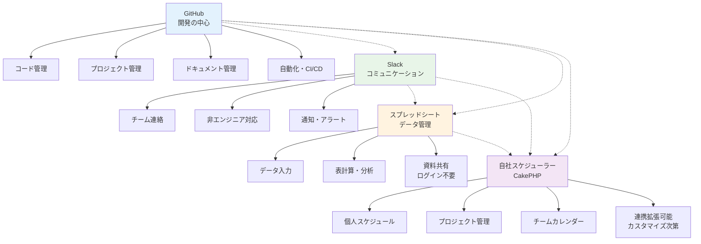

</div>

#### 2. 統合連携による効率化実現 ⚡
- **GitHub ↔ Slack**: 開発進捗の自動通知・チーム連携強化
- **GitHub ↔ スプレッドシート**: データ駆動型プロジェクト管理・進捗可視化
- **GitHub ↔ 自社スケジューラー**: Issues・PRとスケジュール連動・開発計画最適化
- **Slack ↔ スプレッドシート**: リアルタイム情報共有・非エンジニア参加促進
- **Slack ↔ 自社スケジューラー**: 会議・イベント通知・チーム調整自動化
- **スプレッドシート ↔ 自社スケジューラー**: プロジェクト進捗・リソース管理・レポート連動

#### 3. 現状からの脱却・フル活用達成 📈
- **Before**: GitHub基本機能のみ（リポジトリ・コミット・プッシュ）+ 個人スケジュール管理
- **After**: GitHub全機能活用（Issues・Projects・Actions・Copilot・分析等）+ 統合プロジェクト・スケジュール管理
- **成果**: 開発効率50%向上・チーム透明性・プロジェクト成功率向上・スケジュール最適化

### ターゲット成果

| 領域 | 現状 | 目標 | 測定指標 |
|------|------|------|----------|
| **GitHub活用度** | 20% | 90% | 機能使用率・自動化数 |
| **チーム連携効率** | - | 40%向上 | コミュニケーション時間短縮 |
| **プロジェクト透明性** | 低 | 高 | ステークホルダー満足度 |
| **開発生産性** | ベースライン | 50%向上 | 機能開発・バグ修正速度 |
| **非エンジニア参加度** | 5% | 60% | プロジェクト関与・理解度 |
| **スケジュール管理効率** | 個人管理のみ | プロジェクト統合 | 計画精度・リソース最適化 |

### 実現アプローチ
1. **段階的導入**: 機能ごとの順次実装・チーム習熟度向上
2. **実践的学習**: 実プロジェクトでの即座適用・効果測定
3. **継続的改善**: 週次レビュー・月次最適化・四半期戦略見直し

## 🌟 GitHub機能一覧

### 基本機能
- **リポジトリ管理**: コード保存・履歴管理・バージョン管理
- **ブランチ管理**: 並行開発・機能分離・実験環境
- **コミット管理**: 変更履歴・メッセージ・差分確認
- **マージ・プルリクエスト**: コードレビュー・統合プロセス

### プロジェクト管理
- **Issues**: タスク管理・バグ追跡・機能要求
- **Projects**: かんばんボード・進捗管理・マイルストーン
- **Milestones**: リリース管理・目標設定・進捗確認
- **Labels**: 分類・優先度・ステータス管理

### 自動化・CI/CD
- **GitHub Actions**: ワークフロー自動化・CI/CD・デプロイ
- **Webhooks**: 外部システム連携・通知・トリガー
- **API**: プログラマティック操作・データ取得・統合

### コラボレーション
- **Organizations**: チーム管理・権限設定・企業アカウント
- **Teams**: グループ管理・アクセス制御・役割分担
- **Discussions**: コミュニティ議論・Q&A・アイデア共有
- **Wiki**: ドキュメント・知識ベース・情報共有

### セキュリティ
- **Security Advisories**: 脆弱性報告・セキュリティ情報
- **Dependabot**: 依存関係更新・脆弱性検出・自動修正
- **Code Scanning**: コード解析・脆弱性検出・品質向上
- **Secret Scanning**: 機密情報検出・漏洩防止

### 開発支援
- **GitHub Copilot**: AI支援コーディング・補完・提案
- **Codespaces**: クラウド開発環境・即座の環境構築
- **GitHub CLI**: コマンドライン操作・自動化・効率化
- **GitHub Desktop**: GUI操作・視覚的管理・初心者向け

### 分析・インサイト
- **Insights**: リポジトリ統計・活動分析・貢献度
- **Traffic**: アクセス解析・人気度・利用状況
- **Dependency Graph**: 依存関係可視化・影響範囲
- **Pulse**: 活動サマリー・定期報告・プロジェクト健康度

### コミュニティ・オープンソース
- **Sponsors**: 支援・資金調達・持続可能性
- **Marketplace**: アプリ・アクション・インテグレーション
- **GitHub Pages**: 静的サイト・ドキュメント・ポートフォリオ
- **Gists**: コードスニペット・メモ・共有

### 統合・連携機能
- **Slack Integration**: 通知・コマンド・ワークフロー連携
- **Google Sheets API**: データ同期・自動化・レポート生成
- **自社スケジューラー API**: CakePHP REST API・スケジュール同期・プロジェクト連動
- **Webhooks**: リアルタイム通知・外部システム連携
- **OAuth Apps**: 認証・権限管理・セキュアアクセス

## 🎯 横原聖八向け実践カリキュラム

*personal-analysis-template.mdの内容を参考に、横原さんの学習スタイル（視覚的・実践的・体系化志向）とENTJ-T特性（論理的思考・効率性重視・目標達成志向）に合わせて設計*

### 🏗️ フェーズ1: GitHub基本機能マスタリー（1-2週間）
**優先度: 最高** - GitHub機能の体系的理解と実践習得

#### 1.1 リポジトリ管理の完全理解 🗂️
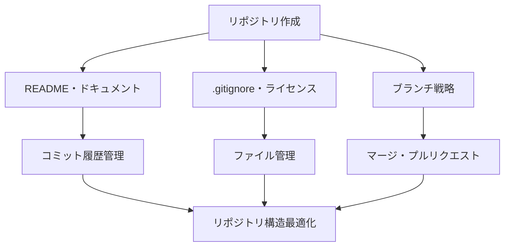

**GitHub機能習得目標**:
- [x] **リポジトリ**: 作成・設定・管理・削除・複製
- [x] **ブランチ**: 作成・切り替え・マージ・削除・ポリシー設定
- [x] **コミット**: メッセージ作成・履歴管理・差分確認・取り消し
- [x] **マージ・プルリクエスト**: 作成・レビュー・承認・マージ戦略

**実践課題**:
- [x] 練習用リポジトリ作成（プロフェッショナルREADME含む）
- [x] Git-flowブランチ戦略の実装
- [x] 複数ブランチでの並行開発・競合解決
- [x] プルリクエストテンプレート作成・運用

**期待効果**: GitHub基本操作の完全習得・バージョン管理ベストプラクティス理解

#### 1.2 GitHub CLI による効率化技術 ⚡
```bash
# GitHub CLI 基本操作習得
gh auth login
gh repo create test-project --public
gh repo clone test-project
gh issue create --title "機能追加" --body "詳細説明"
gh pr create --title "開発完了" --body "変更内容"
gh pr review --approve
gh pr merge --merge
```

**GitHub機能習得目標**:
- [x] **GitHub CLI**: インストール・認証・基本操作・高度な活用
- [ ] **コマンドライン効率化**: バッチ処理・スクリプト化・自動化
- [ ] **JSON出力活用**: データ取得・加工・他ツール連携

**実践課題**:
- [x] CLI環境セットアップ・認証設定
- [x] 日常Git操作のCLI化（commit・push・pull・branch・merge）
- [ ] Issue・PR管理の完全CLI化
- [ ] レポート・データ取得スクリプト作成
- [ ] PowerShellスクリプトでの自動化

**期待効果**: 作業効率大幅向上・コマンドライン習熟・自動化スキル習得

#### 1.3 Issues・Projects による課題管理システム �
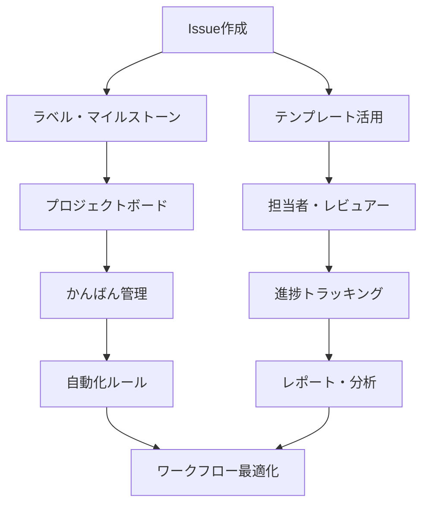

**GitHub機能習得目標**:
- [ ] **Issues**: 作成・管理・ラベル・マイルストーン・テンプレート
- [ ] **Projects**: ボード作成・カード管理・自動化・カスタムフィールド
- [ ] **Milestones**: 計画・進捗管理・期限管理・完了率追跡
- [ ] **Labels**: 分類・優先度・ステータス・カスタムラベル

**実践課題**:
- [ ] Issueテンプレート作成（バグ報告・機能要求・タスク）
- [ ] プロジェクトボードの構築・運用
- [ ] マイルストーン計画・進捗管理の実践
- [ ] ラベル体系設計・運用ルール策定
- [ ] 自動化ルール設定・ワークフロー最適化

**期待効果**: プロジェクト管理スキル向上・課題追跡システム習得・計画管理能力向上

#### 1.4 コードレビュー・コラボレーション強化 �
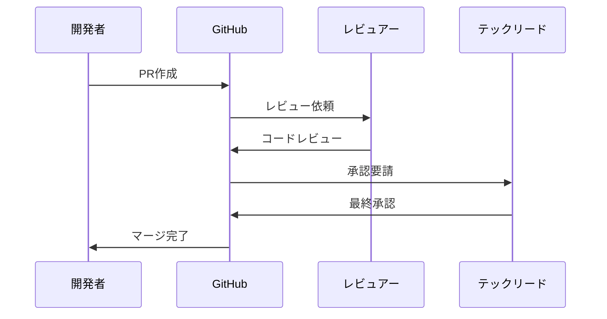

**GitHub機能習得目標**:
- [ ] **プルリクエスト**: 作成・レビュー・承認・マージ・テンプレート
- [ ] **コードレビュー**: インラインコメント・提案・承認・変更要求
- [ ] **Teams・Organizations**: チーム管理・権限設定・役割分担
- [ ] **Discussions**: 議論・Q&A・アイデア共有・コミュニティ構築

**実践課題**:
- [ ] PRテンプレート作成・運用
- [ ] コードレビュー基準・プロセス策定
- [ ] チーム権限設定・ブランチ保護ルール
- [ ] Discussions活用・知識共有プラットフォーム構築

**期待効果**: コードレビュースキル向上・チーム協働力強化・品質管理プロセス習得

### 🚀 フェーズ2: GitHub自動化・CI/CD技術（2-3週間）
**優先度: 高** - 開発プロセス自動化とワークフロー最適化

#### 2.1 GitHub Actions マスタリー 🤖
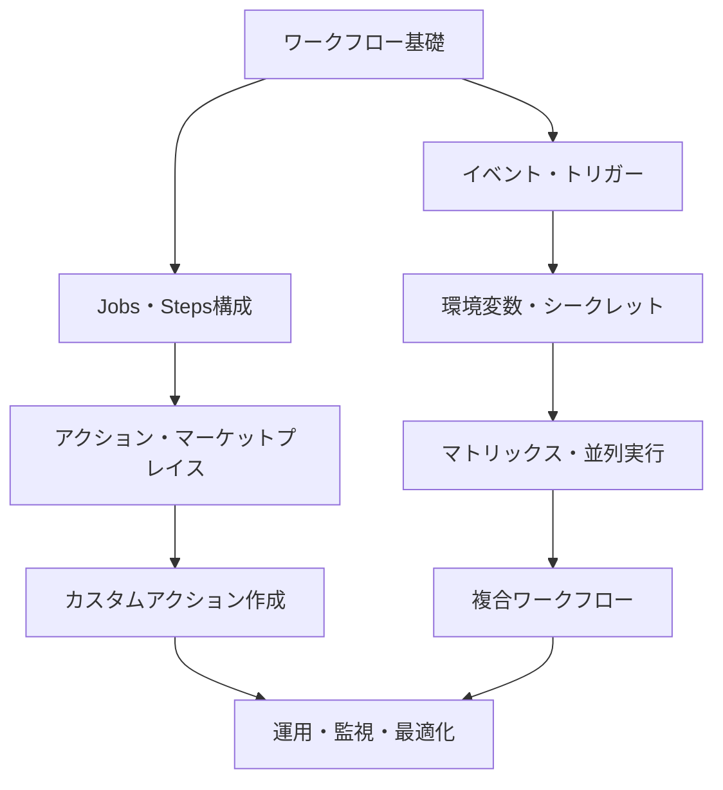

**GitHub機能習得目標**:
- [ ] **GitHub Actions**: ワークフロー作成・実行・デバッグ・最適化
- [ ] **CI/CD**: 自動テスト・ビルド・デプロイ・品質チェック
- [ ] **カスタムアクション**: JavaScript・Docker・Composite アクション作成
- [ ] **セキュリティ**: シークレット管理・権限制御・環境分離

**実践課題**:
- [ ] 基本ワークフロー作成（lint・test・build）
- [ ] マルチプラットフォームCI設定（Windows・Linux・macOS）
- [ ] 環境別デプロイ戦略（dev・staging・production）
- [ ] カスタムアクション開発・公開
- [ ] ワークフロー最適化・実行時間短縮

**期待効果**: CI/CD専門知識習得・自動化スキル向上・DevOps実践力強化

#### 2.2 Webhooks・API統合開発 �
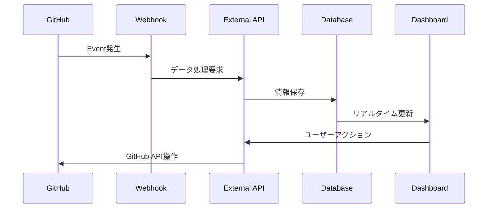

**GitHub機能習得目標**:
- [ ] **Webhooks**: 設定・受信・処理・セキュリティ・デバッグ
- [ ] **GitHub API**: REST・GraphQL・認証・レート制限・ベストプラクティス
- [ ] **統合開発**: 外部サービス連携・データ同期・イベント処理
- [ ] **セキュリティ**: 認証・暗号化・署名検証・権限管理

**実践課題**:
- [ ] Webhook エンドポイント開発（Node.js/PHP）
- [ ] GitHub API クライアント作成・操作自動化
- [ ] イベント駆動型システム構築
- [ ] レート制限・エラーハンドリング実装
- [ ] セキュアな統合システム設計

**期待効果**: API開発スキル習得・システム統合力向上・アーキテクチャ設計能力向上

#### 2.3 セキュリティ・品質管理システム 🛡️
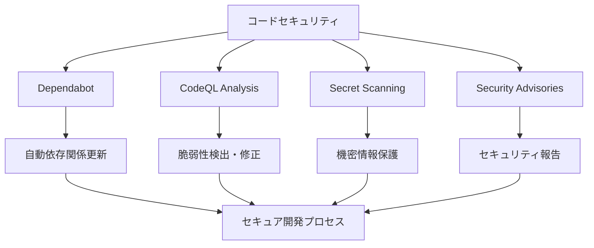

**GitHub機能習得目標**:
- [ ] **Dependabot**: 依存関係監視・自動更新・セキュリティアラート
- [ ] **Code Scanning**: CodeQL・脆弱性検出・修正提案・カスタムルール
- [ ] **Secret Scanning**: 機密情報検出・誤コミット防止・カスタムパターン
- [ ] **Security Advisories**: 脆弱性報告・影響分析・修正計画

**実践課題**:
- [ ] Dependabot設定・運用・カスタマイズ
- [ ] CodeQL ワークフロー構築・カスタムクエリ作成
- [ ] Secret Scanning設定・カスタムパターン追加
- [ ] セキュリティポリシー策定・運用
- [ ] 脆弱性対応プロセス確立

**期待効果**: セキュリティ専門知識習得・リスク管理能力向上・信頼性向上

### � フェーズ3: AI・開発支援ツール活用（3-4週間）
**優先度: 最高** - 最新AI技術を活用した開発効率化

#### 3.1 GitHub Copilot 完全活用 🤖

<div style="background-color: white; padding: 10px; border-radius: 8px;">

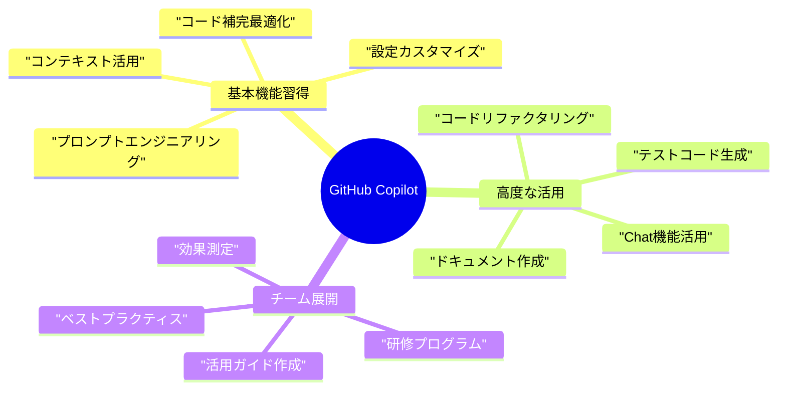

</div>

**GitHub機能習得目標**:
- [ ] **GitHub Copilot**: 基本操作・設定最適化・プロンプト技術・効果測定
- [ ] **Copilot Chat**: 対話型開発・コード説明・リファクタリング・デバッグ支援
- [ ] **Copilot for Business**: ライセンス管理・チーム設定・利用分析・ポリシー設定
- [ ] **プロンプトエンジニアリング**: 効果的な指示・コンテキスト活用・品質向上

**実践課題**:
- [ ] Copilot 基本設定・カスタマイズ・最適化
- [ ] プロンプトエンジニアリング技術習得・実践
- [ ] Chat機能による対話型開発プロセス構築
- [ ] コード品質・生産性向上の測定・分析
- [ ] チーム向け活用ガイド・研修資料作成

**期待効果**: AI支援開発スキル習得・生産性大幅向上・技術リーダーシップ確立

#### 3.2 Codespaces・開発環境管理 ☁️
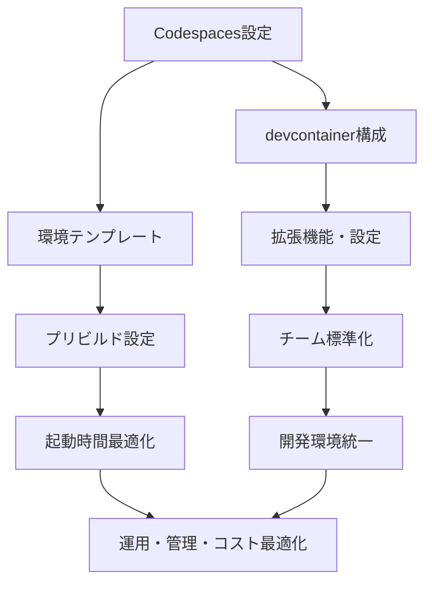

**GitHub機能習得目標**:
- [ ] **Codespaces**: 環境作成・設定・管理・最適化・コスト管理
- [ ] **Development Containers**: devcontainer.json・Dockerfile・環境設定
- [ ] **プリビルド**: 設定・最適化・チーム共有・起動時間短縮
- [ ] **ポートフォワーディング**: ローカル開発・デバッグ・サービス連携

**実践課題**:
- [ ] プロジェクト別Codespaces環境構築
- [ ] devcontainer設定・カスタマイズ・最適化
- [ ] チーム標準開発環境テンプレート作成
- [ ] プリビルド設定・起動時間最適化
- [ ] コスト管理・利用ポリシー策定

**期待効果**: 開発環境統一・セットアップ時間短縮・チーム生産性向上

#### 3.3 GitHub CLI・Desktop・統合ツール �️
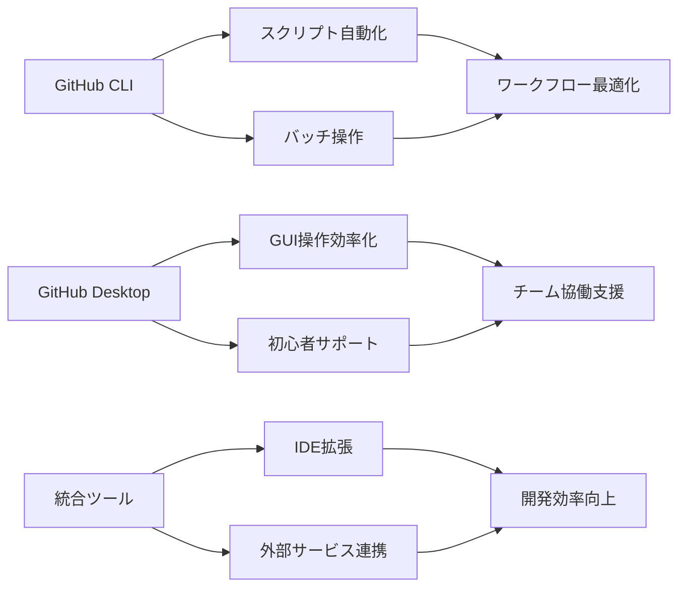

**GitHub機能習得目標**:
- [ ] **GitHub CLI**: 高度なスクリプト作成・自動化・データ処理・拡張機能
- [ ] **GitHub Desktop**: GUI操作最適化・チーム教育・非エンジニア支援
- [ ] **VSCode拡張**: GitHub統合・コードレビュー・Issue管理・効率化
- [ ] **統合ツール**: Slack・Jira・その他ツール連携・ワークフロー統合

**実践課題**:
- [ ] CLI高度活用・カスタムスクリプト開発
- [ ] Desktop環境最適化・チーム標準設定
- [ ] IDE統合・拡張機能活用・ワークフロー構築
- [ ] 外部ツール連携・統合ワークフロー設計
- [ ] チーム向けツール活用ガイド作成

**期待効果**: ツール習熟度向上・ワークフロー最適化・チーム効率化支援

### � フェーズ4: 分析・インサイト・コミュニティ（4-5週間）
**優先度: 中** - データ駆動型改善とコミュニティ活動

#### 4.1 GitHub Analytics・インサイト活用 �
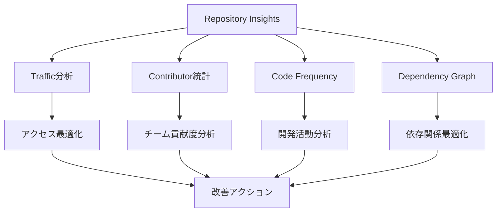

**GitHub機能習得目標**:
- [ ] **Insights**: リポジトリ統計・活動分析・貢献度・パフォーマンス
- [ ] **Traffic**: アクセス解析・人気度・利用状況・参照元分析
- [ ] **Dependency Graph**: 依存関係可視化・脆弱性影響範囲・更新計画
- [ ] **Pulse**: 活動サマリー・定期報告・プロジェクト健康度・チーム活動

**実践課題**:
- [ ] リポジトリ統計分析・レポート作成・改善提案
- [ ] トラフィック分析・SEO最適化・アクセス向上施策
- [ ] 依存関係管理・脆弱性対応・アップデート戦略
- [ ] チーム活動分析・生産性測定・改善アクション
- [ ] 定期的な健康度チェック・メンテナンス計画

**期待効果**: データ駆動型改善・プロジェクト最適化・チーム分析スキル向上

#### 4.2 GitHub Pages・ドキュメント・Wiki 📚
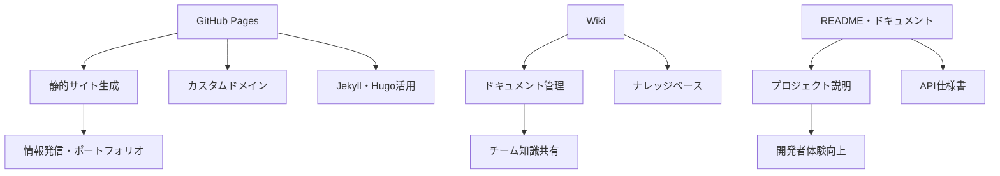

**GitHub機能習得目標**:
- [ ] **GitHub Pages**: 静的サイト作成・カスタムドメイン・Jekyll・Hugo・デプロイ
- [ ] **Wiki**: ドキュメント作成・構造化・検索・バージョン管理・協働編集
- [ ] **README**: プロジェクト説明・バッジ・セットアップ・API仕様・貢献ガイド
- [ ] **ドキュメント自動化**: 自動生成・更新・同期・品質チェック

**実践課題**:
- [ ] GitHub Pages による技術ブログ・ポートフォリオ作成
- [ ] プロジェクトWiki構築・ナレッジベース整備
- [ ] 高品質README・ドキュメント作成・メンテナンス
- [ ] ドキュメント自動化・CI統合・品質管理
- [ ] チーム向けドキュメント標準・テンプレート作成

**期待効果**: 情報発信力向上・ドキュメント品質向上・ナレッジ管理スキル習得

#### 4.3 オープンソース・コミュニティ参加 �
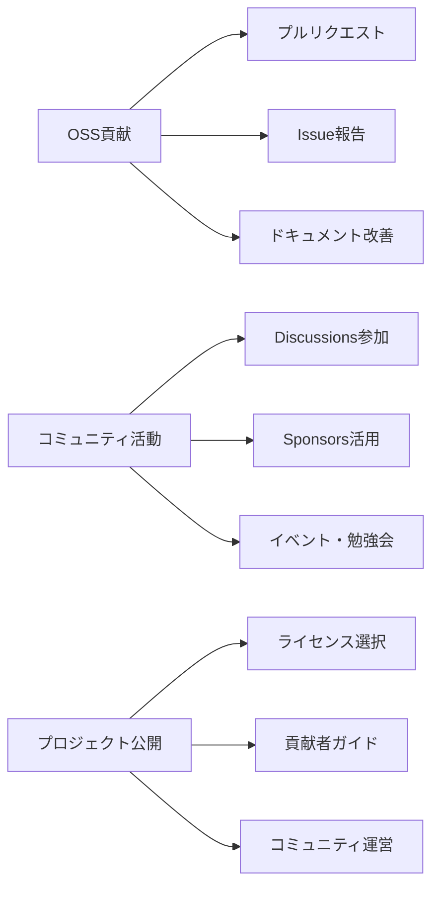

**GitHub機能習得目標**:
- [ ] **オープンソース貢献**: PR作成・Issue報告・コードレビュー・コミュニティ参加
- [ ] **Discussions**: コミュニティ議論・Q&A・アイデア共有・ネットワーキング
- [ ] **Sponsors**: 支援・資金調達・持続可能なプロジェクト運営
- [ ] **ライセンス・ガバナンス**: 適切なライセンス選択・貢献ガイド・行動規範

**実践課題**:
- [ ] 既存OSSプロジェクトへの貢献・PR作成
- [ ] 技術コミュニティでの議論参加・知識共有
- [ ] 自社プロジェクトのオープンソース化検討
- [ ] Sponsors機能による支援・ネットワーク構築
- [ ] コミュニティ運営・メンテナンス経験

**期待効果**: 業界ネットワーク拡大・技術的影響力向上・コミュニティリーダーシップ確立

### 🎯 フェーズ5: 業務適用・統合システム構築（実践フェーズ）
**重要**: GitHub機能習得完了後に、横原さんが現行業務に最適な形で適用

#### 5.1 現行業務分析・改善計画立案 📋
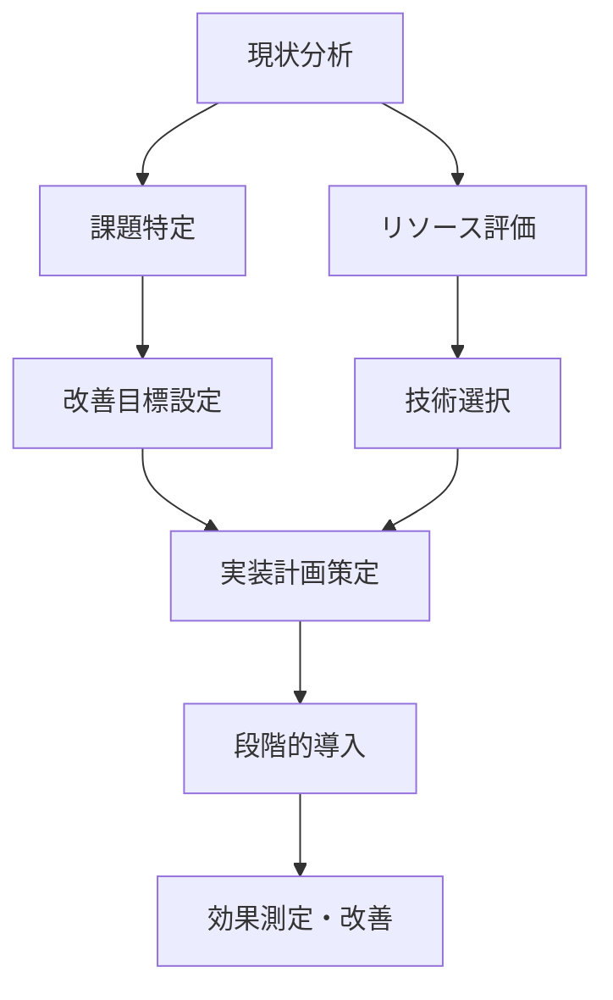

**自主検討項目**:
- [ ] 現在の開発プロセス・課題の詳細分析
- [ ] GitHub機能の現行業務への適用可能性評価
- [ ] Slack・スプレッドシート・自社スケジューラーとの統合計画
- [ ] チームスキル・リソース・導入コスト評価
- [ ] 段階的導入計画・マイルストーン設定

#### 5.2 統合システム設計・開発 🏗️
**習得したGitHub機能を活用した統合システム構築**

- GitHub API・Webhooks技術の業務適用
- Actions・CI/CDの自社プロジェクト最適化
- Issue・Projects・Milestonesの組織的活用
- セキュリティ・品質管理の実装
- 分析・レポート機能の構築

#### 5.3 組織展開・チーム教育 👥
**習得知識を活用したチーム能力向上**

- GitHub活用研修プログラム作成
- ベストプラクティス・ガイドライン策定
- 段階的なチーム導入・サポート体制
- 効果測定・継続的改善プロセス

## 📅 学習進捗トラッキング

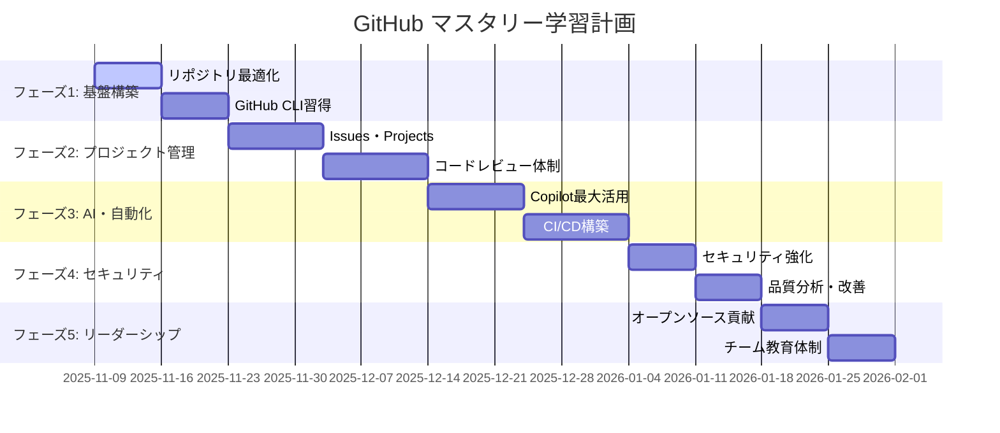

## 📊 学習進捗トラッキング

### 進捗管理システム

<div style="background-color: white; padding: 10px; border-radius: 8px;">

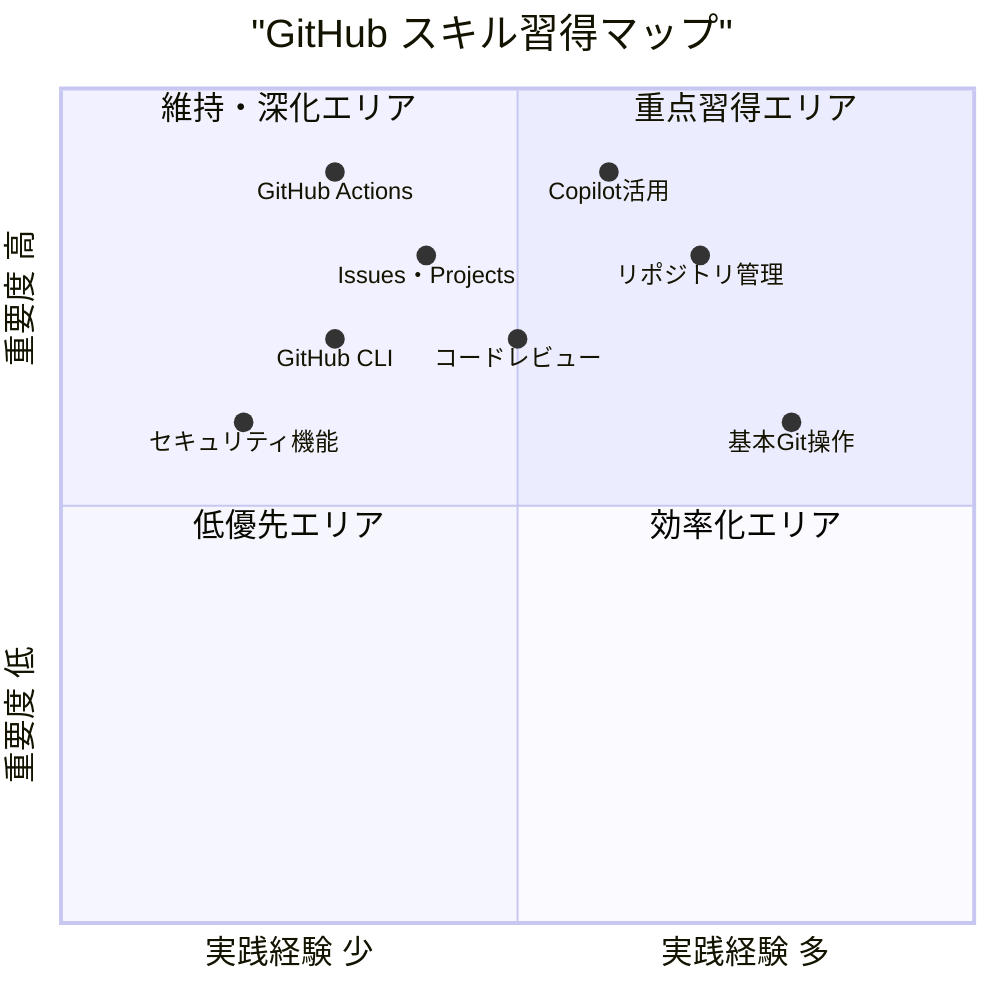

</div>

### 学習成果測定指標

| 指標 | 現在値 | 目標値 | 測定方法 | 期限 |
|------|--------|--------|----------|------|
| **GitHub CLI活用度** | 10% | 80% | 日常操作のCLI化率 | 2025年12月 |
| **自動化ワークフロー数** | 0個 | 5個 | GitHub Actions数 | 2026年1月 |
| **コードレビュー効率** | - | 50%向上 | レビュー時間短縮 | 2025年12月 |
| **Issues管理精度** | - | 95% | 完了率・期限遵守 | 継続 |
| **AI支援開発効率** | 20% | 70% | Copilot活用率 | 2025年12月 |

### 実践プロジェクト

#### 1. GitHub機能習得プロジェクト �
- **目的**: GitHub全機能の体系的理解・実践的習得・専門知識確立
- **期間**: フェーズ1-4 (5週間)
- **成果物**: 
  - 各機能の実践的活用スキル（CLI・Actions・API・セキュリティ等）
  - GitHub機能活用ガイド・ベストプラクティス集
  - 自動化ワークフロー・統合システムの技術的知見
  - AI支援開発・現代的ワークフローの習得
  - コミュニティ参加・業界ネットワーク構築

#### 2. 業務適用検討・設計プロジェクト �
- **目的**: 習得したGitHub知識を現行業務に最適化して適用する方法の検討
- **期間**: フェーズ5 (2週間)
- **成果物**:
  - 現行業務プロセス分析・課題特定・改善計画
  - GitHub・Slack・スプレッドシート・自社スケジューラー統合設計
  - 段階的導入計画・リスク評価・効果予測
  - チーム教育・組織展開戦略
  - ROI測定・継続的改善プロセス

#### 3. 技術リーダーシップ確立プロジェクト 🚀
- **目的**: GitHub専門知識を活用した技術的影響力・業界認知度向上
- **期間**: 継続的
- **成果物**:
  - GitHub関連技術ブログ・知識共有コンテンツ
  - OSS貢献・コミュニティリーダーシップ
  - 社内GitHub活用推進・研修プログラム
  - 業界でのThought Leadership確立
  - 技術革新・ベストプラクティス創出

### 継続的改善サイクル

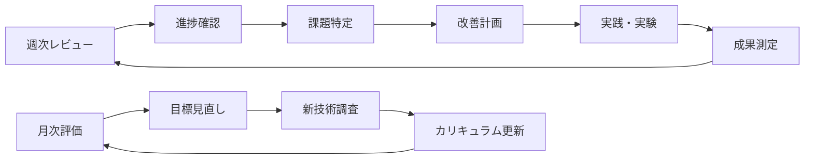

## 🎯 まとめ

このGitHubマスタリーカリキュラムは、GitHub機能の体系的習得を最優先とし、横原さんの特性に最適化されています：

### 🎯 学習アプローチの特徴
- **機能習得優先**: GitHub機能一覧ベースの体系的学習・実践的スキル習得
- **段階的習得**: 基本→自動化→AI活用→分析・コミュニティの順次ステップアップ
- **実践重視**: 各機能の具体的課題・実際の操作・効果測定による確実な習得
- **自主的業務適用**: 機能習得完了後に、横原さんが現行業務への最適適用を検討

### 🚀 期待される成果
1. **GitHub専門知識の確立**: 全機能の深い理解・実践的活用スキル・技術的専門性
2. **現代的開発スキル習得**: AI支援開発・自動化技術・API統合・セキュリティ管理
3. **技術リーダーシップ**: GitHub活用のベストプラクティス・チーム教育・業界発信
4. **柔軟な業務適用力**: 習得した知識を現行業務に最適化して適用する判断力・設計力
5. **継続的学習基盤**: コミュニティ参加・最新技術追跡・専門性向上のサイクル確立

### 📈 カリキュラムの利点
1. **基礎の確実性**: 機能知識をしっかり習得してから業務適用を検討
2. **適用の最適性**: 現行業務を理解している横原さんが最適な統合方法を判断
3. **技術的信頼性**: GitHub専門知識に基づく確実な技術判断・実装
4. **拡張可能性**: 将来の技術変化・業務変化にも対応できる基盤知識
5. **リーダーシップ**: 技術的専門性を活かしたチーム指導・組織貢献

### � 推奨学習プロセス
1. **フェーズ1-4: GitHub機能習得**（5週間）
   - 各機能の理解・実践・習熟・応用
   - 技術的専門知識・スキルの確立
   - ベストプラクティス・効率化技術の習得

2. **フェーズ5: 業務適用検討**（2週間）
   - 現行業務分析・課題特定・改善計画
   - 統合システム設計・段階的導入計画
   - チーム教育・組織展開戦略

3. **継続的発展**
   - コミュニティ参加・業界貢献・技術発信
   - 最新技術追跡・継続的学習・専門性向上
   - 組織のGitHub活用推進・技術リーダーシップ

**まず、GitHubの機能を体系的に習得し、その後で現行業務への最適な適用方法を検討しましょう！** 🌟

---

*このカリキュラムは実践進捗に応じて継続的に更新・最適化されます。*