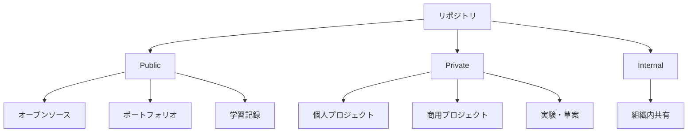
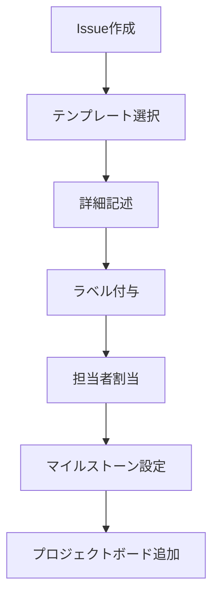
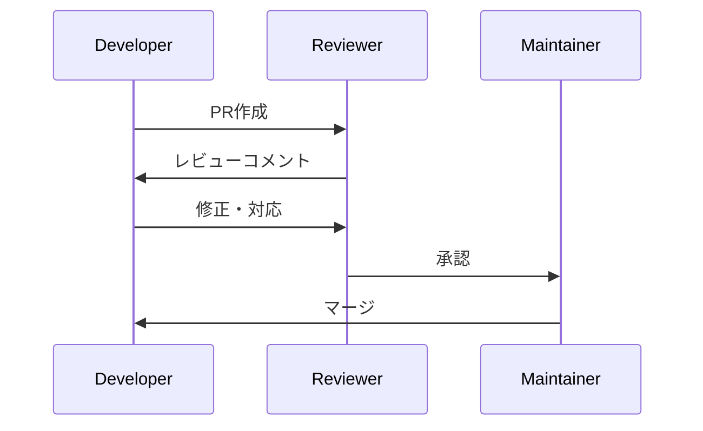
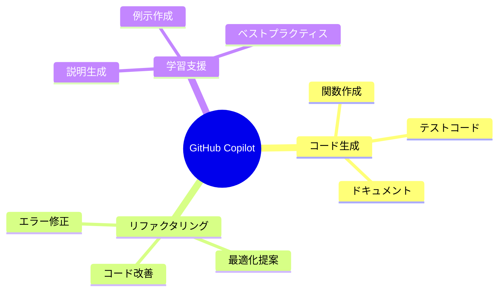

# GitHubフル活用術 🚀

*最終更新: 2025年11月9日*

## 📋 目次

1. [GitHub基礎](#github基礎)
2. [リポジトリ管理術](#リポジトリ管理術)
3. [ブランチ戦略](#ブランチ戦略)
4. [Issue・プロジェクト管理](#issueプロジェクト管理)
5. [プルリクエスト最適化](#プルリクエスト最適化)
6. [GitHub Actions活用](#github-actions活用)
7. [セキュリティ機能](#セキュリティ機能)
8. [コミュニティ活用](#コミュニティ活用)
9. [GitHub Copilot統合](#github-copilot統合)
10. [高度なテクニック](#高度なテクニック)

## 🔰 GitHub基礎

### アカウント設定最適化
- **プロフィール充実**: README.mdでの自己紹介
- **SSH鍵設定**: セキュアな認証
- **2FA有効化**: セキュリティ強化
- **通知設定**: 効率的な情報受信

### リポジトリの種類と使い分け


## 📁 リポジトリ管理術

### 構造化のベストプラクティス

```
project/
├── .github/
│   ├── workflows/        # GitHub Actions
│   ├── ISSUE_TEMPLATE/   # Issue テンプレート
│   ├── PULL_REQUEST_TEMPLATE.md
│   └── CODEOWNERS        # コードレビュー担当者
├── docs/                 # ドキュメント
├── src/                  # ソースコード
├── tests/                # テストファイル
├── .gitignore           # 除外ファイル設定
├── README.md            # プロジェクト説明
├── LICENSE              # ライセンス
└── CONTRIBUTING.md      # 貢献ガイドライン
```

### READMEテンプレート

```markdown
# プロジェクト名

## 概要
簡潔な説明

## 機能
- 主要機能1
- 主要機能2

## インストール
ステップバイステップ

## 使用方法
コード例付き

## 貢献
貢献方法

## ライセンス
ライセンス情報
```

## 🌿 ブランチ戦略

### Git Flow vs GitHub Flow

```mermaid
gitgraph
    commit id: "Initial"
    branch feature/new-feature
    commit id: "Feature work"
    commit id: "Feature complete"
    checkout main
    merge feature/new-feature
    commit id: "Release"
```

### ブランチ命名規則
- `feature/機能名`: 新機能開発
- `bugfix/バグ名`: バグ修正
- `hotfix/緊急修正名`: 緊急修正
- `docs/ドキュメント名`: ドキュメント更新
- `refactor/リファクタ名`: リファクタリング

### コミットメッセージ規則
```
type(scope): subject

- feat: 新機能
- fix: バグ修正
- docs: ドキュメント
- style: コードスタイル
- refactor: リファクタリング
- test: テスト
- chore: その他
```

## 📋 Issue・プロジェクト管理

### Issue活用術



### ラベル体系
- **Type**: `bug`, `feature`, `documentation`, `question`
- **Priority**: `high`, `medium`, `low`
- **Status**: `in-progress`, `review-needed`, `blocked`
- **Difficulty**: `easy`, `medium`, `hard`

### プロジェクトボード活用
1. **To Do**: 未着手タスク
2. **In Progress**: 作業中
3. **Review**: レビュー待ち
4. **Done**: 完了

## 🔄 プルリクエスト最適化

### PR作成のベストプラクティス



### PRテンプレート
```markdown
## 変更内容
- 変更点1
- 変更点2

## テスト
- [ ] ユニットテスト通過
- [ ] 手動テスト完了

## チェックリスト
- [ ] ドキュメント更新
- [ ] CHANGELOG更新
- [ ] レビュー完了
```

## ⚡ GitHub Actions活用

### CI/CDパイプライン

```yaml
name: CI/CD Pipeline

on:
  push:
    branches: [ main, develop ]
  pull_request:
    branches: [ main ]

jobs:
  test:
    runs-on: ubuntu-latest
    steps:
    - uses: actions/checkout@v4
    - name: Setup Node.js
      uses: actions/setup-node@v4
      with:
        node-version: '18'
    - name: Install dependencies
      run: npm install
    - name: Run tests
      run: npm test
    - name: Build
      run: npm run build
```

### 便利なワークフロー例
- **自動テスト**: プルリクエスト時
- **デプロイ**: mainブランチへのマージ時
- **依存関係更新**: Dependabot
- **コードカバレッジ**: Codecov連携
- **セキュリティスキャン**: CodeQL

## 🔒 セキュリティ機能

### セキュリティ対策チェックリスト
- [ ] **Dependabot**: 依存関係の脆弱性監視
- [ ] **Secret scanning**: 機密情報の検出
- [ ] **Code scanning**: コード脆弱性検出
- [ ] **Security advisories**: セキュリティ情報公開
- [ ] **Protected branches**: 重要ブランチ保護

### Secrets管理
```yaml
# GitHub Secrets活用例
env:
  API_KEY: ${{ secrets.API_KEY }}
  DATABASE_URL: ${{ secrets.DATABASE_URL }}
```

## 🌍 コミュニティ活用

### オープンソース貢献
1. **Good First Issues**: 初心者向けタスク探し
2. **Contributing Guidelines**: 貢献方法確認
3. **Code of Conduct**: 行動規範遵守
4. **Issue報告**: バグや改善提案
5. **プルリクエスト**: コード貢献

### ネットワーキング
- **GitHub Discussions**: コミュニティ議論
- **GitHub Sponsors**: 支援活動
- **GitHub Stars**: 興味あるプロジェクト管理
- **Following**: 開発者フォロー

## 🤖 GitHub Copilot統合

### Copilot活用シーン


### 効果的な使い方
- **明確なコメント**: 意図を明確に記述
- **段階的開発**: 小さな単位で生成
- **レビュー習慣**: 生成コードの検証
- **継続学習**: Copilotの提案から学ぶ

## 🚀 高度なテクニック

### Git submodules
```bash
# サブモジュール追加
git submodule add https://github.com/user/repo.git libs/repo

# サブモジュール更新
git submodule update --init --recursive
```

### GitHub CLI活用
```bash
# PRの作成とレビュー
gh pr create --title "新機能追加" --body "詳細説明"
gh pr review --approve

# Issue管理
gh issue create --title "バグ報告" --body "詳細"
gh issue list --label bug
```

### カスタムGitHooks
```bash
#!/bin/sh
# pre-commit hook例
npm run lint
npm run test
```

## 📈 効果測定・改善

### メトリクス監視
- **Insights**: リポジトリ統計
- **Pulse**: 活動概要
- **Contributors**: 貢献者統計
- **Traffic**: アクセス解析
- **Dependencies**: 依存関係分析

### 継続的改善
1. **定期レビュー**: ワークフロー見直し
2. **ツール更新**: 最新機能活用
3. **チーム教育**: 知識共有
4. **自動化推進**: 手作業削減

## 🎯 まとめ

GitHubは単なるコード管理ツールではなく、開発プロセス全体を支援する包括的プラットフォームです。これらの機能を体系的に活用することで、個人・チーム両方の開発効率と品質を大幅に向上させることができます。

**次のステップ**:
1. 現在の使用状況を評価
2. 未活用機能の導入計画策定
3. チーム内での知識共有
4. 継続的な改善サイクル確立

---

*このドキュメントは継続的に更新されます。最新のGitHub機能や最適化されたワークフローを反映していきます。*