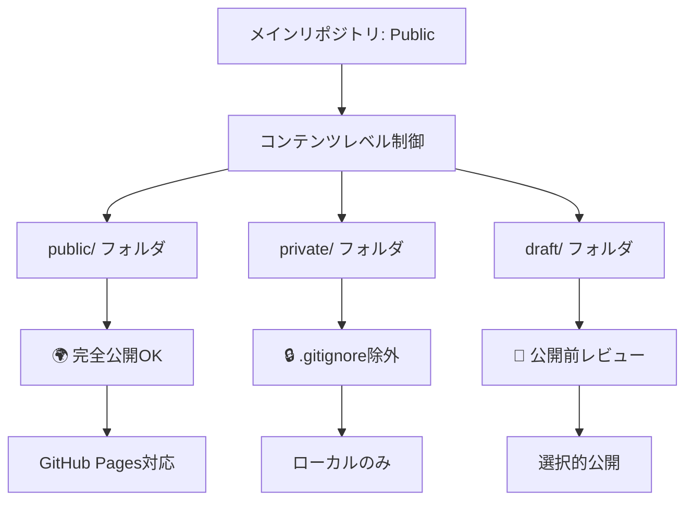
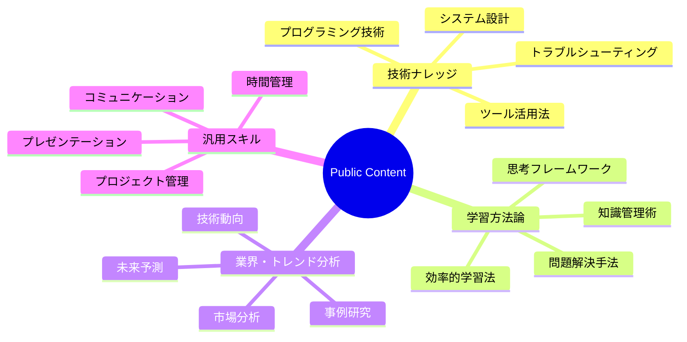
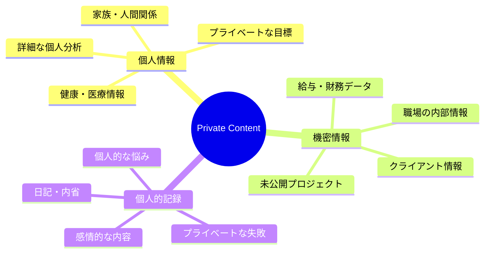
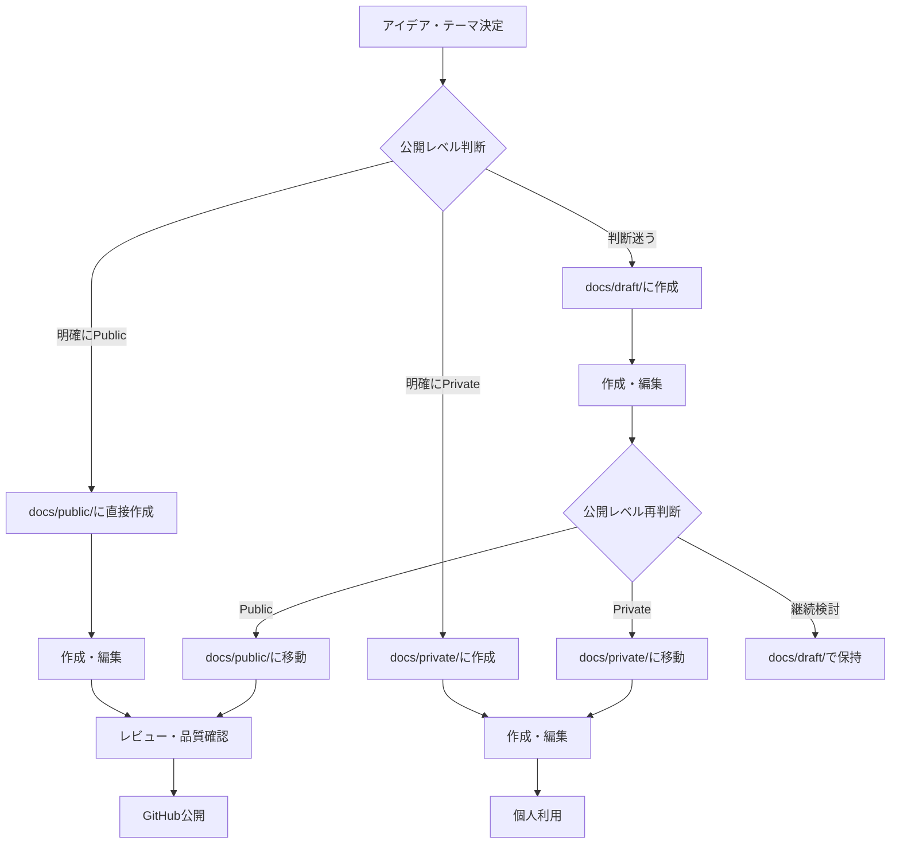
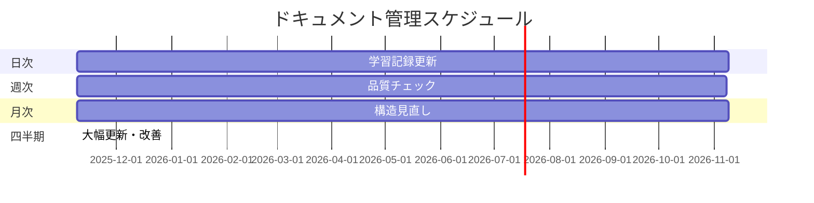

# GitHub公開戦略ガイド 🌍

*最終更新: 2025年11月9日*

## 📋 目次

1. [公開戦略概要](#公開戦略概要)
2. [リポジトリ設定](#リポジトリ設定)
3. [コンテンツ分類基準](#コンテンツ分類基準)
4. [公開フロー](#公開フロー)
5. [セキュリティ対策](#セキュリティ対策)
6. [運用・メンテナンス](#運用メンテナンス)

## 🎯 公開戦略概要

### 基本方針



### 利点・メリット

1. **透明性**: オープンな学習・成長プロセス
2. **コミュニティ価値**: 他者にも有用な知識共有
3. **アカウンタビリティ**: 継続的な学習動機
4. **フィードバック**: コミュニティからの改善提案
5. **ポートフォリオ**: 体系的な知識管理能力の証明

## ⚙️ リポジトリ設定

### 🎯 推奨設定

**リポジトリ基本情報**:
- **可視性**: Public
- **名前**: `knowledge-management` または `documents`
- **説明**: "個人学習・成長記録とナレッジ管理プロジェクト"
- **トピック**: `learning`, `knowledge-management`, `markdown`, `mermaid`

**設定項目**:
```yaml
Repository Settings:
  - Visibility: Public
  - Features:
    - Issues: Enabled (改善提案・質問受付)
    - Projects: Enabled (進捗管理)
    - Wiki: Disabled (メインドキュメントで十分)
    - Discussions: Enabled (コミュニティ交流)
  - GitHub Pages: Enabled
    - Source: Deploy from a branch
    - Branch: main / docs
```

### 📋 必要ファイル

```
repository-root/
├── .github/
│   ├── README.md                 # プロジェクト説明
│   ├── copilot-instructions.md   # Copilot活用指示
│   └── workflows/               # GitHub Actions
├── docs/                        # メインコンテンツ
├── .gitignore                   # 除外設定
├── LICENSE                      # ライセンス
└── CONTRIBUTING.md              # 貢献ガイド
```

## 📊 コンテンツ分類基準

### 🌍 Public コンテンツ（公開OK）



**具体例**:
- GitHubフル活用術
- AIの未来予測
- プログラミングベストプラクティス
- 学習効率化テクニック
- システム設計パターン

### 🔒 Private コンテンツ（非公開）



**具体例**:
- 詳細な個人分析結果
- 具体的な収入・支出記録
- 職場の人間関係分析
- 健康状態・医療記録
- プライベートな目標・悩み

### 📝 Draft コンテンツ（公開前レビュー）

- 完成度が低いドキュメント
- 事実確認が必要な内容
- 公開判断が必要な境界線コンテンツ
- 実験的・試行錯誤中の内容

## 🔄 公開フロー

### 📋 新規ドキュメント作成フロー



### ✅ 公開前チェックリスト

**内容チェック**:
- [ ] 個人情報・機密情報の除去確認
- [ ] 事実確認・ソース検証完了
- [ ] 文章の品質・分かりやすさ確認
- [ ] Mermaid図表の正確性確認
- [ ] リンク・参照の有効性確認

**形式チェック**:
- [ ] 適切なフォルダ配置
- [ ] ファイル命名規則遵守
- [ ] 必要な見出し・構造完備
- [ ] 絵文字・フォーマット統一
- [ ] 最終更新日記載

**価値チェック**:
- [ ] 他者にとって有用な内容
- [ ] 実践的・具体的な価値提供
- [ ] 長期的な価値維持可能性
- [ ] コミュニティガイドライン適合

## 🔐 セキュリティ対策

### 📋 .gitignore設定

```gitignore
# プライベート・個人情報
docs/private/
docs/draft/sensitive/

# 一時ファイル
*.tmp
*.temp
.DS_Store
Thumbs.db

# ログファイル
*.log
logs/

# 個人設定・機密情報
.env
.env.local
config/personal/
credentials/

# バックアップファイル
*.bak
*.backup
backup/

# 編集中ファイル
*~
.#*
```

### 🛡️ 追加セキュリティ対策

1. **定期的な履歴確認**
   ```bash
   # 機密情報の誤コミット確認
   git log --all --grep="password\|secret\|key"
   ```

2. **pre-commit hooks**
   ```bash
   # 機密情報検出
   git config core.hooksPath .githooks
   ```

3. **ブランチ保護**
   - main ブランチへの直接pushを制限
   - プルリクエスト必須
   - レビュー必須設定

## 🔧 運用・メンテナンス

### 📅 定期メンテナンススケジュール



### 📊 品質管理プロセス

1. **日次確認**
   - 新規追加コンテンツの適切な分類
   - リンク・参照の有効性
   - 基本的な文法・形式チェック

2. **週次レビュー**
   - コンテンツ品質の総合評価
   - 読者フィードバックの確認・対応
   - 改善が必要な箇所の特定

3. **月次更新**
   - 古い情報の更新・削除
   - 新しい学びの反映
   - 全体構造の最適化

4. **四半期改善**
   - 大幅な構造変更・改善
   - 新しいカテゴリ・セクション追加
   - テンプレート・ガイドライン更新

### 🤝 コミュニティ対応

**Issue対応**:
- 改善提案・質問への迅速な対応
- 建設的なフィードバックの積極的な取り入れ
- 荒らし・不適切な投稿への適切な対応

**Discussion活用**:
- 学習コミュニティとしての価値提供
- 知識共有・経験交流の促進
- ネットワーキング・関係構築

### 📈 成果測定

**定量指標**:
- リポジトリのスター・フォーク数
- ドキュメントの閲覧数（GitHub Pages）
- Issue・Discussionの活発さ
- コミット頻度・継続性

**定性指標**:
- コミュニティからのフィードバック品質
- 自身の学習・成長実感
- ドキュメントの実用性・価値
- 長期的な知識蓄積効果

## 🎯 今後の発展計画

### 📈 短期目標（3ヶ月）
- [ ] 基本ドキュメント10件作成
- [ ] GitHub Pages設定・公開
- [ ] 初回コミュニティフィードバック獲得
- [ ] 継続的更新リズム確立

### 🚀 中期目標（6ヶ月）
- [ ] 50件以上の高品質ドキュメント
- [ ] 100スター獲得
- [ ] アクティブなコミュニティ形成
- [ ] 他プロジェクトとの連携

### 🌟 長期ビジョン（1年）
- [ ] 包括的な学習・成長ナレッジベース完成
- [ ] 教育・学習コミュニティのハブ化
- [ ] 書籍・講演等への発展
- [ ] 持続可能な知識共有エコシステム

---

## 🎯 実行チェックリスト

### 🚀 今すぐ実行
- [ ] `.gitignore`設定確認・更新
- [ ] README.md作成・更新
- [ ] 初回コミット・プッシュ
- [ ] リポジトリ設定最適化

### 📅 今週中に実行
- [ ] GitHub Pages設定
- [ ] Contributing.md作成
- [ ] License選択・設定
- [ ] 初期ドキュメント公開

### 📈 継続的に実行
- [ ] 定期的なコンテンツ追加
- [ ] 品質維持・向上
- [ ] コミュニティ対応
- [ ] セキュリティ確認

---

*この戦略に従って、価値あるオープンな学習リソースを構築していきましょう！* 🌟