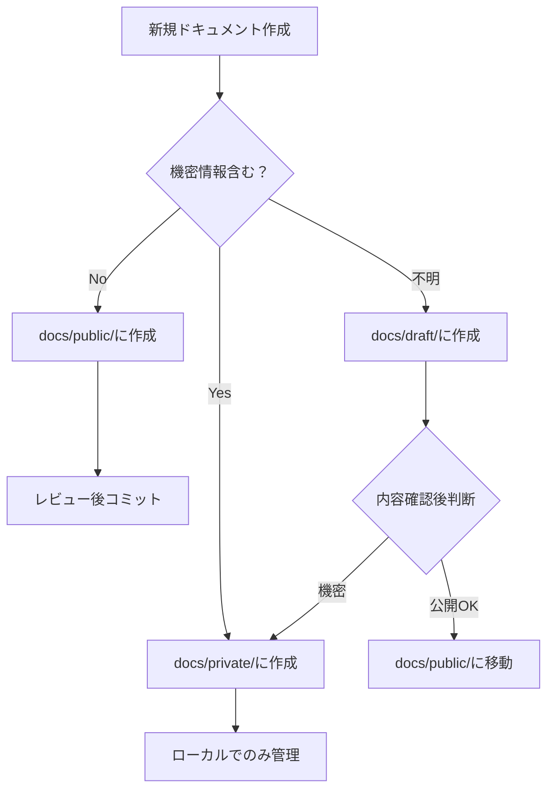

# セキュリティ確認ガイド 🔒

*最終更新: 2025年11月9日*

## 🎯 プライベート情報保護の重要ポイント

### ✅ 安全な現在の設定

```gitignore
# プライベート・個人情報（絶対に公開されない）
docs/private/
docs/draft/

# 一時ファイル
*.tmp
*.temp
.DS_Store
Thumbs.db

# 個人設定・機密情報
.env
.env.local
config/personal/
```

### 🚨 絶対に避けるべき間違い

1. **プライベートファイルを一度でもコミット**
   ```bash
   # ❌ 危険: 一度でもコミットすると履歴に残る
   git add docs/private/personal-info.md
   git commit -m "個人情報追加"  # この時点で永続的に記録される
   ```

2. **後から.gitignoreに追加**
   ```bash
   # ❌ 既にコミット済みファイルは.gitignore効果なし
   # 履歴から完全削除が必要
   ```

### 🛡️ セキュリティチェックリスト

#### 📋 コミット前チェック
- [ ] `git status`で追加ファイル確認
- [ ] `docs/private/`配下にファイルがないか確認
- [ ] 個人情報（名前、住所、電話番号等）含有確認
- [ ] 機密情報（パスワード、API Key等）含有確認

#### 📋 定期セキュリティ監査
- [ ] コミット履歴に機密情報がないか確認
  ```bash
  # 機密情報の検索
  git log --all --grep="password\|secret\|key\|personal"
  git log -p --all | grep -i "password\|secret\|key\|api"
  ```

- [ ] ファイル内容の機密情報スキャン
  ```bash
  # ファイル内容検索
  grep -r "password\|secret\|key" docs/public/
  ```

### 🔧 緊急時の対処法

#### 🚨 間違って機密情報をコミットした場合

1. **即座の対応**
   ```bash
   # 最新コミットから削除（まだプッシュしていない場合）
   git reset --soft HEAD~1
   git reset HEAD docs/private/secret-file.md
   ```

2. **履歴からの完全削除**
   ```bash
   # git filter-branchで履歴から完全削除
   git filter-branch --force --index-filter \
   'git rm --cached --ignore-unmatch docs/private/secret-file.md' \
   --prune-empty --tag-name-filter cat -- --all
   ```

3. **強制プッシュ（既にプッシュしている場合）**
   ```bash
   git push origin --force --all
   git push origin --force --tags
   ```

⚠️ **注意**: 強制プッシュは他の貢献者に影響を与える可能性があります。

#### 🔄 リポジトリ再作成（最終手段）

重大な機密情報が漏洩した場合：

1. 新しいリポジトリを作成
2. 機密情報を除いたクリーンな状態で移行
3. 古いリポジトリを削除
4. 関連する認証情報（API Key等）をすべて変更

## 🎯 推奨ワークフロー

### 📝 安全なファイル作成手順



### 🔍 コミット前確認コマンド

```bash
# 安全確認スクリプト例
#!/bin/bash
echo "🔍 セキュリティチェック開始..."

# 追加予定ファイルの確認
echo "📁 追加予定ファイル:"
git diff --cached --name-only

# プライベートフォルダのファイルがないか確認
if git diff --cached --name-only | grep -q "docs/private/"; then
    echo "🚨 エラー: プライベートファイルが含まれています！"
    echo "以下のファイルを確認してください:"
    git diff --cached --name-only | grep "docs/private/"
    exit 1
fi

# 機密情報パターンの検索
echo "🔍 機密情報パターン検索..."
if git diff --cached | grep -i "password\|secret\|key\|api_key\|token"; then
    echo "⚠️  警告: 機密情報の可能性があるパターンを検出"
    echo "内容を確認してください"
    exit 1
fi

echo "✅ セキュリティチェック完了 - 安全です"
```

## 📚 参考資料

- [GitHub - Removing sensitive data](https://docs.github.com/en/authentication/keeping-your-account-and-data-secure/removing-sensitive-data-from-a-repository)
- [Git - git-filter-branch](https://git-scm.com/docs/git-filter-branch)
- [BFG Repo-Cleaner](https://rtyley.github.io/bfg-repo-cleaner/) - 履歴クリーニングツール

---

*プライベート情報の保護は、一度の間違いが致命的になる可能性があります。慎重な管理を心がけてください。*