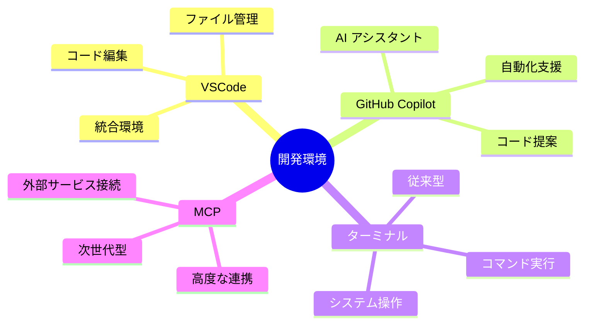
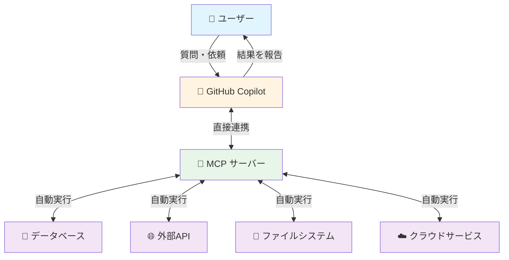
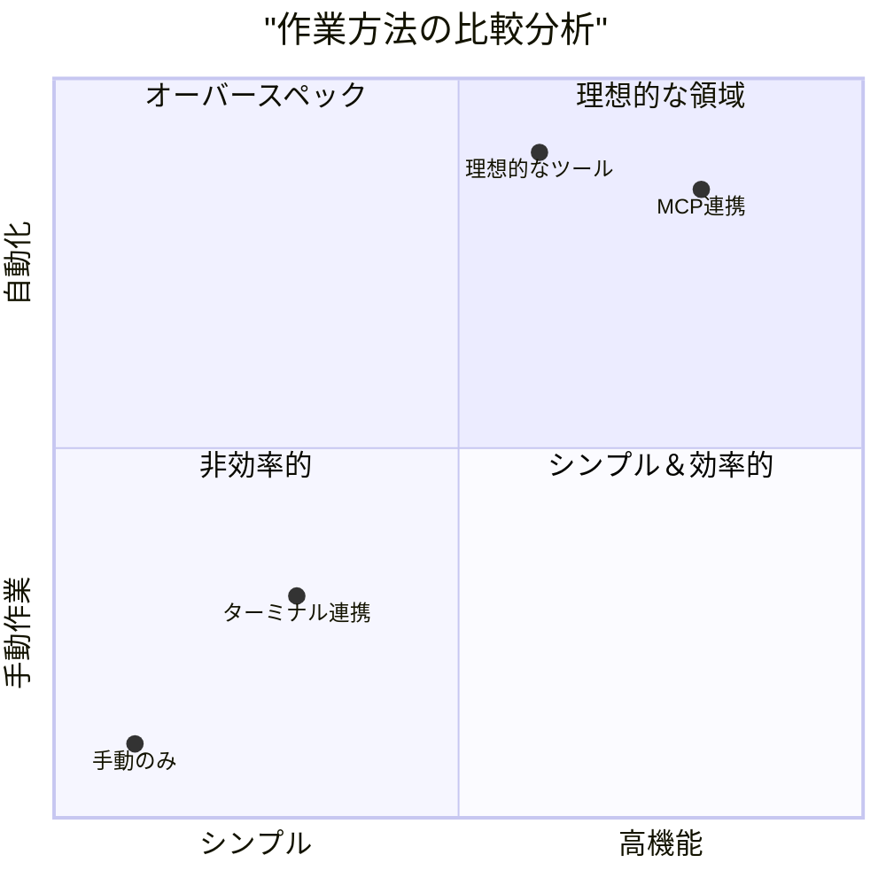
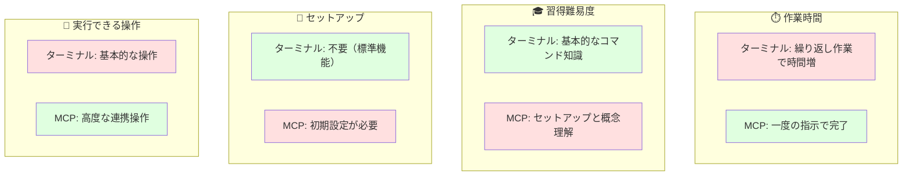
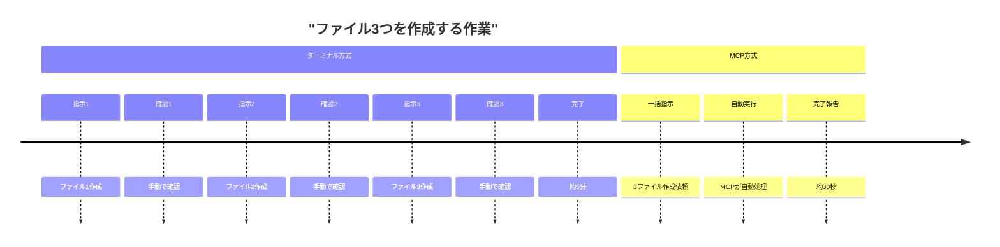
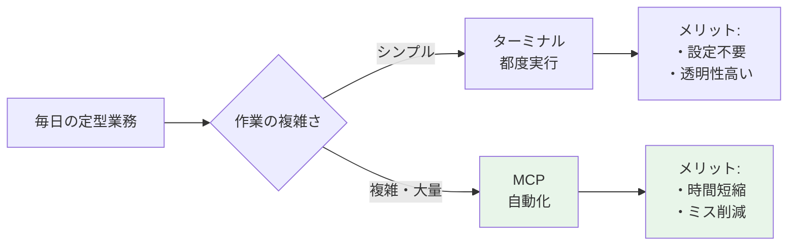
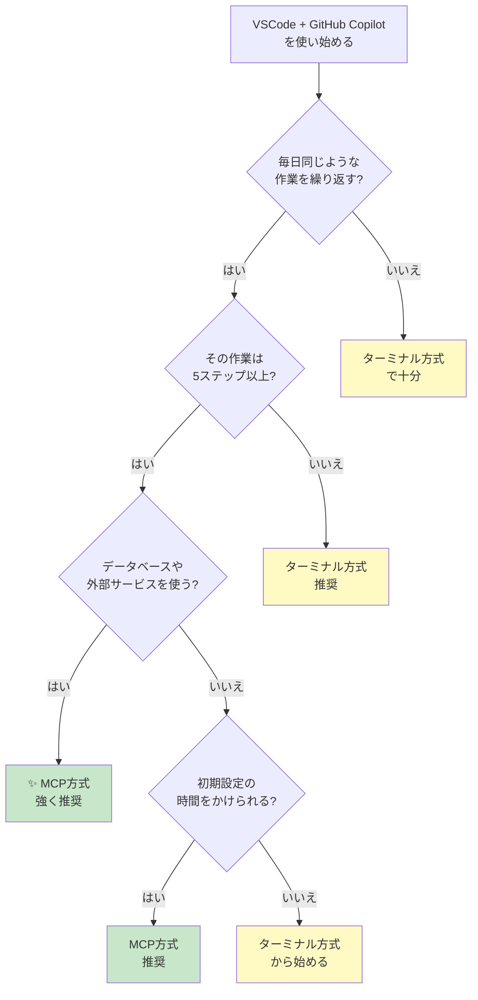
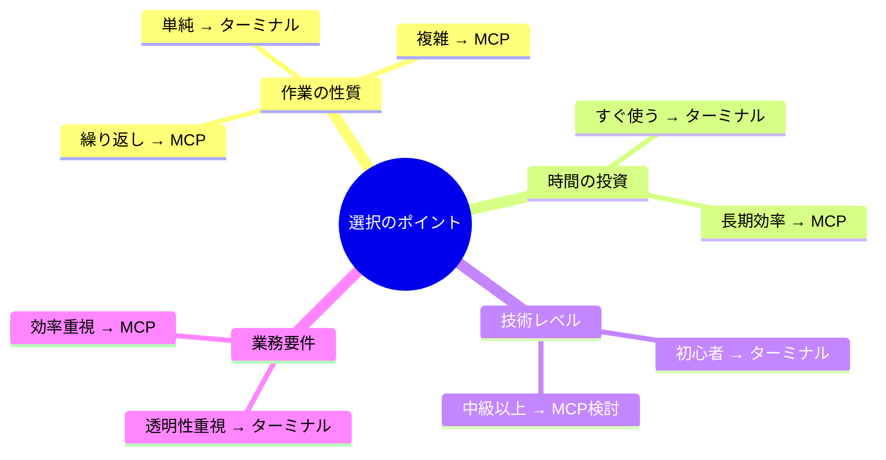

# VSCode + GitHub Copilot：ターミナル vs MCP 比較ガイド 🚀

*最終更新: 2025年12月13日*

## 📋 目次

1. [概要・目的](#概要目的)
2. [基本的な理解](#基本的な理解)
3. [従来の方法：ターミナル連携](#従来の方法ターミナル連携)
4. [新しい方法：MCP連携](#新しい方法mcp連携)
5. [詳細比較](#詳細比較)
6. [実際の業務シーン別活用](#実際の業務シーン別活用)
7. [導入の判断基準](#導入の判断基準)
8. [まとめ](#まとめ)

---

## 🎯 概要・目的

このドキュメントは、**非エンジニア向け**に、VSCode（Visual Studio Code）とGitHub Copilotを使った2つの異なる作業方法を比較説明するものです。

### このドキュメントで分かること

- **従来の方法**：ターミナル（コマンド入力画面）を使った作業
- **新しい方法**：MCP（Model Context Protocol）を使った作業
- それぞれの**メリット・デメリット**
- **どちらを選ぶべきか**の判断基準

---

## 🔍 基本的な理解

### 主要ツールの説明



#### 🖥️ VSCode（Visual Studio Code）
**説明**: マイクロソフトが提供する無料のコード編集ツール
- **例えるなら**: 高機能なWordのようなもの（ただしプログラミング専用）
- **何ができる**: ファイルの編集、管理、検索など

#### 🤖 GitHub Copilot
**説明**: AIが開発作業を支援してくれるアシスタント
- **例えるなら**: プログラミングの専門知識を持った秘書
- **何ができる**: コードの提案、説明、自動生成など

#### 💻 ターミナル
**説明**: 文字でコンピュータに指示を出す画面（黒い画面でコマンドを打つところ）
- **例えるなら**: コンピュータとの直接会話ツール
- **何ができる**: ファイル操作、プログラム実行、システム設定など

#### 🔗 MCP（Model Context Protocol）
**説明**: AIと外部サービスを連携させる新しい仕組み
- **例えるなら**: AIアシスタントに様々な「スキル」を追加できるプラグイン
- **何ができる**: データベース接続、API利用、クラウドサービス連携など

---

## 🛠️ 従来の方法：ターミナル連携

### 仕組みの概要


### 作業の流れ

1. **ユーザー**: Copilotに「〇〇を実行して」と依頼
2. **Copilot**: 適切なコマンドを提案
3. **ユーザー**: ターミナルでコマンドを実行（承認）
4. **ターミナル**: 結果を表示
5. **ユーザー**: 結果を確認して次の指示

### 特徴

#### ✅ メリット

- **シンプル**: 理解しやすい直線的な流れ
- **標準機能**: 追加のセットアップ不要
- **透明性**: 何が実行されるか明確に見える
- **互換性**: すべてのシステムで動作

#### ⚠️ デメリット

- **手動操作**: 各コマンドを手動で実行する必要がある
- **連続作業が面倒**: 複数の操作を繰り返す場合、毎回手作業
- **エラー対応**: 問題が起きたら手動で修正
- **制限あり**: ターミナルでできることのみ

### 実際の作業例

```
例：ファイルを10個作成する場合

1. Copilot「このコマンドを実行してください」
2. ユーザー：コマンドをコピー＆実行
3. 結果確認
4. 次のファイルのためにステップ1-3を繰り返し...
→ 10回の手動操作が必要
```

---

## 🚀 新しい方法：MCP連携

### 仕組みの概要



### 作業の流れ

1. **ユーザー**: Copilotに「〇〇を実行して」と依頼
2. **Copilot**: MCPサーバーに自動で指示
3. **MCPサーバー**: 必要な操作を自動実行
4. **Copilot**: 完了を報告（ユーザーは待つだけ）

### 特徴

#### ✅ メリット

- **自動化**: 複数の操作を自動で連続実行
- **効率的**: 手動操作が大幅に削減
- **高機能**: ターミナルでは難しい操作も可能
- **安全性**: エラーハンドリングが組み込まれている
- **拡張性**: 様々なサービスと連携可能

#### ⚠️ デメリット

- **初期設定**: MCPサーバーのセットアップが必要
- **学習コスト**: 仕組みを理解するのに時間がかかる
- **依存性**: MCPサーバーが動いていないと使えない
- **ブラックボックス**: 内部で何が起きているか見えにくい

### 実際の作業例

```
例：ファイルを10個作成する場合

1. ユーザー「10個のファイルを作成して」
2. Copilot → MCPが自動で全て実行
3. 完了報告「10個のファイルを作成しました」
→ 1回の指示で完了
```

---

## 📊 詳細比較

### 機能比較マトリックス



### 各項目での詳細比較



### 比較表

| 項目 | ターミナル連携 | MCP連携 |
|------|---------------|---------|
| **初期設定** | ⭐⭐⭐ 不要 | ⭐ 必要 |
| **使いやすさ** | ⭐⭐ 中程度 | ⭐⭐⭐ 簡単（慣れれば） |
| **作業スピード** | ⭐⭐ 手動操作が必要 | ⭐⭐⭐ 自動で高速 |
| **できること** | ⭐⭐ 基本的な操作 | ⭐⭐⭐ 高度な連携 |
| **安全性** | ⭐⭐ 目視確認可能 | ⭐⭐⭐ エラー処理組込 |
| **学習コスト** | ⭐⭐⭐ 低い | ⭐⭐ 中程度 |

---

## 💼 実際の業務シーン別活用

### シナリオ1：簡単なファイル操作



**推奨**: 簡単な操作なら**ターミナル**でも十分

### シナリオ2：データベース操作を含む複雑な作業

**例**: 100件のデータをデータベースに登録する

**ターミナル方式**:
1. データベース接続コマンド実行
2. SQL文を実行（手動）
3. 結果確認
4. 次のデータで繰り返し...
→ **非常に時間がかかる**

**MCP方式**:
1. 「このExcelデータをデータベースに登録して」
2. 自動で全て処理
3. 完了報告
→ **数秒で完了**

**推奨**: 複雑な操作は**MCP**が圧倒的に有利

### シナリオ3：定期的な繰り返し作業



**推奨**: 繰り返し作業が多いなら**MCP**の導入を検討

---

## 🎯 導入の判断基準

### 判断フローチャート



### ケース別推奨

#### 🟢 ターミナル方式がおすすめの場合

- 初めてVSCodeを使う
- 簡単なファイル操作のみ
- 何が実行されるか常に確認したい
- すぐに使い始めたい（設定時間なし）

#### 🔵 MCP方式がおすすめの場合

- 日常的に繰り返し作業がある
- データベースやAPIを扱う
- 大量のデータを処理する
- 時間効率を最大化したい
- チーム全体で標準化したい

#### 🟡 段階的移行がおすすめ

1. **フェーズ1**: ターミナル方式で基本を学ぶ（1-2週間）
2. **フェーズ2**: MCPの概念を理解する（1週間）
3. **フェーズ3**: 簡単な作業でMCPを試す（1-2週間）
4. **フェーズ4**: 本格的にMCPを活用開始

---

## 🎯 まとめ

### 重要ポイント



### 各方式の適用シーン

| シーン | ターミナル | MCP | 理由 |
|--------|----------|-----|------|
| **学習初期** | ⭐⭐⭐ | ⭐ | 基本を理解しやすい |
| **簡単な操作** | ⭐⭐⭐ | ⭐⭐ | 設定不要で手軽 |
| **複雑な操作** | ⭐ | ⭐⭐⭐ | 自動化で効率的 |
| **繰り返し作業** | ⭐ | ⭐⭐⭐ | 時間削減効果大 |
| **データベース連携** | ⭐ | ⭐⭐⭐ | 高度な処理が可能 |
| **緊急時の対応** | ⭐⭐⭐ | ⭐⭐ | 直接確認できる |

### 最終推奨

#### 🎯 これから始める方

1. **まずはターミナル方式**で基本を習得
2. 作業に慣れてきたら**MCP方式を検討**
3. 両方を使い分けるのが**最も効率的**

#### 🚀 すでに使っている方

1. 現在の作業を**分析**
2. 繰り返し・複雑な作業を**リストアップ**
3. それらの作業から**段階的にMCP化**

### 次のステップ


---

## 📚 参考情報

### 関連ドキュメント

- [GitHub Copilot 完全マスターガイド](github-mastery-guide.md)
- [非エンジニア向け開発ワークフロー](development-workflow-for-non-engineers.md)

### 用語集

- **VSCode**: コード編集ツール（無料）
- **GitHub Copilot**: AIアシスタント（有料）
- **ターミナル**: コマンド入力画面
- **MCP**: Model Context Protocol（AI連携の新しい仕組み）
- **API**: プログラム間で情報をやり取りする仕組み
- **データベース**: データを整理して保存する場所

---

## 🔄 更新履歴

| 日付 | 内容 |
|------|------|
| 2025/12/13 | 初版作成 - 非エンジニア向けミーティング資料として作成 |

---

*このドキュメントは非エンジニアの方々の理解を支援するために作成されました。*
*技術的な質問や不明点がありましたら、お気軽にお問い合わせください。* 🙋‍♀️