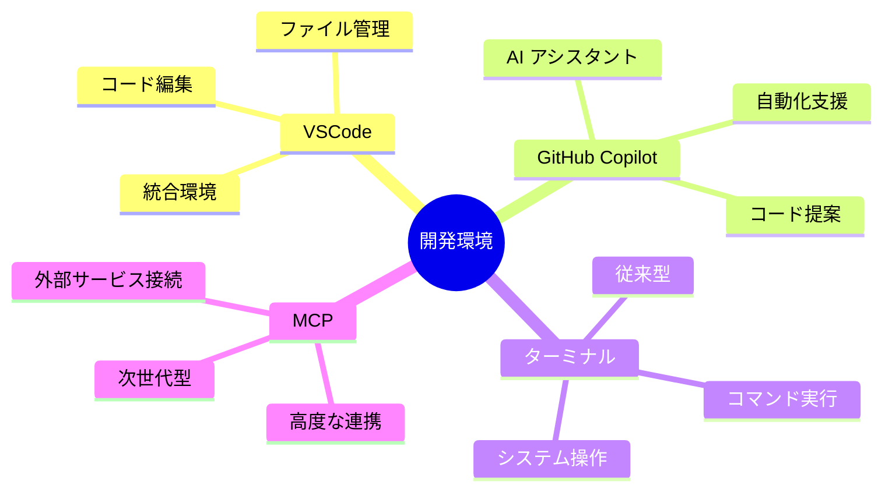
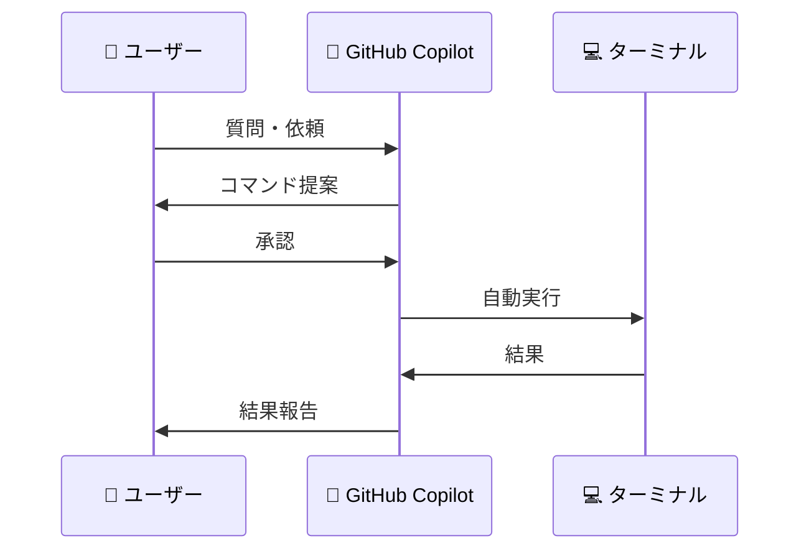
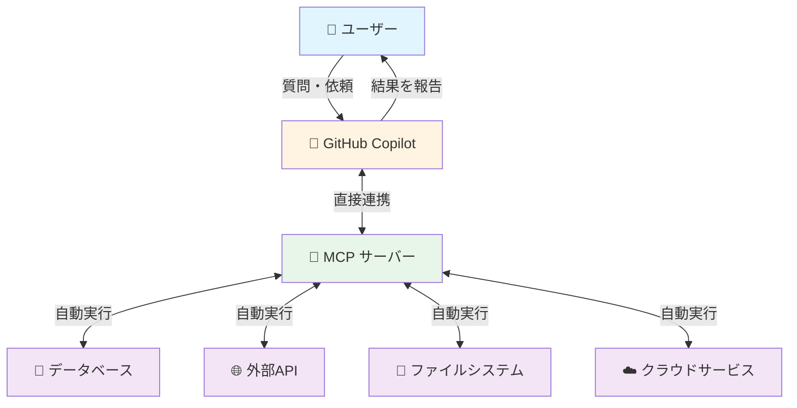
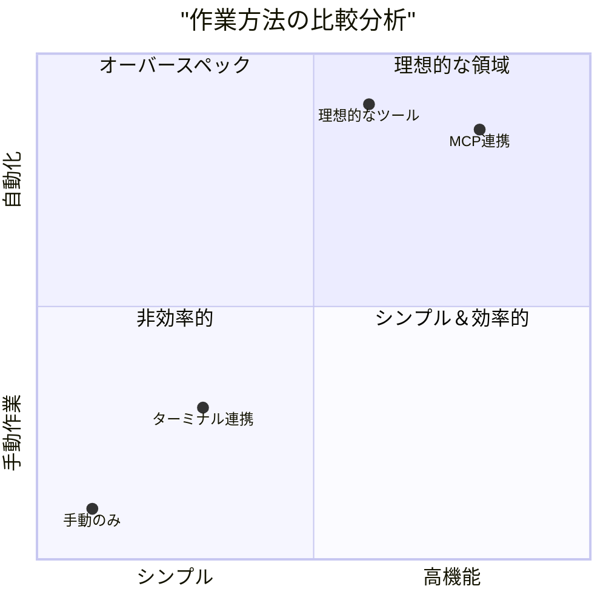
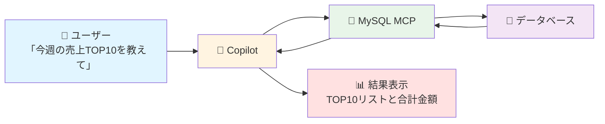
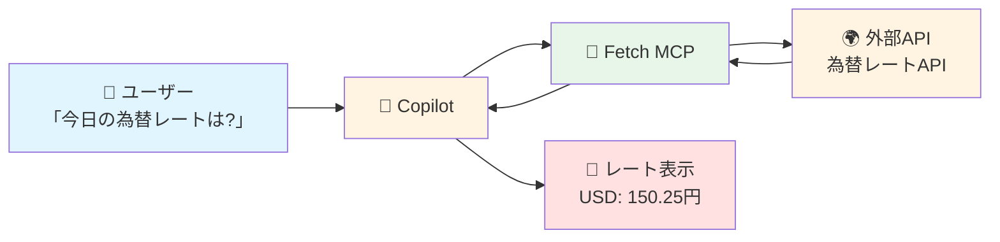
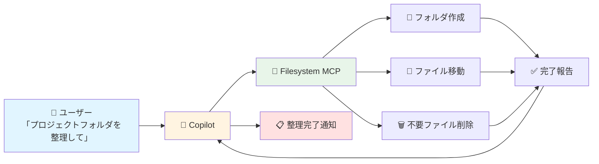
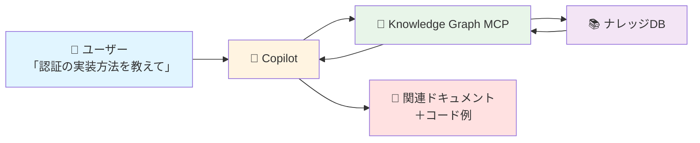
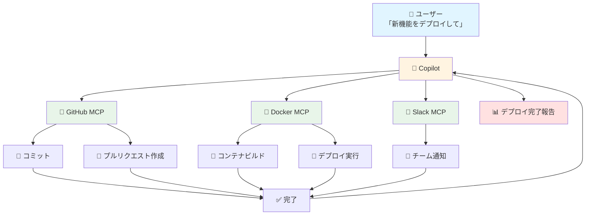
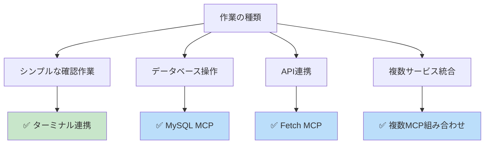

# VSCode + GitHub Copilot：ターミナル vs MCP 比較ガイド 🚀

*最終更新: 2025年12月13日*

## 📋 目次

1. [概要・目的](#概要目的)
2. [基本的な理解](#基本的な理解)
3. [従来の方法：ターミナル連携](#従来の方法ターミナル連携)
4. [新しい方法：MCP連携](#新しい方法mcp連携)
5. [詳細比較](#詳細比較)
6. [定番のMCP活用事例 5選](#定番のmcp活用事例-5選)
7. [実際の業務シーン別活用](#実際の業務シーン別活用)

---

## 🎯 概要・目的

このドキュメントは、VSCode（Visual Studio Code）とGitHub Copilotを使った2つの異なる作業方法を比較説明するものです。

### このドキュメントで分かること

- **従来の方法**：ターミナル（コマンド入力画面）を使った作業
- **新しい方法**：MCP（Model Context Protocol）を使った作業
- それぞれの**メリット・デメリット**
- **どちらを選ぶべきか**の判断基準

---

## 🔍 基本的な理解

### 主要ツールの説明



#### 🖥️ VSCode（Visual Studio Code）
**説明**: マイクロソフトが提供する無料のコード編集ツール

#### 🤖 GitHub Copilot
**説明**: AIが開発作業を支援してくれるアシスタント

#### 💻 ターミナル
**説明**: 文字でコンピュータに指示を出す画面（黒い画面でコマンドを打つところ）
- **例えるなら**: コンピュータとの直接会話ツール
- **何ができる**: ファイル操作、プログラム実行、システム設定など

#### 🔗 MCP（Model Context Protocol）
**説明**: AIと外部サービスを連携させる新しい仕組み
- **例えるなら**: AIアシスタントに様々な「スキル」を追加できるプラグイン
- **何ができる**: データベース接続、API利用、クラウドサービス連携など

---

## 🛠️ 従来の方法：ターミナル連携

### 仕組みの概要



### 作業の流れ

1. **ユーザー**: Copilotに「〇〇を実行して」と依頼
2. **Copilot**: 適切なコマンドを提案
3. **ユーザー**: コマンドを確認して承認
4. **Copilot**: ターミナルで自動実行
5. **Copilot**: 結果を確認して報告

### 特徴

#### ✅ メリット

- **シンプル**: 理解しやすい直線的な流れ
- **標準機能**: 追加のセットアップ不要
- **透明性**: 何が実行されるか明確に見える
- **互換性**: すべてのシステムで動作

#### ⚠️ デメリット

- **環境依存**: OS・設定の違いで動作が不安定になることがある
- **情報不足**: コンテキスト情報が限定的で失敗しやすい
- **エラー対応**: 問題が起きたら手動で修正が必要
- **制限あり**: ターミナルでできることのみ

### 実際の作業例

```
例：MySQLデータベースで特定の条件のデータを検索・集計する場合

【ターミナル方式】
1. Copilot「このmysqlコマンドを実行してください」
2. ユーザー：コマンドを承認
3. Copilot：ターミナルでmysqlコマンド実行
4. エラー発生（パスワード・接続情報が不足）
5. ユーザー：接続情報を確認して再実行
6. 再度エラー（テーブル名のtypo）
7. 修正して再実行...
→ 環境情報が不足し、試行錯誤が必要
```

---

## 🚀 新しい方法：MCP連携

### 仕組みの概要



### 作業の流れ

1. **ユーザー**: Copilotに「〇〇を実行して」と依頼
2. **Copilot**: MCPサーバーに自動で指示
3. **MCPサーバー**: 必要な操作を自動実行
4. **Copilot**: 完了を報告（ユーザーは待つだけ）

### 特徴

#### ✅ メリット

- **自動化**: 複数の操作を自動で連続実行
- **効率的**: 手動操作が大幅に削減
- **高機能**: ターミナルでは難しい操作も可能
- **安全性**: エラーハンドリングが組み込まれている
- **拡張性**: 様々なサービスと連携可能

#### ⚠️ デメリット

- **初期設定**: MCPサーバーのセットアップが必要
- **学習コスト**: 仕組みを理解するのに時間がかかる
- **依存性**: MCPサーバーが動いていないと使えない
- **ブラックボックス**: 内部で何が起きているか見えにくい

### 実際の作業例

```
例：MySQLデータベースで特定の条件のデータを検索・集計する場合

【MCP方式】
1. ユーザー「売上データから今月の集計を出して」
2. Copilot → MySQL MCPが接続情報を使って自動実行
3. 完了報告「今月の売上合計は〇〇円です」
→ 接続情報・スキーマ情報を保持しているため確実に実行
```

---

## 📊 詳細比較

### 機能比較マトリックス



## 🌟 定番のMCP活用事例 5選

MCPの実践的な活用シーンを紹介します。

#### 1. 💾 データベース操作の自動化



**活用シーン**: 
- 売上データの集計・分析
- 顧客情報の検索・更新
- レポート生成

**メリット**: 
- 接続情報の管理不要
- スキーマ情報を自動活用
- 複雑なSQL文も自然言語で指示可能

---

#### 2. 🌐 Web API連携の簡略化



**活用シーン**: 
- 為替レート取得
- 天気情報の確認
- ニュースAPIからの情報取得

**メリット**: 
- API認証情報の自動管理
- レスポンスの自動パース
- エラー処理が組み込まれている

---

#### 3. 📁 ファイルシステム操作の高度化



**活用シーン**: 
- プロジェクトフォルダの整理
- バックアップファイルの作成
- ログファイルのクリーンアップ

**メリット**: 
- 複数ファイルの一括操作
- 条件に応じた処理
- 安全な削除（確認付き）

---

#### 4. 🔍 ナレッジベース検索



**活用シーン**: 
- 過去のプロジェクトドキュメント検索
- 社内ナレッジベースの活用
- コードスニペットの検索

**メリット**: 
- セマンティック検索（意味で検索）
- 関連情報の自動提示
- コンテキストを理解した回答

---

#### 5. 🎨 開発ワークフローの統合



**活用シーン**: 
- コードのコミット〜デプロイまでの自動化
- チーム通知の自動送信
- CI/CDパイプラインの実行

**メリット**: 
- 複数サービスの統合操作
- ワークフロー全体の自動化
- 手作業によるミス防止

---

## 🎯 実際の業務シーン別活用

### 開発シーン別の推奨方法



---

### 最終アドバイス

> 💡 **完璧を目指さず、まず始めることが重要**
> 
> - ターミナル連携で基礎を学ぶ
> - 必要性を感じたらMCPへ
> - チームで知見を共有
> - 継続的に改善

---

*このガイドが、あなたの開発作業をより効率的にする一助となれば幸いです。* 🎉
