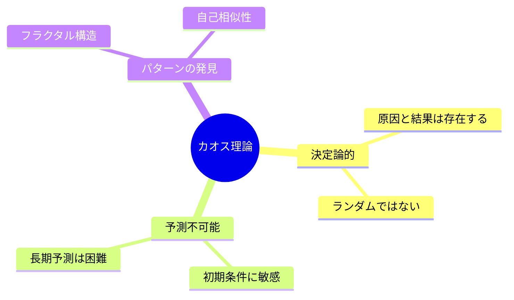
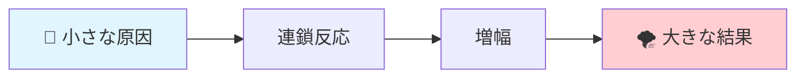
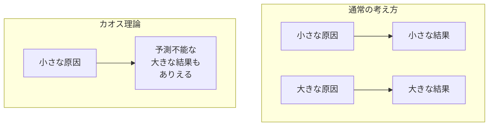
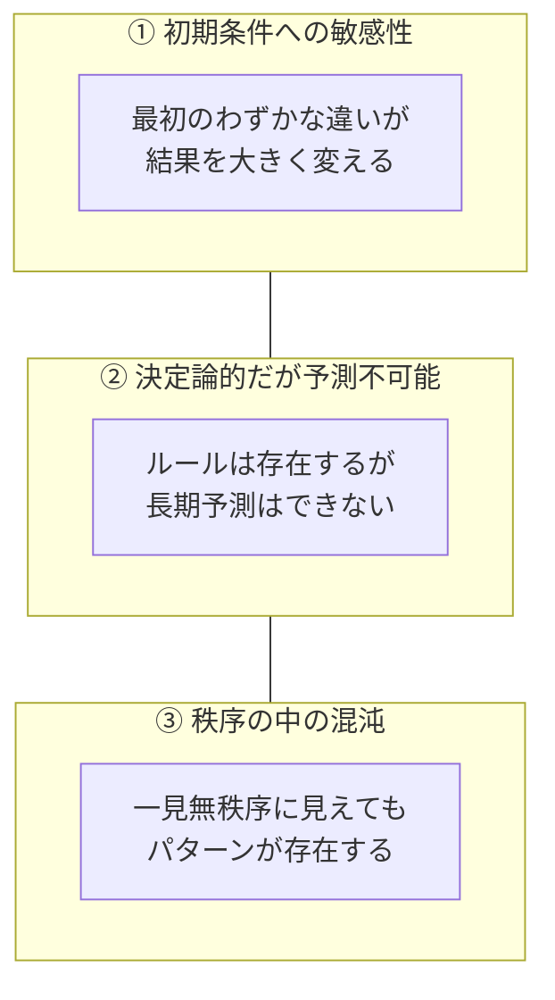
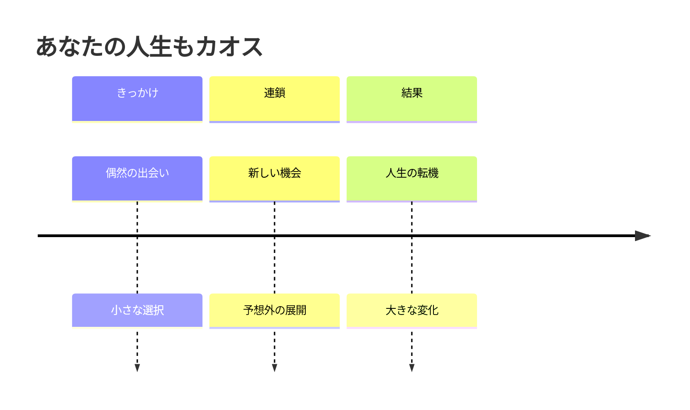
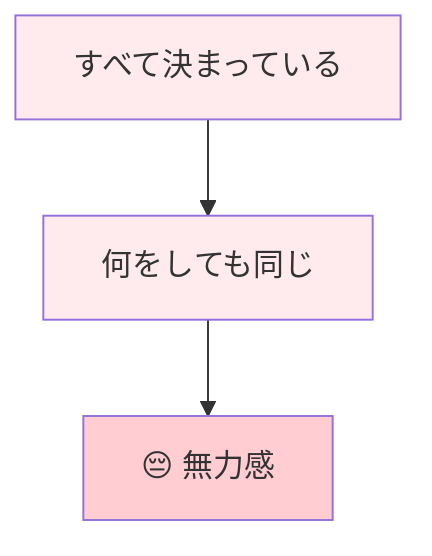
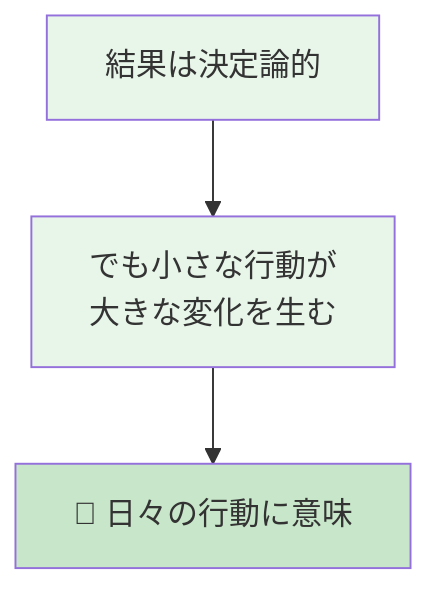
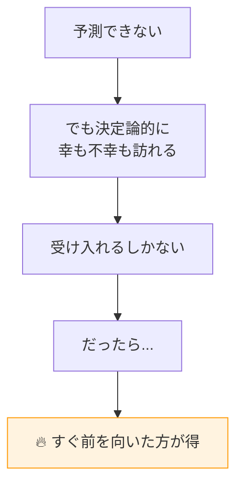
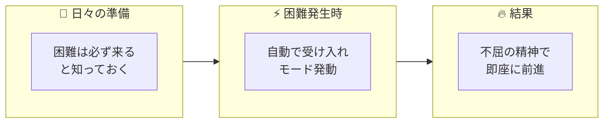

# カオス理論 🦋

*最終更新: 2026年1月10日*

## 📋 目次

1. [概要](#-概要)
2. [核心概念：バタフライ効果](#-核心概念バタフライ効果)
3. [カオス理論の3つの特徴](#-カオス理論の3つの特徴)
4. [日常での例](#-日常での例)
5. [まとめ](#-まとめ)

---

## 🎯 概要

**カオス理論**とは、「小さな変化が、やがて大きな結果を生む」という現象を説明する理論です。

> 💡 **一言で言うと**: 世界は予測不可能に見えるが、そこには隠れた秩序がある

---

## 🦋 核心概念：バタフライ効果

**「ブラジルで蝶が羽ばたくと、テキサスで竜巻が起きる」**

これは比喩ですが、カオス理論の本質を表しています。

### なぜこうなるのか？

---

## 📊 カオス理論の3つの特徴

---

## 🌍 日常での例

| 分野 | カオスの例 |
|------|-----------|
| 🌤️ 天気 | 1週間後の天気予報が外れやすい理由 |
| 📈 経済 | 小さなニュースが株価を大きく動かす |
| 🧬 人生 | 偶然の出会いが人生を変える |

---

## 🎯 まとめ

### 🤔 なぜ「決定論」ではなく「カオス理論」なのか

<table>
<tr>
<td>

**❌ 決定論**

</td>
<td>

**✅ カオス理論**

</td>
</tr>
</table>

> 💡 **カオス理論を選ぶ理由**:
> 「日頃の行いが良い」「日頃の行いが悪い」——この因果応報的な感覚は、カオス理論と相性が良い。
> 小さな善行・悪行が、予測不能な形で大きな結果につながる。だから**今日の行動に意味がある**。

### 💡 カオス理論が教えてくれること

カオス理論から得られる最大の恩恵は、**精神的な強さ**です。

#### 🧠 日常での心構え

| 状況 | カオス理論的な受け止め方 |
|------|--------------------------|
| 苦しい出来事が起きた | 「これは決定論的に訪れた。仕方ない」 |
| 落ち込みそうになる | 「悩んでいる時間がもったいない」 |
| 立ち直りたい | 「絶対に乗り越えてやる」 |

#### 💪 不屈の精神への変換

> **自己催眠のすすめ**: 
> 「いつか必ず困難は訪れる。でもそれは決定論的なのだから仕方ない。だったらすぐ受け入れて前を向く」
> 
> これを日々意識しておくことで、実際に困難が来たとき、無意識が**「絶対に乗り越えてやる」**という不屈の精神に自動変換してくれる。

---

> *"You can't connect the dots looking forward; you can only connect them looking backward. So you have to trust that the dots will somehow connect in your future."*
> 
> （点と点は前を見ていては繋がらない。振り返って初めて繋がる。だから、いつか点が繋がると信じるしかない）
> 
> — **スティーブ・ジョブズ**（スタンフォード大学卒業式スピーチ, 2005年）
