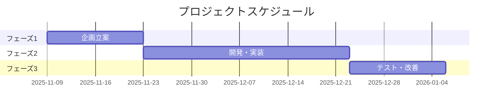
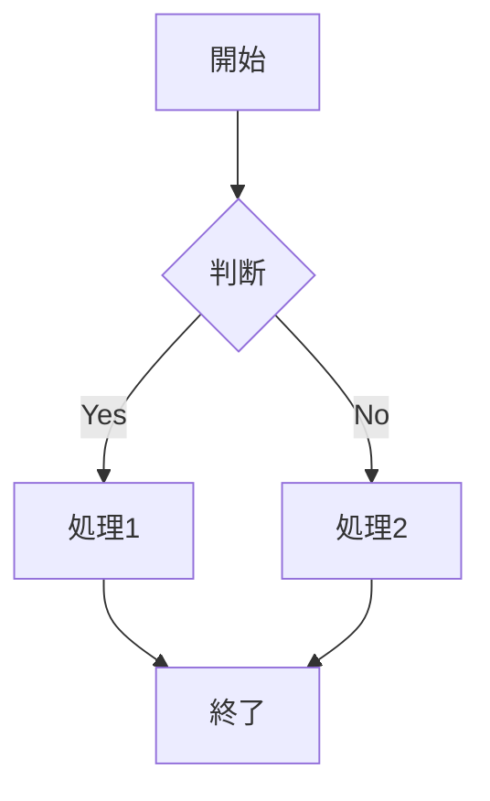
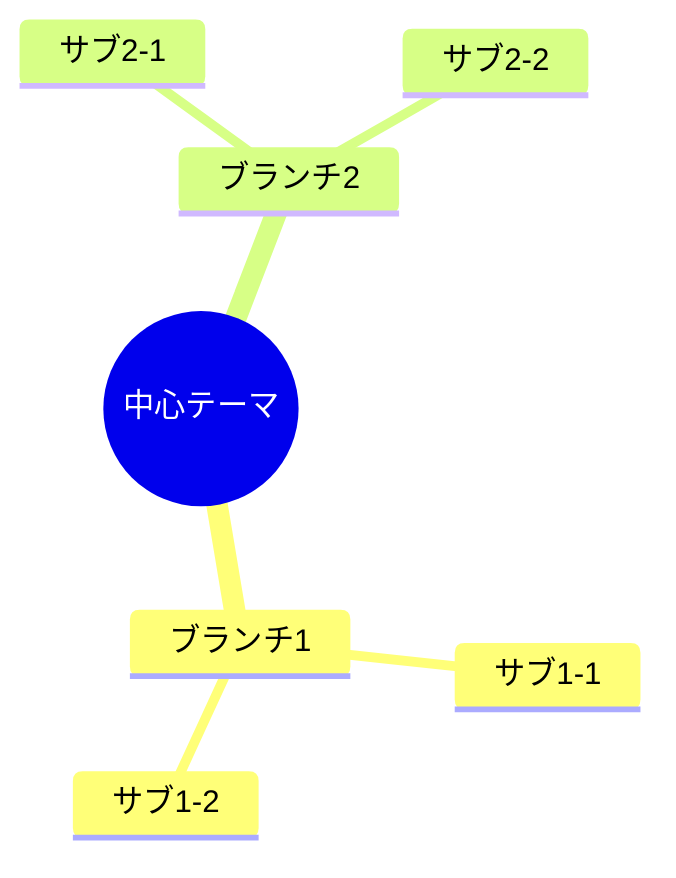
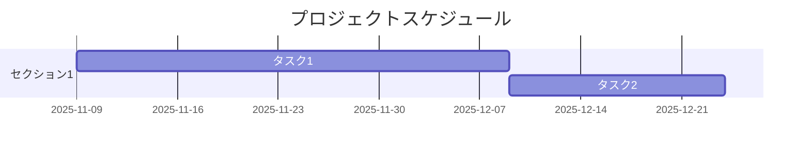
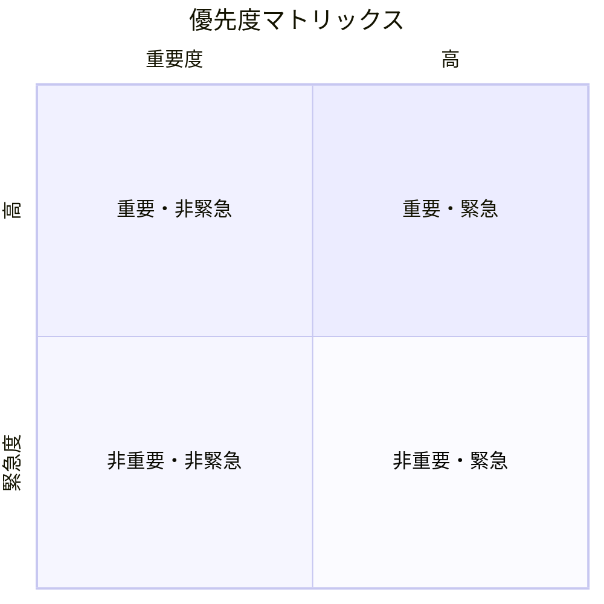

# ドキュメントテンプレート集 📝

## 🎯 基本テンプレート

### 📋 一般的なドキュメント構成

```markdown
# [ドキュメントタイトル] 

*最終更新: [日付]*

## 📋 目次

1. [セクション1](#セクション1)
2. [セクション2](#セクション2)
3. [セクション3](#セクション3)

## 🎯 概要・目的

[このドキュメントの目的と価値を明確に記述]

## 📊 現状分析

[現在の状況、課題、背景を分析]

## 💡 解決策・手法

[具体的なアプローチ、方法論を詳述]

## 📈 実践・実例

[具体例、ケーススタディ、実装例]

## 🔧 ツール・リソース

[使用ツール、参考資料、関連リンク]

## ⚡ アクションプラン

[次のステップ、実行計画]

## 🎯 まとめ

[重要ポイント、学び、結論]

---

*[更新・メンテナンス情報]*
```

## 🚀 プロジェクト系テンプレート

### 📋 プロジェクト企画書

```markdown
# [プロジェクト名] 企画書

## 🎯 プロジェクト概要
- **目的**: [具体的な目的]
- **期間**: [開始日] - [終了予定日]
- **責任者**: [名前・役割]
- **予算**: [概算]

## 📊 現状分析・課題
### 解決すべき課題
1. [課題1]
2. [課題2]
3. [課題3]

### 機会・メリット
1. [機会1]
2. [機会2]
3. [機会3]

## 💡 解決案・アプローチ
[具体的なソリューション]

## 📈 成功指標・KPI
- [指標1]: [目標値]
- [指標2]: [目標値]
- [指標3]: [目標値]

## 🗓️ スケジュール


## 🎯 リスク・対策
| リスク | 影響度 | 発生確率 | 対策 |
|--------|--------|----------|------|
| [リスク1] | 高/中/低 | 高/中/低 | [対策内容] |

## 💰 リソース・予算
[必要なリソース、予算配分]

## ✅ 次のアクション
- [ ] [アクション1]
- [ ] [アクション2]
- [ ] [アクション3]
```

### 📋 プロジェクト振り返り

```markdown
# [プロジェクト名] 振り返り

## 📊 プロジェクト基本情報
- **期間**: [実際の期間]
- **チームメンバー**: [参加者]
- **最終成果**: [達成結果]

## 🎯 目標達成度
| 目標 | 計画値 | 実績値 | 達成率 |
|------|--------|--------|--------|
| [目標1] | [計画] | [実績] | [%] |
| [目標2] | [計画] | [実績] | [%] |

## ✅ うまくいったこと (Keep)
1. [成功要因1]
2. [成功要因2]
3. [成功要因3]

## ⚠️ 問題・課題 (Problem)
1. [問題1 - 原因と影響]
2. [問題2 - 原因と影響]
3. [問題3 - 原因と影響]

## 💡 改善案・学び (Try)
1. [改善案1]
2. [改善案2]
3. [改善案3]

## 📈 定量的分析
[時間、コスト、品質などの数値分析]

## 🎯 次プロジェクトへの活用
[今回の学びを次にどう活かすか]
```

## 📚 学習系テンプレート

### 📋 学習ログ

```markdown
# 学習ログ - [日付]

## 📅 基本情報
- **日付**: [年月日]
- **学習時間**: [時間]
- **分野**: [技術/ビジネス/その他]

## 🎯 学習目標
[今日の学習目標・意図]

## 📖 学習内容
### 学習したこと
1. [内容1]
2. [内容2]
3. [内容3]

### 重要なポイント
- [ポイント1]
- [ポイント2]
- [ポイント3]

### 新しい発見・気づき
[今まで知らなかったこと、驚いたこと]

## 💭 理解度・感想
- **理解度**: [1-5段階]
- **難易度**: [1-5段階]
- **興味度**: [1-5段階]
- **感想**: [自由記述]

## 🔗 関連リソース
- [参考書籍・記事]
- [参考URL]
- [関連ツール]

## ⚡ 次のアクション
- [ ] [実践すること]
- [ ] [深掘りすること]
- [ ] [関連して学ぶこと]

## 🤔 疑問・課題
[まだ理解できていないこと、今後調べたいこと]
```

### 📋 読書記録

```markdown
# 読書記録: [書籍名]

## 📚 基本情報
- **書籍名**: [タイトル]
- **著者**: [著者名]
- **出版年**: [年]
- **ページ数**: [ページ]
- **読了日**: [日付]

## ⭐ 評価
- **総合評価**: [★★★★★]
- **内容の質**: [★★★★★]
- **読みやすさ**: [★★★★★]
- **実用性**: [★★★★★]

## 📋 要約
[本の主要テーマと内容を3-5文で要約]

## 💡 重要なポイント・学び
1. [学び1]
2. [学び2]
3. [学び3]

## 📝 印象的な引用
> [印象的だった文章・引用]

## 🎯 実践可能なアクション
- [ ] [実践すること1]
- [ ] [実践すること2]
- [ ] [実践すること3]

## 🔗 関連・推奨図書
- [関連書籍1]
- [関連書籍2]
- [関連書籍3]

## 👥 推奨対象
[どんな人にオススメか]
```

## 🛠️ 技術系テンプレート

### 📋 技術調査・検証

```markdown
# [技術・ツール名] 調査・検証レポート

## 🎯 調査目的
[なぜこの技術を調査するのか]

## 📊 基本情報
- **技術名**: [名称]
- **バージョン**: [バージョン]
- **開発元**: [会社・組織]
- **ライセンス**: [ライセンス種別]
- **URL**: [公式サイト]

## 🔍 詳細調査

### 主要機能・特徴
1. [機能1]
2. [機能2]
3. [機能3]

### 技術仕様
- **対応OS**: [OS情報]
- **必要環境**: [システム要件]
- **依存関係**: [必要なライブラリ等]

### 導入方法
```bash
[インストール・セットアップ手順]
```

## 💪 メリット・長所
1. [メリット1]
2. [メリット2]
3. [メリット3]

## ⚠️ デメリット・制約
1. [デメリット1]
2. [デメリット2]
3. [デメリット3]

## 🆚 競合比較
| 項目 | [技術A] | [技術B] | [調査対象] |
|------|---------|---------|------------|
| 性能 | | | |
| 使いやすさ | | | |
| コスト | | | |
| 学習コスト | | | |

## 🧪 検証結果
[実際に試した結果、パフォーマンス等]

## 🎯 結論・推奨事項
[採用すべきか、どんな場面で有効か]

## 📚 参考資料
- [公式ドキュメント]
- [チュートリアル]
- [コミュニティ情報]
```

### 📋 トラブルシューティング

```markdown
# [問題・エラー名] トラブルシューティング

## 🚨 問題概要
[発生した問題の概要]

## 📋 基本情報
- **発生日時**: [日時]
- **環境**: [OS, ソフトウェアバージョン等]
- **影響範囲**: [影響を受けるシステム・ユーザー]
- **緊急度**: [高/中/低]

## 🔍 問題詳細

### 症状・エラーメッセージ
```
[具体的なエラーメッセージ]
```

### 再現手順
1. [手順1]
2. [手順2]
3. [手順3]

### 発生条件
[どんな時に発生するか]

## 🔧 解決方法

### 即座の対処法
[応急処置・ワークアラウンド]

### 根本的解決策
[根本原因への対処]

### 実施手順
1. [解決手順1]
2. [解決手順2]
3. [解決手順3]

## ✅ 解決確認
[解決したことをどう確認するか]

## 🛡️ 予防策
[今後同じ問題を防ぐための対策]

## 📚 参考情報
- [参考URL]
- [関連ドキュメント]
- [コミュニティ情報]
```

## 📈 分析系テンプレート

### 📋 SWOT分析

```markdown
# [対象] SWOT分析

## 🎯 分析対象
[分析する対象・テーマ]

## 📊 SWOT分析

```mermaid
quadrantChart
    title SWOT分析
    x-axis 内部要因 --> 外部要因
    y-axis ポジティブ --> ネガティブ
    
    quadrant-1 機会 (Opportunities)
    quadrant-2 強み (Strengths)  
    quadrant-3 弱み (Weaknesses)
    quadrant-4 脅威 (Threats)
```

### 💪 強み (Strengths)
1. [強み1]
2. [強み2]
3. [強み3]

### ⚠️ 弱み (Weaknesses)
1. [弱み1]
2. [弱み2]
3. [弱み3]

### 🚀 機会 (Opportunities)
1. [機会1]
2. [機会2]
3. [機会3]

### 🚨 脅威 (Threats)
1. [脅威1]
2. [脅威2]
3. [脅威3]

## 💡 戦略提案

### SO戦略 (強み×機会)
[強みを活かして機会を掴む戦略]

### WO戦略 (弱み×機会)
[弱みを改善して機会を活用する戦略]

### ST戦略 (強み×脅威)
[強みで脅威を回避・軽減する戦略]

### WT戦略 (弱み×脅威)
[弱みと脅威を最小化する戦略]

## 🎯 アクションプラン
1. [具体的アクション1]
2. [具体的アクション2]
3. [具体的アクション3]
```

## 🎨 Mermaid図表テンプレート集

### フローチャート


### マインドマップ


### ガントチャート


### クアドラント図


---

*これらのテンプレートを活用して、効率的で一貫性のあるドキュメント作成を実現してください。必要に応じてカスタマイズしてご使用ください。*